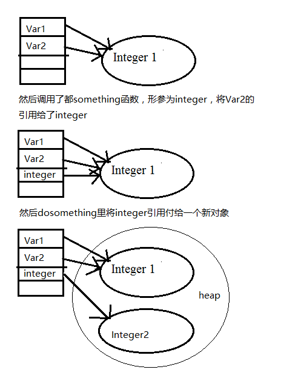

# 值传递和引用传递
传值传参的时候，我们在函数中改变了参数的值，其对应的变量的值并不改变，值类型传参就是将变量保存的内容复制到函数的形参中，他们是两个不同的变量，值不过保存的内容相同不了.
引用传参保存的是一个地址，这个地址里保存的是变量的具体值，而引用类型作为参数的时候，是将变量保存的地址值赋值到参数变量里，这样他们都指向了同一个内容，这样我们改变参数的成员的话，那么相应的变量的成员也会改变。

```
public class Example{
    String str=new String("tarena");
    char[]ch={'a','b','c'};
    public static void main(String args[]){
        Example ex=new Example();
        ex.change(ex.str,ex.ch);
        System.out.print(ex.str+" and ");
        System.out.print(ex.ch);
    }
    public void change(String str,char ch[]){
   //引用类型变量，传递的是地址，属于引用传递。
        str="test ok";
        ch[0]='g';
    }
}
```
string和char数组都是引用类型，引用类型是传地址的，会影响原变量的值，但是string是特殊引用类型，为什么呢？
因为string类型的值是不可变的，为了考虑一些内存，安全等综合原因，把它设置成不可变的; 不可变是怎么实现的？Java在内存中专门为string开辟了一个字符串常量池，用来锁定数据不被篡改，所以题目中函数中的str变量和原来的str已经不是一个东西了，它是一个局部引用，指向一个testok的字符串，随着函数结束，它也就什么都没了，但是char数组是会改变原值的

其实前面有几个答案说的已经很清楚了，足够我们理解这一道题。有一些东西可能还不是很清楚，导致这种题容易发生混乱。记住几点就可以了:
1.为什么string字符串的值是不可变的？当我们new一个字符串，给它赋值之后，那么当前对象的值就固定了，永远不会改变。
比如String str=new String("test")，那么str的值就是test，这是因为在String源码当中是用char数组来按顺序存储字符串中的每一个字符的，并且这个char数组是用final修饰的，这意味着一旦我们给字符串赋值之后，这个对象的值就永远不会改变。
2.可是当我们在一个类当中的某个方法里面，给这个对象str赋值了一个新的字符串，它这时候的值是多少呢？比如这时str="good"，str的值就是good，(你可以在这个方法里面写输出语句，输出这个引用，就知道怎么回事了)可不是说引用的值不可以改变么？这里改变的不是引用的值，而是引用str指向的常量不一样了而已，而这个引用的生命周期和当前方法的一样的，也就是方法结束，引用被杀死，也结束了，那么它刚才指向good的这个引用，就结束了，所以在这个方法结束之后，再输出引用str的值，自然就是引用str之前指向的值了，也就是test。

## call by value  and call by reference
```
引用数据类型是引用传递（call by reference），基本数据类型是值传递（call by value）
值传递不可以改变原变量的内容和地址---》原因是java方法的形参传递都是传递原变量的副本，在方法中改变的是副本的值，而不适合原变量的
引用传递不可以改变原变量的地址，但可以改变原变量的内容---》原因是当副本的引用改变时，原变量 的引用并没有发生变化，当副本改变内容时，由于副本引用指向的是原变量的地址空间，所以，原变量的内容发生变化。

结论：1.值传递不可以改变原变量的内容和地址；
     2.引用传递不可以改变原变量的地址，但可以改变原变量的内容；
```
## 题1
```
public class Tester{
public static void main(String[] args){
   Integer var1=new Integer(1);
   Integer var2=var1;
   doSomething(var2);
   System.out.print(var1.intValue());
   System.out.print(var1==var2);
}
public static void doSomething(Integer integer){
    integer=new Integer(2);
    }
}
```
运行结果:1True
java中引用类型的实参向形参的传递，只是传递的引用，而不是传递的对象本身。
 