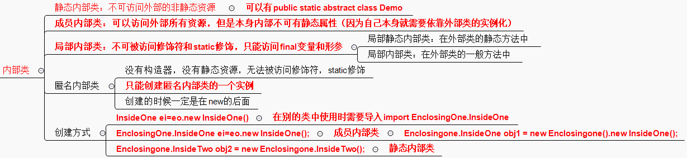

# 内部类
## 内部类分类
```
静态内部类不可以直接访问外围类的非静态数据，而非静态内部类可以直接访问外围类的数据，包括私有数据。(true)
```
总结
1. 静态内部类：
    1. 静态内部类本身可以访问外部的静态资源，包括静态私有资源。但是不能访问非静态资源，可以不依赖外部类实例而实例化。
2. 成员内部类：
    1. 成员内部类本身可以访问外部的所有资源，但是自身不能定义静态资源，因为其实例化本身就还依赖着外部类。
3. 局部内部类：
    1. 局部内部类就像一个局部方法，不能被访问修饰符修饰，也不能被static修饰。
    2. 局部内部类只能访问所在代码块或者方法中被定义为final的局部变量。
4. 匿名内部类：
    1. 没有类名的内部类，不能使用class，extends和implements，没有构造方法。
    2. 多用于GUI中的事件处理。
    3. 不能定义静态资源
    4. 只能创建一个匿名内部类实例。
    5. 一个匿名内部类一定是在new后面的，这个匿名类必须继承一个父类或者实现一个接口。
    6. 匿名内部类是局部内部类的特殊形式，所以局部内部类的所有限制对匿名内部类也有效。
```
int a=2;
  static int b=9;
  private String s;
  
  //可以访问外部的全部资源,但是自身不能定义静态资源
  class Inner1
    {
        public void test()
        {
            System.out.println(a);
            System.out.println(b);
            System.out.println(s);
        }
    }
  //只能访问外部的静态资源,包括私有  
  static class Inner2
  {
      public void test()
      {
          System.out.println(a);//exception
          System.out.println(b);
          System.out.println(c);//exception
      }
  }
```
## 题1
内部类（也叫成员内部类）可以有4种访问权限。（ 对 ）
**解析**
1.成员内部类中不能定义静态成员
2.内部类可以直接访问外部类中的成员变量，
3.**内部类可以定义在外部类的方法外面，也可以定义在外部类的方法体中**
3.1.**在方法体外面定义的内部类的访问类型可以是public,protecte,默认的，private等4种类型，创建内部类的实例对象时，一定要先创建外部类的实例对象，然后用这个外部类的实例对象去创建内部类的实例对象**
3.2.方法内部定义的内部类前面不能有访问类型修饰符，就好像方法中定义的局部变量一样，但这种内部类的前面可以使用final或abstract修饰符。这种内部类对其他类是不可见的，其他类无法引用这种内部类，但是这种内部类创建的实例对象可以传递给其他类访问。
4.在方法外部定义的内部类前面可以加上static关键字，从而成为Static Nested Class，它不再具有内部类的特性，所有，从狭义上讲，它不是内部类

## 题2
于 访问权限说法正确 的是 ？ (    )
正确答案: B   你的答案: B (正确)
A,类定义前面可以修饰public,protected和private
B,内部类前面可以修饰public,protected和private
C,局部内部类前面可以修饰public,protected和private
**内部类可以拥有private访问权限、protected访问权限、public访问权限及包访问权限。如果成员内部类用private修饰，则只能在外部类的内部访问；如果用public修饰，则任何地方都能访问；如果用protected修饰，则只能在同一个包下或者继承外部类的情况下访问；如果是默认访问权限，则只能在同一个包下访问。外部类只能被public和包访问两种权限修饰。**
**局部内部类就像是方法里面的一个局部变量一样，是不能有public、protected、private以及static修饰符的。
**
```
在Java中，可以将一个类定义在另一个类里面或者一个方法里边，这样的类称为内部类，广泛意义上的内部类一般包括四种：成员内部类，局部内部类，匿名内部类，静态内部类 。
1.成员内部类
（1）该类像是外部类的一个成员，可以无条件的访问外部类的所有成员属性和成员方法（包括private成员和静态成员）；
（2）成员内部类拥有与外部类同名的成员变量时，会发生隐藏现象，即默认情况下访问的是成员内部类中的成员。如果要访问外部类中的成员，需要以下形式访问：【外部类.this.成员变量  或  外部类.this.成员方法】；
（3）在外部类中如果要访问成员内部类的成员，必须先创建一个成员内部类的对象，再通过指向这个对象的引用来访问；
（4）成员内部类是依附外部类而存在的，也就是说，如果要创建成员内部类的对象，前提是必须存在一个外部类的对象；
（5）内部类可以拥有private访问权限、protected访问权限、public访问权限及包访问权限。如果成员内部类用private修饰，则只能在外部类的内部访问；如果用public修饰，则任何地方都能访问；如果用protected修饰，则只能在同一个包下或者继承外部类的情况下访问；如果是默认访问权限，则只能在同一个包下访问。外部类只能被public和包访问两种权限修饰。

2.局部内部类

（1）局部内部类是定义在一个方法或者一个作用域里面的类，它和成员内部类的区别在于局部内部类的访问仅限于方法内或者该作用域内；

（2）局部内部类就像是方法里面的一个局部变量一样，是不能有public、protected、private以及static修饰符的。

3.匿名内部类

（1）一般使用匿名内部类的方法来编写事件监听代码；

（2）匿名内部类是不能有访问修饰符和static修饰符的；

（3）匿名内部类是唯一一种没有构造器的类；

（4）匿名内部类用于继承其他类或是实现接口，并不需要增加额外的方法，只是对继承方法的实现或是重写。

4.内部静态类

（1）静态内部类是不需要依赖于外部类的，这点和类的静态成员属性有点类似；

（2）不能使用外部类的非static成员变量或者方法。
```
## 题3

## 为什么局部内部类和匿名内部类只能访问final的局部变量?
```
class OutClass {
    private int age = 12;

    public void outPrint(final int x) {
        class InClass {
            public void InPrint() {
                System.out.println(x);
                System.out.println(age);
            }
        }
        new InClass().InPrint();
    }

}
```
```
chengcongyue@chengcongyue:~/idea-workspace/suanfa/src/com/ccy/test16$ javap -private OutClass\$1InClass.class 
Compiled from "Test03.java"
class com.ccy.test16.OutClass$1InClass {
  final int val$x;
  final com.ccy.test16.OutClass this$0;
  com.ccy.test16.OutClass$1InClass();
  public void InPrint();
}
```
当outPrint()这个方法执行完之后,其中的局部遍历就会消失了,但是InClass这个类的对象并没有被销毁,其中就会有一个对int x的copy
问题又出现了：将局部变量复制为内部类的成员变量时，必须保证这两个变量是一样的，也就是如果我们在内部类中修改了成员变量，方法中的局部变量也得跟着改变，怎么解决问题呢？

 就将局部变量设置为final，对它初始化后，我就不让你再去修改这个变量，就保证了内部类的成员变量和方法的局部变量的一致性。这实际上也是一种妥协。

若变量是final时：

若是基本类型，其值是不能改变的，就保证了copy与原始的局部变量的值是一样的；

若是引用类型，其引用是不能改变的，保证了copy与原始的变量引用的是同一个对象。

这就使得局部变量与内部类内建立的拷贝保持一致。

## 内部类总结
这是我学习Java内部类的笔记
1.为什么使用内部类?
使用内部类最吸引人的原因是：每个内部类都能独立地继承一个（接口的）实现，所以无论外围类是否已经继承了某个（接口的）实现，
对于内部类都没有影响
1.1.使用内部类最大的优点就在于它能够非常好的解决多重继承的问题,使用内部类还能够为我们带来如下特性:
(1)、内部类可以用多个实例，每个实例都有自己的状态信息，并且与其他外围对象的信息相互独。
(2)、在单个外围类中，可以让多个内部类以不同的方式实现同一个接口，或者继承同一个类。
(3)、创建内部类对象的时刻并不依赖于外围类对象的创建。
(4)、内部类并没有令人迷惑的“is-a”关系，他就是一个独立的实体。
(5)、内部类提供了更好的封装，除了该外围类，其他类都不能访问。
2.内部类分类:
(一).成员内部类:
```
public class Outer{
        private int age = 99;
        String name = "Coco";
        public class Inner{
            String name = "Jayden";
            public void show(){
                System.out.println(Outer.this.name);
                System.out.println(name);
                System.out.println(age);
            }
        }
        public Inner getInnerClass(){
            return new Inner();
        }
        public static void main(String[] args){
            Outer o = new Outer();
            Inner in = o.new Inner();
            in.show();
        }
    }
```
1.Inner 类定义在 Outer 类的内部，相当于 Outer 类的一个成员变量的位置，Inner 类可以使用任意访问控制符，
如 public 、 protected 、 private 等
2.Inner 类中定义的 show() 方法可以直接访问 Outer 类中的数据，而不受访问控制符的影响，
如直接访问 Outer 类中的私有属性age
3.定义了成员内部类后，必须使用外部类对象来创建内部类对象，而不能直接去 new 一个内部类对象，
即：内部类 对象名 = 外部类对象.new 内部类( );
4.**编译上面的程序后，会发现产生了两个 .class 文件: Outer.class,Outer$Inner.class{}**
5.**成员内部类中不能存在任何 static 的变量和方法,可以定义常量**:
(1).因为非静态内部类是要依赖于外部类的实例,而静态变量和方法是不依赖于对象的,仅与类相关,
简而言之:在加载静态域时,根本没有外部类,所在在非静态内部类中不能定义静态域或方法,编译不通过;
非静态内部类的作用域是实例级别
(2).常量是在编译器就确定的,放到所谓的常量池了
★★友情提示:
1.外部类是不能直接使用内部类的成员和方法的，可先创建内部类的对象，然后通过内部类的对象来访问其成员变量和方法;
2.如果外部类和内部类具有相同的成员变量或方法，内部类默认访问自己的成员变量或方法，如果要访问外部类的成员变量，
可以使用 this 关键字,如:Outer.this.name
(二).静态内部类: 是 static 修饰的内部类,
1.静态内部类不能直接访问外部类的非静态成员，但可以通过 new 外部类().成员 的方式访问 
2.如果外部类的静态成员与内部类的成员名称相同，可通过“类名.静态成员”访问外部类的静态成员；
如果外部类的静态成员与内部类的成员名称不相同，则可通过“成员名”直接调用外部类的静态成员
3.创建静态内部类的对象时，不需要外部类的对象，可以直接创建 内部类 对象名 = new 内部类();
```
public class Outer{
            private int age = 99;
            static String name = "Coco";
            public static class Inner{
                String name = "Jayden";
                public void show(){
                    System.out.println(Outer.name);
                    System.out.println(name);                  
                }
            }
            public static void main(String[] args){
                Inner i = new Inner();
                i.show();
            }
        }
```
(三).方法内部类：其作用域仅限于方法内，方法外部无法访问该内部类
(1).局部内部类就像是方法里面的一个局部变量一样，是不能有 public、protected、private 以及 static 修饰符的
(2).只能访问方法中定义的 final 类型的局部变量,因为:
当方法被调用运行完毕之后，局部变量就已消亡了。但内部类对象可能还存在,
直到没有被引用时才会消亡。此时就会出现一种情况，就是内部类要访问一个不存在的局部变量;
==>使用final修饰符不仅会保持对象的引用不会改变,而且编译器还会持续维护这个对象在回调方法中的生命周期.
局部内部类并不是直接调用方法传进来的参数，而是内部类将传进来的参数通过自己的构造器备份到了自己的内部，
自己内部的方法调用的实际是自己的属性而不是外部类方法的参数;
防止被篡改数据,而导致内部类得到的值不一致
```
   /*
        使用的形参为何要为 final???
         在内部类中的属性和外部方法的参数两者从外表上看是同一个东西，但实际上却不是，所以他们两者是可以任意变化的，
         也就是说在内部类中我对属性的改变并不会影响到外部的形参，而然这从程序员的角度来看这是不可行的，
         毕竟站在程序的角度来看这两个根本就是同一个，如果内部类该变了，而外部方法的形参却没有改变这是难以理解
         和不可接受的，所以为了保持参数的一致性，就规定使用 final 来避免形参的不改变
         */
        public class Outer{
            public void Show(){
                final int a = 25;
                int b = 13;
                class Inner{
                    int c = 2;
                    public void print(){
                        System.out.println("访问外部类:" + a);
                        System.out.println("访问内部类:" + c);
                    }
                }
                Inner i = new Inner();
                i.print();
            }
            public static void main(String[] args){
                Outer o = new Outer();
                o.show();
            }
        }    
```        
(3).注意:在JDK8版本之中,方法内部类中调用方法中的局部变量,可以不需要修饰为 final,匿名内部类也是一样的，主要是JDK8之后增加了 Effectively final 功能
http://docs.oracle.com/javase/tutorial/java/javaOO/localclasses.html
反编译jdk8编译之后的class文件,发现内部类引用外部的局部变量都是 final 修饰的
(四).匿名内部类:
(1).匿名内部类是直接使用 new 来生成一个对象的引用;
(2).对于匿名内部类的使用它是存在一个缺陷的，就是它仅能被使用一次，创建匿名内部类时它会立即创建一个该类的实例，
该类的定义会立即消失，所以匿名内部类是不能够被重复使用;
(3).使用匿名内部类时，我们必须是继承一个类或者实现一个接口，但是两者不可兼得，同时也只能继承一个类或者实现一个接口;
(4).匿名内部类中是不能定义构造函数的,匿名内部类中不能存在任何的静态成员变量和静态方法;
(5).匿名内部类中不能存在任何的静态成员变量和静态方法,匿名内部类不能是抽象的,它必须要实现继承的类或者实现的接口的所有抽象方法
(6).匿名内部类初始化:使用构造代码块！利用构造代码块能够达到为匿名内部类创建一个构造器的效果
```
  public class OuterClass {
            public InnerClass getInnerClass(final int   num,String str2){
                return new InnerClass(){
                    int number = num + 3;
                    public int getNumber(){
                        return number;
                    }
                };        /* 注意：分号不能省 */
            }
            public static void main(String[] args) {
                OuterClass out = new OuterClass();
                InnerClass inner = out.getInnerClass(2, "chenssy");
                System.out.println(inner.getNumber());
            }
        }
        interface InnerClass {
            int getNumber();
        }         
```
## 题4
```
正确答案: A D 
一个文件中只能有一个public class。
一个文件中可以有多个类。
一个类中可以有两个main方法。
若类中只含一个main方法，则必须是public的。
```