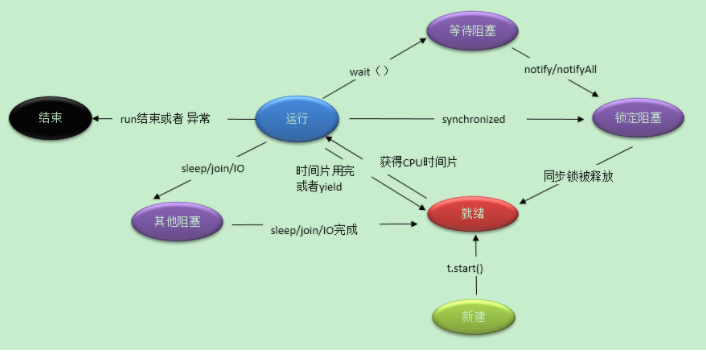

# 线程的状态转化
## 图1

```
初始态->运行态
初始态也就是新建了一个线程,必须调用t.start()才准备这进入运行状态,现在就是就绪态
```
```
就绪态->运行态 就绪态也就是获取到CPU的时间片,运行在回到就绪就是时间片用完,或者调用yield()方法
```
```
阻塞态->运行态
阻塞分为三种情况,但是它们最终只能变成就绪状态,它不可能直接变成运行状态,而是变成就绪状态.
等待阻塞,就是在等待队列中,也就是调用wait(),它notify之后还是阻塞,不过已经可以竞争锁了,当拿到锁标识的时候,就进入就绪状态了.
```
```
运行态->就绪态
```
## 图2


线程间的状态转换： 
1. 新建(new)：新创建了一个线程对象。

2. 可运行(runnable)：线程对象创建后，其他线程(比如main线程）调用了该对象的start()方法。该状态的线程位于可运行线程池中，等待被线程调度选中，获取cpu 的使用权 。

3. 运行(running)：可运行状态(runnable)的线程获得了cpu 时间片（timeslice） ，执行程序代码。

4. 阻塞(block)：阻塞状态是指线程因为某种原因放弃了cpu 使用权，也即让出了cpu timeslice，暂时停止运行。直到线程进入可运行(runnable)状态，才有机会再次获得cpu timeslice 转到运行(running)状态。阻塞的情况分三种： 

(一). 等待阻塞：运行(running)的线程执行o.wait()方法，JVM会把该线程放入等待队列(waitting queue)中。

(二). 同步阻塞：运行(running)的线程在获取对象的同步锁时，若该同步锁被别的线程占用，则JVM会把该线程放入锁池(lock pool)中。

(三). 其他阻塞：运行(running)的线程执行Thread.sleep(long ms)或t.join()方法，或者发出了I/O请求时，JVM会把该线程置为阻塞状态。当sleep()状态超时、join()等待线程终止或者超时、或者I/O处理完毕时，线程重新转入可运行(runnable)状态。

5. 死亡(dead)：线程run()、main() 方法执行结束，或者因异常退出了run()方法，则该线程结束生命周期。死亡的线程不可再次复生。

## 题1
```
下面那些情况可以终止当前线程的运行？
正确答案: B
当一个优先级高的线程进入就绪状态时
抛出一个异常时
当该线程调用sleep()方法时
当创建一个新线程时
```
解析:
```
B
当一个优先级高的线程进入就绪状态时，它只是有较高的概率能够抢到CPU的执行权，不是一定就能抢到执行权，所以A错
抛出一个例外时，该线程就终止了，所以B正确
当前线程调用sleep()方法或者wait()方法时，只是暂时停止了该线程的运行，不是终止线程，注意题目说的是“终止”，就是完全停止,所以C错误
当创建一个新的线程时，该线程也加入到了抢占cpu执行权的队伍中，但是是否能抢到，并不清楚，和A的思想一样，所以D错误
```