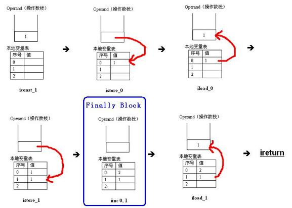

# finally
## finally不执行的情况
### 清单1
```
public class Test08 {

    public static void main(String[] args) {
        System.out.println("return value of test(): " + test());
    }

    public static int test() {
        int i = 1;

          //if(i == 1)
          //    return 0;
        System.out.println("the previous statement of try block");
        i = i / 0;

        try {
            System.out.println("try block");
            return i;
        }finally {
            System.out.println("finally block");
        }
    }
}
```
运行结果如下:
```
the previous statement of try block
Exception in thread "main" java.lang.ArithmeticException: / by zero
	at com.ccy.test13.Test08.test(Test08.java:15)
	at com.ccy.test13.Test08.main(Test08.java:6)
```
当把注解打开之后运行结果如下:
```
return value of test(): 0
```
以上两种情况都没有执行finally,所以我们得到一种情况
**在以上两种情况下，finally 语句块都没有执行，说明什么问题呢？只有与 finally 相对应的 try 语句块得到执行的情况下，finally 语句块才会执行。以上两种情况，都是在 try 语句块之前返回（return）或者抛出异常，所以 try 对应的 finally 语句块没有执行。**
### 清单2
```
  public static void main(String[] args) {
        System.out.println("return value of test(): " + test());
    }

    public static int test() {
        int i = 1;

        try {
            System.out.println("try block");
            System.exit(0);
            return i;
        }finally {
            System.out.println("finally block");
        }
    }
```
当没有在try中执行就返回了,不会执行finally,但是在try中执行代码也不一定会返回,如上代码
**finally 语句块还是没有执行，为什么呢？因为我们在 try 语句块中执行了 System.exit (0) 语句，终止了 Java 虚拟机的运行。那有人说了，在一般的 Java 应用中基本上是不会调用这个 System.exit(0) 方法的。OK ！没有问题，我们不调用 System.exit(0) 这个方法，那么 finally 语句块就一定会执行吗？
再一次让大家失望了，答案还是否定的。当一个线程在执行 try 语句块或者 catch 语句块时被打断（interrupted）或者被终止（killed），与其相对应的 finally 语句块可能不会执行。还有更极端的情况，就是在线程运行 try 语句块或者 catch 语句块时，突然死机或者断电，finally 语句块肯定不会执行了。可能有人认为死机、断电这些理由有些强词夺理，没有关系，我们只是为了说明这个问题。**
## finally和跳转语句执行的先后顺序

### 清单３
```
public static void main(String[] args) {
        try {
            System.out.println("try block");

            return ;
        } finally {
            System.out.println("finally block");
        }
    }
```
运行结果：
```
try block
finally block
```
说明在return之前执行finally中的语句.
### 清单4
```
 public static void main(String[] args) {
        System.out.println("reture value of test() : " + test());
    }

    public static int test(){
        int i = 1;

        try {
            System.out.println("try block");
            i = 1 / 0;
            return 1;
        }catch (Exception e){
            System.out.println("exception block");
            return 2;
        }finally {
            System.out.println("finally block");
        }
    }
```
运行结果:
```
try block
exception block
finally block
reture value of test() : 2
```
**从上面的清单 3 和清单 4，我们可以看出，其实 finally 语句块是在 try 或者 catch 中的 return 语句之前执行的。更加一般的说法是，finally 语句块应该是在控制转移语句之前执行，控制转移语句除了 return 外，还有 break 和 continue。另外，throw 语句也属于控制转移语句。虽然 return、throw、break 和 continue 都是控制转移语句，但是它们之间是有区别的。其中 return 和 throw 把程序控制权转交给它们的调用者（invoker），而 break 和 continue 的控制权是在当前方法内转移**

### 清单5
```
public class Test { 
public static void main(String[] args) { 
       System.out.println("return value of getValue(): " + getValue()); 
    } 
 
public static int getValue() { 
       try { 
                return 0; 
       } finally { 
                return 1; 
           } 
    } 
}
```
运行结果:
```
return value of getValue(): 1
```
### 清单6
```
public class Test { 
public static void main(String[] args) { 
       System.out.println("return value of getValue(): " + getValue()); 
    } 
 
public static int getValue() { 
       int i = 1; 
       try { 
                return i; 
       } finally { 
                i++; 
       } 
    } 
}
```
运行结果:
```
return value of getValue(): 1
```
**实际上，Java 虚拟机会把 finally 语句块作为 subroutine（对于这个 subroutine 不知该如何翻译为好，干脆就不翻译了，免得产生歧义和误解。）直接插入到 try 语句块或者 catch 语句块的控制转移语句之前。但是，还有另外一个不可忽视的因素，那就是在执行 subroutine（也就是 finally 语句块）之前，try 或者 catch 语句块会保留其返回值到本地变量表（Local Variable Table）中。待 subroutine 执行完毕之后，再恢复保留的返回值到操作数栈中，然后通过 return 或者 throw 语句将其返回给该方法的调用者（invoker）。**
看Test的字节码
```
 public static int getValue();
    descriptor: ()I
    flags: ACC_PUBLIC, ACC_STATIC
    Code:
      stack=1, locals=3, args_size=0
         0: iconst_1
         1: istore_0
         2: iload_0
         3: istore_1
         4: iinc          0, 1
         7: iload_1
         8: ireturn
         9: astore_2
        10: iinc          0, 1
        13: aload_2
        14: athrow

```

try 或者 catch 语句块会保留其返回值到本地变量表（Local Variable Table）中,也就是把原本的i保存一份,最后再返回.

```
[finally](https://www.ibm.com/developerworks/cn/java/j-lo-finally/)
```
## 题1
```
public class TestDemo
{
    public static String output = ””;
    public static void foo(inti)
    {
        try
        {
            if (i == 1)
            {
                throw new Exception();
            }
        }
        catch (Exception e)
        {
            output += “2”;
            return ;
        } finally
        {
            output += “3”;
        }
        output += “4”;
    }
    public static void main(String[] args)
    {
        foo(0);
        foo(1);
        System.out.println(output);
    }
}
```
3423