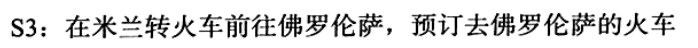

# 事务概述
在数据库中引入事务的,目的是:
事务会把数据库从一种一致的状态变成另一种一致的状态.在数据库提交的过程中,要么全部提交,要么全部不提交.
ACID:
原子性,一致性,隔离性,持久性
前面讨论的锁,主要是事务的隔离性,现在主要讨论的是事务的原子性.
## 认识事务
数据库的事务,是由一系列的sql语句组成的,可以是一条sql语句,也可以是多条sql语句.
事务是访问并且更新数据库各项数据项的程序执行单元.
事务有着ACID四个特性,但是数据库并不是完全实现这四个特性.大多数情况下,不完全遵守四个特性,可以带来性能上的提升.
对于Innodb,默认的事务隔离级别为Read repeatable 完全遵守事务的特性.

**原子性(atomicity)**
数据库事务不可分割的工作单位,事务中的全部数据库操作成功,才能称为成功.
失败的话执行成功的sql语句也会撤销.
事务中的操作如果是只读的,保持原子性是十分简单的,发生错误的话,重试或者是返回错误代码.
**一致性**
是指从一个一致性的状态到另一个一致性的状态.
在事务开始和结束,数据库的完整性约束没有被破坏.
举个例子,表中有一个字段,是name,是唯一的,如果一个事务修改name,导致name是不一致的话,这样就违反了数据库的一致性,就会发生回滚.
**隔离性**
其他的称呼:并发控制,可串行化,锁.事务的隔离性,就是对事务操作的不同对象相互不可见,通常就是通过锁来实现的,同时会采取粒度锁的策略,仅仅锁住实体对象的子集,提高子集的并发度.
**持久性**
事务一旦提交,结果就是永久的.发生宕机等故障,数据库也是可以恢复的,这都是数据库内部的原因,但是由于外部的原因,自然灾害等情况,数据就会丢失.

## 事务的分类
### 扁平事务
扁平事务是事务类型中最简单的一种,但是在实际的生产中,是使用最为频繁的事务
在扁平事务中,所有的操作都是属于同一层次的,从begin work开始到commit work或者rollback work结束,期间的操作都是原子的,要么全部执行,要么全部失败.
扁平事务是应用程序称为原子操作的基本组成模块.

这就是扁平事务的三种不同的情况.
**扁平事务主要限制就是不能回滚或者提交一部分,或者是分步骤的提交.**

### 带保存点的事务
先举个例子

如果我们在执行到s3的时候,因为特殊的情况,要在米兰停一晚上,如果是扁平事务来执行的话,就会回滚s1,s2,s3这三个操作,这样的话代价就会比较大,如果是有计划的回滚,这个时候就出现了**带保存点的事务**.
支持扁平事务之外,还允许执行过程中回滚到一个较早的状态.
对于一般的扁平事务,它阴式设置了一个保存点,

其中灰色部分表示的是回滚的内容,首先当执行到ROLLBACK WORK:2的时候就要回滚,回滚到SAVE WORK2:然后在执行到ROLLBACK WORK7,回滚到SAVE WORK7,然后再执行,然后提交.
每一次不一定+1,只要是单调递增就可以了.
### 链事务
在提交一个事务的时候,讲这个事务的上下文传递给下一个要开始的事务,

下个事务的开始就是当前事务的提交,多个事务通过传递上下文,好像同一个事务似得.
链事务只能回滚到最近的保存点,而带有保存点的事务可以回到任意的保存点

### 嵌套事务

* 嵌套事务就是一颗树,子树可以嵌套事务,也可以是扁平事务

这是比较重要的两点.
实际的工作由叶子节点完成,父节点仅仅是负责逻辑控制,决定什么时候调用相关的子事务.
**一个系统不支持子事务,但是可以通过带有保存点的事务来进行模拟**
要想实现事务之间的并行性,需要支持真正的嵌套事务.