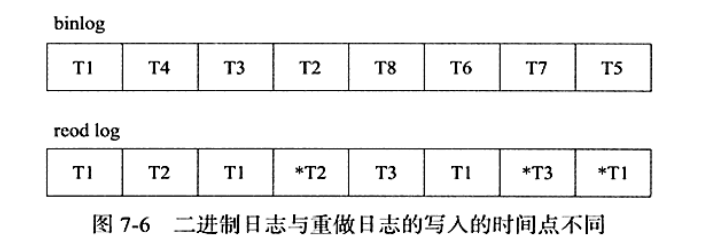

# 事务的实现
## redo
### 基本概念
redo表示的是重做日志之一
重做日志用来维持事务的持久性,就是事务中的D有两部分
重做的日志缓冲
重做的日志文件
当有事务提交时,必须将事务中所有的日志写入到重做日志中进行持久化,然后等待事务提交之后才能算完成,这里的重做日志包括两个redo log和undo log,redo  log是来保持事务的持久性,undo log是用来帮助事务回滚以及MVCC的功能.
redo是顺序写的,undo是随机读写的.
为了确保每次日志都写入到重做日志中,在每次讲重做日志写入到重做文件中,Innodb就会执行fsync的操作.
也就是通过这个将缓冲写入到磁盘上,所以磁盘的性能决定了数据库的性能,也就是数据库的功能.
Innodb可以设置非持久化的情况,依次来提高数据库的性能.    
并不是每一次的commit都要写到重写的磁盘.而是等待一个时间周期,这样有可能会造成丢失.
然后我们来看一个参数
```
mysql> show variables like 'innodb_flush_log_at_trx_commit';
+--------------------------------+-------+
| Variable_name                  | Value |
+--------------------------------+-------+
| innodb_flush_log_at_trx_commit | 1     |
+--------------------------------+-------+
1 row in set (0.01 sec)

```
这个就是写到重做日志的策略,分为0,1,2.
```
mysql> delimiter //
mysql> create procedure p_load(count int unsigned)
    -> begin
    -> declare s int unsigned default 1;
    -> declare c char(80) default repeat('a',80);
    -> while s<=count DO
    -> insert into test_load select numm,c;
    -> commit ;
    -> set s=s+1;
    -> end while;
    -> end;
    -> //
Query OK, 0 rows affected (0.00 sec)
```
我们写一个存储过程.然后插入50万次的操作,需要2分钟的时间,因为每一次的commit都要写到重写日志.
但是如果将策略改成0,这样就只需要10几秒.
这样的话就会降低性能.

**重做日志和二进制文件**
重做日志是存储引擎层,二进制文件是mysql数据库上层
二进制文件记录的是逻辑日志,对应这sql语句,而重做日志记录的是对每一个页的修改.


binlog只有在事务提交的时候才会写入.重做日志是在事务执行中就会写会.
### log block
重做日志都是以512字节存储的,重做日志的缓存,重做日志的文件都是以块的形式存储的,重做日志块.
如果一个页中产生的重做日志大于512字节,那么就要分割成多个重做日志进行存储.
重做日志的写入可以保证原子性,

header一共占用12字节,重做日志尾占用8字节.
其中LOG_BLOCK_HDR_NO表示数组所在的位置
LOG_BLOCK_HDR_DATA_LEN表示这个块的大小
LOG_BLOCK_FIRST_REC_GROUP表示整个Redo log buffer的偏移量(第一个日志所在的位置)

### log group

## undo 
### 基础概念
事务需要回滚操作,这个时候就会需要undo.因此在对数据库进行修改时,Innodb不但会产生redo,还会产生undo.
undo存放在数据库内部一个特殊的段中,这个段被称作是undo segment段.
undo segment
```
chengcongyue@chengcongyue:~/下载/innodb$ sudo python py_innodb_page_info.py /var/lib/mysql/ibdata1
[sudo] chengcongyue 的密码： 
Total number of page: 4864:
Insert Buffer Bitmap: 1
System Page: 138
Transaction system Page: 2
Freshly Allocated Page: 4389
Undo Log Page: 275
File Segment inode: 6
B-tree Node: 50
File Space Header: 3
```
undo用于数据库物理的恢复到执行语句或者事务之前的样子(XXX),
这种想法是错的.我们来看一下书中(因为是并发的,所以只是逻辑上的回到原来的样子)

实际上只是对要回滚的操作进行相反的操作

除了回滚的操作,undo的作用就是MVCC,在存储引擎中MVCC是通过undo来完成的.
### undo存储管理
rollback segment中undo log segment有1024.表示在线支持的全部的事务有1024.后来的版本支持128个rollback segment,所以一共支持的事务为1024*128
然后就是对rollback segment进一步的设置,三个属性
```
mysql> show variables like 'innodb_undo%'
    -> ;
+--------------------------+-------+
| Variable_name            | Value |
+--------------------------+-------+
| innodb_undo_directory    | ./    |
| innodb_undo_log_truncate | OFF   |
| innodb_undo_logs         | 128   |
| innodb_undo_tablespaces  | 0     |
+--------------------------+-------+
4 rows in set (0.01 sec)

mysql> show variables like 'datadir';
+---------------+-----------------+
| Variable_name | Value           |
+---------------+-----------------+
| datadir       | /var/lib/mysql/ |
+---------------+-----------------+
1 row in set (0.00 sec)
```
事务在执行,从undo log segment中分配写入到undo log的时候,同样的需要重做日志.
.

## purge
当事务在提交时,Innodb会做下面的两件事情:
将undo log放入到列表中,等purge使用
因为支持MVCC,在事务提交的时候不能马上就执行,其他的事务有可能正在引用这一行,所以需要保存记录之前的版本,如果不在被其他的事务引用,这样的话就可以删除了(通过purge)
一个页上允许多个undo log的存在,后面产生的undo lop总在后面,然后history列表进行连接.
history list表示按照事务提交的顺序将undo log进行组织.先提交的就放在后面.
然后有一个undo page,存放了history list的undo log.

先处理的是trx1和trx3,然后是trx5,结果发现被引用,然后处理trx7.
然后是undo page2依次处理 trx2,trx6,trx5
## group commit
每次事务提交都会进行一次fsync操作,依次来保证重做日志都写入了磁盘.
为了提高磁盘的fsync的效率,当前数据库都提供了group commit的功能,一次fsync操作可以确保多个事务日志被写入文件.
在事务提交时,会进行两个方面的操作:

在执行步骤2的时候可以通过group commit将多个重做日志一次刷新到磁盘.