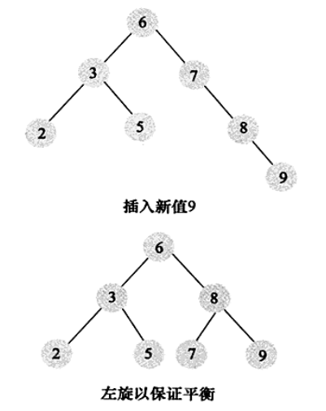
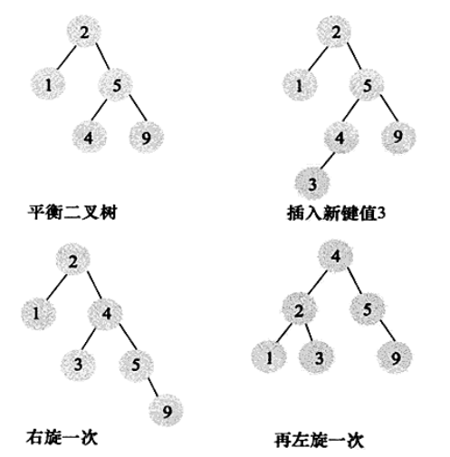
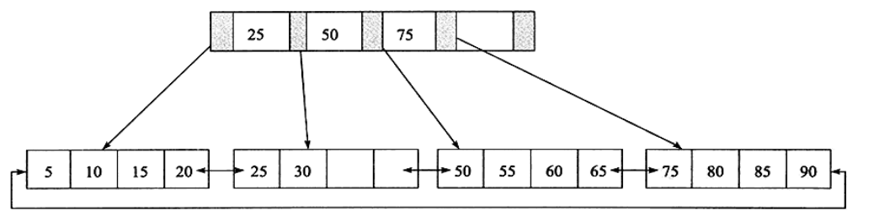
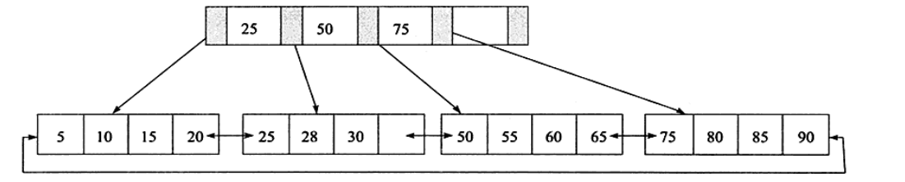
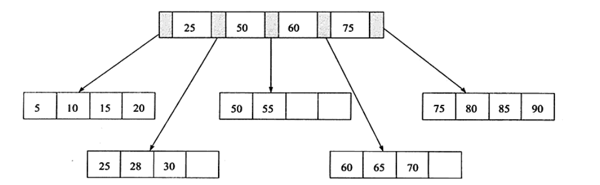
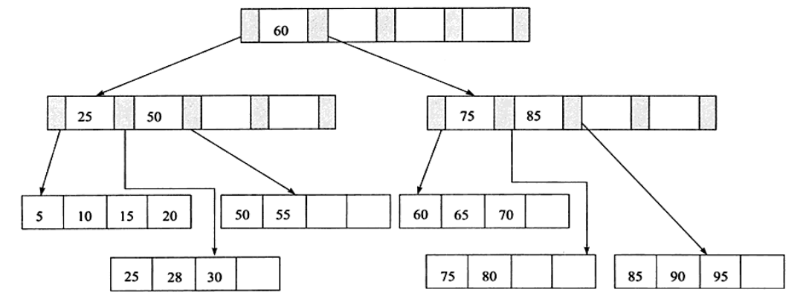
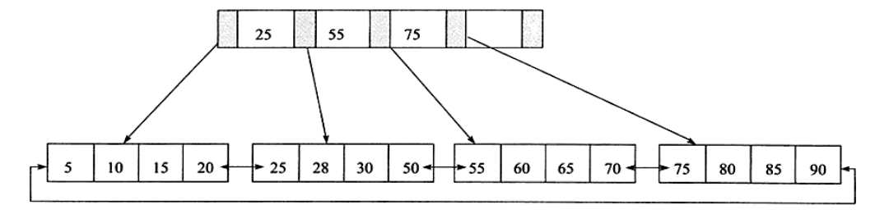
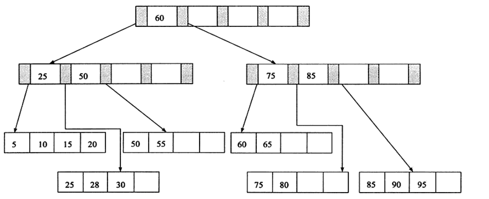
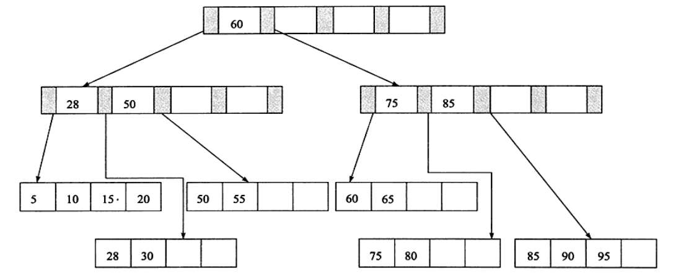

# 索引和算法(一)
## 在Innodb中,常用的索引方式如下:
* B+树索引
* 全文索引
* 哈希索引
哈希索引是自适应的,Innodb会根据自己的情况生成一个哈希索引.
b+树就是传统意义上的索引,也就是关系型数据库最常用也是最有效的索引
b树表示的是平衡而不是二叉,b+树并不是一个二叉树,
b+树索引只能找到数据行所在的页,然后把页读入到内存,然后在内存中查找,最后找到想要的数据

## 数据结构与算法
### 二分查找法
### 二叉查找树和平衡二叉树
如果想最大性能的构造一个二叉查找树,那么就引入了AVL树,**每个节点的两个子树高度差相差为1**.
维护一个平衡二叉树的代价是非常大的,需要通过左旋或者右旋(一次或者多次)来维护一个平衡二叉树,

插入9之后,通过7--8--9的左旋来维持平衡,我们再来看一个例子,

以上就要经过两次旋转,才能实现平衡二叉树的维护.
## b+树
b+树是由b树和索引顺序访问演变过来的,**b+树是为磁盘或者其他直接存储设备设计的一种平衡查找树**.
在b+树中,所有的记录节点都是按照键值的大小按顺序存放的,

所有的记录都是放在叶子节点上的,并且按照顺序存放.
### b+树的插入操作
b+树必须保证插入之后叶节点的顺序是有序的,所有对于不同的形态,采取不同的结果

现在我们插入70这个节点,这样直接插入即可,即当前的叶子节点,没有满,index page也没有满,就可以直接插入.
然后我们在此基础上插入28,现在leaf page已经满了,但这个时候index page还没有满,
我们先通过中间值进行划分,拆分叶子节点,

我们通过中间值,来划分,小于中间值的左边,大于中间值的在右边.
这是在leaf满但Index没有满的情况,然后我们看最后一种情况,在整个树都是满的情况,也就是当index page和leaf page都是满的情况,

这里要经过两次拆分,b+树为了保持平衡要进行大量的拆分操作,b+树就是用于磁盘,页的拆分就是磁盘的操作,所以经过尽可能的减少b+树的拆分操作,

这里,就没有执行拆分.
### b+树的删除操作
b+树的删除操作,这里要引入填充因子,50%是可以设的最小的值,删除之后仍要保证整体叶子节点的有序,其中还会有合并Indexpage的操作

这是删除70之后的,只是单纯的删除了70,当你删除28的时候,就要把28更新到Index page中,

**当你删除60的时候,填充因子就小于50%,这个时候就要执行合并,然后Index page执行进一步的合并**