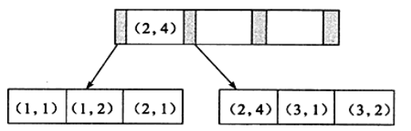
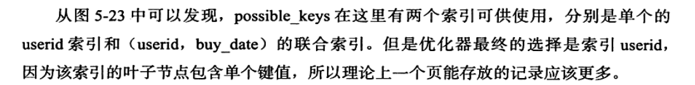
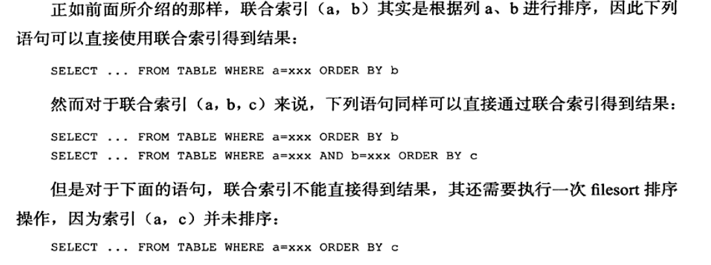
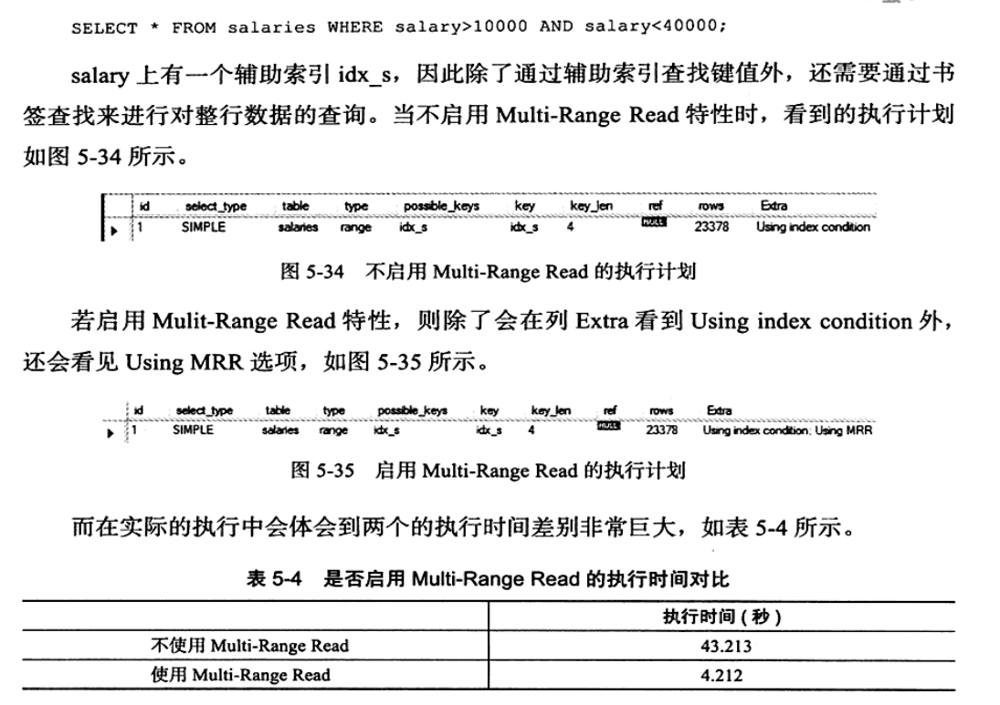
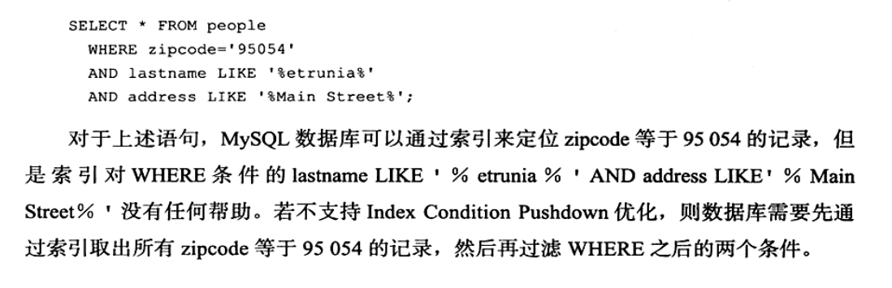

# 索引和算法(三)
B+树索引的使用
## 不同的应用场景对B+树的使用
OLTP和OLAP,不同的场景
OLTP查询操作只是数据的一小部分,10条记录一下,有时候甚至是1条记录,根据订单号获取用户信息,这就是典型的在线事务操作(OLTP),这样的话,建立的索引采用意义,即通过索引获取少量的数据.
对OLAP情况比较复杂.
## 联合索引
```
mysql> create table t( a int ,b int, primary key(a),key idx_a_b(a,b))engine=innodb;
Query OK, 0 rows affected (0.07 sec)
```
上面的例子,在查询a时会用到索引,当查询a,b时会用到索引,但是当用到b时不会使用索引.

因为我们观察可以发现,其中(a,b)和(a)都是有序的.
```
mysql> create table buy_log(userid int unsigned not null, buy_date date)engine=innodb;
Query OK, 0 rows affected (0.06 sec)

mysql> insert into buy_log values(1,'2009-01-01');
Query OK, 1 row affected (0.00 sec)

mysql> insert into buy_log values(2,'2009-01-01');
Query OK, 1 row affected (0.01 sec)

mysql> insert into buy_log values(3,'2009-01-01');
Query OK, 1 row affected (0.00 sec)

mysql> insert into buy_log values(1,'2009-02-01');
Query OK, 1 row affected (0.01 sec)

mysql> insert into buy_log values(3,'2009-02-01');
Query OK, 1 row affected (0.01 sec)

mysql> insert into buy_log values(1,'2009-03-01');
Query OK, 1 row affected (0.00 sec)

mysql> insert into buy_log values(1,'2009-04-01');
Query OK, 1 row affected (0.00 sec)

mysql> alter table buy_log add key (userid);
Query OK, 0 rows affected (0.07 sec)
Records: 0  Duplicates: 0  Warnings: 0

mysql> alter table buy_log add key (userid,buy_date);
Query OK, 0 rows affected (0.07 sec)
Records: 0  Duplicates: 0  Warnings: 0

mysql> explain select * from buy_log where userid=2;
+----+-------------+---------+------------+------+-----------------+--------+---------+-------+------+----------+-------+
| id | select_type | table   | partitions | type | possible_keys   | key    | key_len | ref   | rows | filtered | Extra |
+----+-------------+---------+------------+------+-----------------+--------+---------+-------+------+----------+-------+
|  1 | SIMPLE      | buy_log | NULL       | ref  | userid,userid_2 | userid | 4       | const |    1 |   100.00 | NULL  |
+----+-------------+---------+------------+------+-----------------+--------+---------+-------+------+----------+-------+
1 row in set, 1 warning (0.00 sec)
```
上面这个例子单个索引可以使用,组合索引也可以使用,但是使用的是userid这个索引,我们来看一下解释

```
mysql> explain select * from buy_log where userid = 1 order by buy_date desc limit 3;
+----+-------------+---------+------------+------+-----------------+----------+---------+-------+------+----------+--------------------------+
| id | select_type | table   | partitions | type | possible_keys   | key      | key_len | ref   | rows | filtered | Extra                    |
+----+-------------+---------+------------+------+-----------------+----------+---------+-------+------+----------+--------------------------+
|  1 | SIMPLE      | buy_log | NULL       | ref  | userid,userid_2 | userid_2 | 4       | const |    4 |   100.00 | Using where; Using index |
+----+-------------+---------+------------+------+-----------------+----------+---------+-------+------+----------+--------------------------+
1 row in set, 1 warning (0.00 sec)

```
这个时候就要使用联合索引,是因为在联合索引中,某一个人的createddate已经被排序好了,所以优化器会使用这个联合索引,当我们强制使用单个索引时,会在基础上在进行一次排序
上面的问题总结如下:

## 覆盖索引
如果是只查询主键的值,那么就直接通过访问辅助索引即可
覆盖索引还有一个应用场景,那么就是数量的统计,我们来下面的sql语句
```
mysql> explain select count(*) from buy_log;
+----+-------------+---------+------------+-------+---------------+--------+---------+------+------+----------+-------------+
| id | select_type | table   | partitions | type  | possible_keys | key    | key_len | ref  | rows | filtered | Extra       |
+----+-------------+---------+------------+-------+---------------+--------+---------+------+------+----------+-------------+
|  1 | SIMPLE      | buy_log | NULL       | index | NULL          | userid | 4       | NULL |    7 |   100.00 | Using index |
+----+-------------+---------+------------+-------+---------------+--------+---------+------+------+----------+-------------+
```
其中就使用了userid,统计辅助索引,这样就减少了IO的数量,这个是优化器采用实现的.
当执行统计操作的时候,也会使用到辅助索引
```
mysql> explain select count(*) from buy_log where buy_date>='2011-01-01'  and buy_date<'2011-02-01';
+----+-------------+---------+------------+-------+---------------+----------+---------+------+------+----------+--------------------------+
| id | select_type | table   | partitions | type  | possible_keys | key      | key_len | ref  | rows | filtered | Extra                    |
+----+-------------+---------+------------+-------+---------------+----------+---------+------+------+----------+--------------------------+
|  1 | SIMPLE      | buy_log | NULL       | index | NULL          | userid_2 | 8       | NULL |    7 |    14.29 | Using where; Using index |
+----+-------------+---------+------------+-------+---------------+----------+---------+------+------+----------+--------------------------+
1 row in set, 1 warning (0.00 sec)
```
覆盖索引就是能使用辅助索引,就不在使用主键索引.    
## 优化器不使用索引的情况
```
select * from orderDetails  where orderid>100000 and  orderid<10200;
```
我们给它创建了索引,orderId还有orderId和productId,这个时候我们有可能不使用索引,是因为我们要的整条的行信息,所以一定是要访问主键索引的,如果在辅助索引是有序的话,那么在主键索引就有可能是离散的(逻辑上的有序,但是物理上并不是有序的),这样的话全表扫面是顺序读, 比辅助索引的离散读,效率要高很多.

## 索引提示
mysql会显示的告诉优化器使用哪个索引.
```
mysql> create table t( a int ,b int ,key(a),key(b))engine=innodb;
Query OK, 0 rows affected (0.07 sec)

mysql> insert into t select 1,1;
Query OK, 1 row affected (0.01 sec)
Records: 1  Duplicates: 0  Warnings: 0

mysql> insert into t select 1,2;
Query OK, 1 row affected (0.01 sec)
Records: 1  Duplicates: 0  Warnings: 0

mysql> insert into t select 2,3;
Query OK, 1 row affected (0.01 sec)
Records: 1  Duplicates: 0  Warnings: 0

mysql> insert into t select 2,4;
Query OK, 1 row affected (0.01 sec)
Records: 1  Duplicates: 0  Warnings: 0

mysql> insert into t select 1,2;
Query OK, 1 row affected (0.02 sec)
Records: 1  Duplicates: 0  Warnings: 0
```
创建一个表
```
mysql> explain select * from t where a=1 and b=2;
+----+-------------+-------+------------+-------------+---------------+------+---------+------+------+----------+------------------------------------------------+
| id | select_type | table | partitions | type        | possible_keys | key  | key_len | ref  | rows | filtered | Extra                                          |
+----+-------------+-------+------------+-------------+---------------+------+---------+------+------+----------+------------------------------------------------+
|  1 | SIMPLE      | t     | NULL       | index_merge | a,b           | b,a  | 5,5     | NULL |    1 |   100.00 | Using intersect(b,a); Using where; Using index |
+----+-------------+-------+------------+-------------+---------------+------+---------+------+------+----------+------------------------------------------------+
1 row in set, 1 warning (0.00 sec)
```
其中使用了这两个索引来进行查询结果,其中Using intersect(b,a)表示的两个结果求交
```
mysql> explain select * from t use index(a) where a=1 and b=2;
+----+-------------+-------+------------+------+---------------+------+---------+------+------+----------+-------------+
| id | select_type | table | partitions | type | possible_keys | key  | key_len | ref  | rows | filtered | Extra       |
+----+-------------+-------+------------+------+---------------+------+---------+------+------+----------+-------------+
|  1 | SIMPLE      | t     | NULL       | ALL  | a             | NULL | NULL    | NULL |    5 |    20.00 | Using where |
+----+-------------+-------+------------+------+---------------+------+---------+------+------+----------+-------------+
1 row in set, 1 warning (0.00 sec)
```
我们使用use index(a)这里表示的是我们指定使用a索引,但是优化器可以选择不使用,优化器还是采用全表扫描的方式
```
mysql> select * from t force index(a) where a = 1 and b =2;
+------+------+
| a    | b    |
+------+------+
|    1 |    2 |
|    1 |    2 |
+------+------+
2 rows in set (0.00 sec)

mysql> explain select * from t force index(a) where a = 1 and b =2;
+----+-------------+-------+------------+------+---------------+------+---------+-------+------+----------+-------------+
| id | select_type | table | partitions | type | possible_keys | key  | key_len | ref   | rows | filtered | Extra       |
+----+-------------+-------+------------+------+---------------+------+---------+-------+------+----------+-------------+
|  1 | SIMPLE      | t     | NULL       | ref  | a             | a    | 5       | const |    3 |    25.00 | Using where |
+----+-------------+-------+------------+------+---------------+------+---------+-------+------+----------+-------------+
1 row in set, 1 warning (0.00 sec)
```
这里我们就强制使用了a索引

## multi-Range read
目的就是降低磁盘的随机访问,并且将随机访问转化为顺序的数据访问,
* 访问变为顺序.在使用辅助索引时,按照主键进行排序,然后按照主键的顺序进行书签查找.
* 减少缓冲页中被替换的次数
* 批量处理对键值对的查询操作
执行的操作如下:
* 将得到的辅助索引放在一个缓存中,这是缓冲中的数据是根据辅助索引的键值排序得到的,
* 然后通过rowId(主键)进行排序
* 根据排序之后来访问实际的数据文件
频繁的离散读写会导致缓冲中的页被替换出缓冲池,所以按照主键顺序进行访问,就会把这种行为降为最低,

这就是使用multi-Range read的好处,提升的速度非常多,

MRR还会将一些范围查询修改为键值对查询,以次来进行批量的处理,我们来举个例子
```
select * from t where key_part1>=1000 and key_part1<2000
and key_part2 = 1000;
```
其中有key_part1和key_part2的联合索引,在不进行优化的时候,是这样执行的,根据key_part1和key_part2进行排序,我们先讲key_part1在1000和2000之间的值得到其中包括key_part2不满足条件的,然后在通过key_part2进行过滤,这样就会有大量的无用数据.
这个时候我们启用MRR,我们会将范围查询改为查询(1000,1000),(1001,1000),(1002,1000),(1003,1000).......

## Index Condition PushDown(ICP)优化
平常我们会先通过索引来查询,然后在通过where语句.在支持Index Condition pushDown之后,在得到索引的同时,判断是否可以在进行where条件的过滤,**也就是讲where放在了存储引擎层**,这样就大大减少了对记录的索取.
我们来看一下书中的例子

