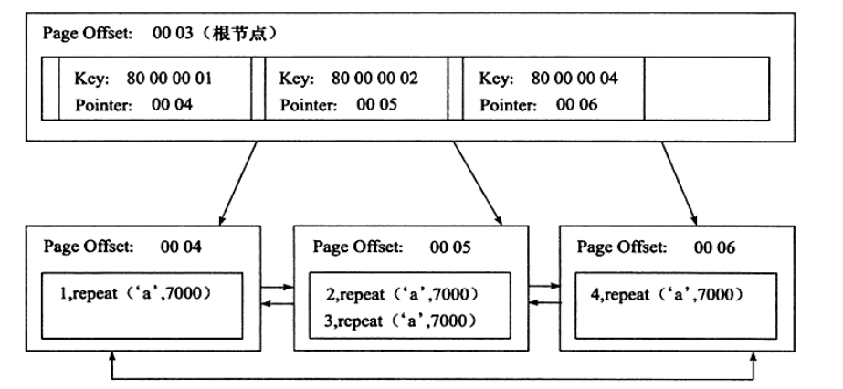

# 索引和算法(二)
上面介绍了b+树独立的数据结构,然后我们看看它是如何应用在数据库中的.

b+树在数据库中的一个重要特点,高扇出性,b+树在数据库中最大有2---4层,也就是说定位一个信息,只需要2---4此的IO操作.
b+索引在数据库中分为聚集索引和辅助索引.不管是聚集索引还是辅助索引,它内部都是b+树的样子,高度平衡.
**它们不同在于.是否存在的一整行的数据**
## 聚集索引
我们举个例子
```
mysql> create table t( a int not null,b varchar(8000),c int not null,primary key(a),key idx_c(c))engine=innodb;
Query OK, 0 rows affected (0.09 sec)
mysql> insert into t select 1,repeat('a',7000),-1;
Query OK, 1 row affected (0.01 sec)
Records: 1  Duplicates: 0  Warnings: 0

mysql> insert into t select 2,repeat('a',7000),-2;
Query OK, 1 row affected (0.01 sec)
Records: 1  Duplicates: 0  Warnings: 0

mysql> insert into t select 3,repeat('a',7000),-3;
Query OK, 1 row affected (0.01 sec)
Records: 1  Duplicates: 0  Warnings: 0

mysql> insert into t select 4,repeat('a',7000),-4;
Query OK, 1 row affected (0.02 sec)
Records: 1  Duplicates: 0  Warnings: 0
```
我们人为设定列的长度为7000,这样一个数据页下面会有两条记录,根据上面的表的笔记中所说的8093是一个阈值,超过这个阈值,就会使用blob页,7000恰好是可以放置两条数据.然后我们通过Python语言实现的工具,来检查一下
```
root@chengcongyue:/home/chengcongyue/下载/innodb# ./py_innodb_page_info.py -v /var/lib/mysql/LearningInooDB4/t.ibd
page offset 00000000, page type <File Space Header>
page offset 00000001, page type <Insert Buffer Bitmap>
page offset 00000002, page type <File Segment inode>
page offset 00000003, page type <B-tree Node>, page level <0001>
page offset 00000004, page type <B-tree Node>, page level <0000>
page offset 00000005, page type <B-tree Node>, page level <0000>
page offset 00000006, page type <B-tree Node>, page level <0000>
page offset 00000007, page type <B-tree Node>, page level <0000>
page offset 00000000, page type <Freshly Allocated Page>
Total number of page: 9:
Freshly Allocated Page: 1
Insert Buffer Bitmap: 1
File Space Header: 1
B-tree Node: 5
File Segment inode: 1
```
其中我们分析page offset 00000003, page type <B-tree Node>, page level <0001>,然后在这个表空间文件中分析,得出数据页上存放的是完整的行的记录,非数据页的索引页上存放的是键值以及数据页的偏移量,

截自书上,和我们的情况并不相同
**聚簇索引是按照顺序物理的进行存储?**根据上面的分析,我们会有这样的感觉,但是如果聚簇索引在内部是按照物理磁盘顺序存储的,这样的维护成本会非常的高
**所以聚簇索引的存储是逻辑上的连续的,但是在物理上不是.**
首先是页按照主键的顺序排序的,其次页中的数据是按照主键顺序排序的.
**聚簇索引的另一个好处,就是对于主键和范围查询的速度非常快**.
## 非聚簇索引
```
root@chengcongyue:/home/chengcongyue/下载/innodb# ./py_innodb_page_info.py -v /var/lib/mysql/LearningInooDB4/t.ibd
page offset 00000000, page type <File Space Header>
page offset 00000001, page type <Insert Buffer Bitmap>
page offset 00000002, page type <File Segment inode>
page offset 00000003, page type <B-tree Node>, page level <0001>
page offset 00000004, page type <B-tree Node>, page level <0000>
page offset 00000005, page type <B-tree Node>, page level <0000>
page offset 00000006, page type <B-tree Node>, page level <0000>
page offset 00000007, page type <B-tree Node>, page level <0000>
page offset 00000000, page type <Freshly Allocated Page>
Total number of page: 9:
Freshly Allocated Page: 1
Insert Buffer Bitmap: 1
File Space Header: 1
B-tree Node: 5
File Segment inode: 1
```
其中page offset为00000004的就是辅助索引页
```
00010000: dee6 202e 0000 0004 ffff ffff ffff ffff  .. .............
00010010: 0000 0000 0d8d 0758 45bf 0000 0000 0000  .......XE.......
00010020: 0000 0000 009b 0002 00ac 8006 0000 0000  ................
00010030: 00a4 0001 0003 0004 0000 0000 0000 4538  ..............E8
00010040: 0000 0000 0000 0000 00a3 0000 009b 0000  ................
00010050: 0002 0272 0000 009b 0000 0002 01b2 0100  ...r............
00010060: 0200 4169 6e66 696d 756d 0005 000b 0000  ..Ainfimum......
00010070: 7375 7072 656d 756d 0000 10ff f37f ffff  supremum........
00010080: ff80 0000 0100 0018 fff3 7fff fffe 8000  ................
00010090: 0002 0000 20ff f37f ffff fd80 0000 0300  .... ...........
000100a0: 0028 fff3 7fff fffc 8000 0004 0000 0000  .(..............
000100b0: 0000 0000 0000 0000 0000 0000 0000 0000  ................
```
这就是辅助索引页中的内容,它就是一个key对应这一个pointer,然后这个pointer指向的是聚集索引的.

我们看到key就是-1,-2,-3也就是列c的值,它每一个值都对应这一个pointer,这些pointer指向的就是聚集索引的Index page页.
我们来总结一下:
对于辅助索引,叶子节点并不包含行记录的全部数据.叶子节点除了键值之后,还有一个书签字段(bookmark).这个书签就会告诉你Innodb存储引擎可以找到与索引相对应的行数据.Innodb存储的索引组织表,因此Innodb的辅助索引的书签就是相应行数据的聚集索引键,

辅助索引的存在并不会影响数据在聚集索引中的组织,每个表可以有多个辅助索引,Innodb会通过遍历辅助索引并通过叶级别的指针获得并指向主键索引的主键,然后在通过主键索引的主键,然后在通过主键索引查找到一条记录.

先通过辅助索引查找到,对应的主键,然后在通过主键在聚簇索引中找到最终的数据页.
## b+树索引的分裂
## b+树索引的管理
### 索引的管理
```
mysql> alter table t add key idx_b (b(100));
Query OK, 0 rows affected (0.07 sec)
Records: 0  Duplicates: 0  Warnings: 0

mysql> alter table t add key idx_a_c(a,c);
Query OK, 0 rows affected (0.06 sec)
Records: 0  Duplicates: 0  Warnings: 0

mysql> show index from t;
+-------+------------+----------+--------------+-------------+-----------+-------------+----------+--------+------+------------+---------+---------------+
| Table | Non_unique | Key_name | Seq_in_index | Column_name | Collation | Cardinality | Sub_part | Packed | Null | Index_type | Comment | Index_comment |
+-------+------------+----------+--------------+-------------+-----------+-------------+----------+--------+------+------------+---------+---------------+
| t     |          0 | PRIMARY  |            1 | a           | A         |           4 |     NULL | NULL   |      | BTREE      |         |               |
| t     |          1 | idx_c    |            1 | c           | A         |           4 |     NULL | NULL   |      | BTREE      |         |               |
| t     |          1 | idx_b    |            1 | b           | A         |           1 |      100 | NULL   | YES  | BTREE      |         |               |
| t     |          1 | idx_a_c  |            1 | a           | A         |           4 |     NULL | NULL   |      | BTREE      |         |               |
| t     |          1 | idx_a_c  |            2 | c           | A         |           4 |     NULL | NULL   |      | BTREE      |         |               |
+-------+------------+----------+--------------+-------------+-----------+-------------+----------+--------+------+------------+---------+---------------+
5 rows in set (0.00 sec)

```
show index就是查看table中所有的索引状况.
 Cardinality是比较重要的值,优化器根据这个值来判断要不要使用这个索引.在运行之前使用几次analyze table能够是索引和优化器更好的操作.

### fast Index creation
最原先的操作mysql数据库对于索引的添加和删除这类的DDL操作

因此就有了快速索引创建.FIC
对于辅助索引的创建,会在这个表上加s锁,FIC的方式只适合与辅助索引,在加锁期间只能进行读操作,对于主键的创建和删除同样要重建一张表.
### Online schema change
facebook 在执行事务操作的时候,可以对数据库进行读写操作,提高并发性,
php代码操作而不是对Innodb进行源码修改,
### Online DDL
在创建辅助索引的同时,还允许执行其他的ddl操作
## Cardinality
### 什么是Cardinality?
并不是所有的列都要索引,什么时候添加索引?在访问表中很少的一部分才会使用索引.对于性别,类型字段,属于低选择性字段. 
如果一个字段基本没有重复值,这就是高选择性,适合设置为索引,比如说姓名字段.
Cardinality就是对字段选择性的估计.不重复数量的预估值,不是一个准确值,在实际的开发应用中,Carinality/n_rows_in_table应尽可能的接近于1,太小的话表示可以不用这个索引,

这个时候就使用了userNick的索引.
## Cardinality的统计
采用抽样的方式得到这个值,Cardinality的更新发生在Insert和update中.我们更新的策略不可能是每一次Insert和update操作就更新一次Cardinality,
我们采用的策略如下:

解释一下:在上一次的Cardinality操作之后表中有1/16的数据发生了变化.第二种表示的是在存储引擎内部有一个计数器,表示变化的次数