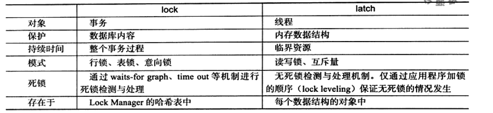
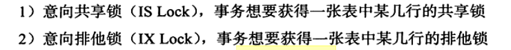
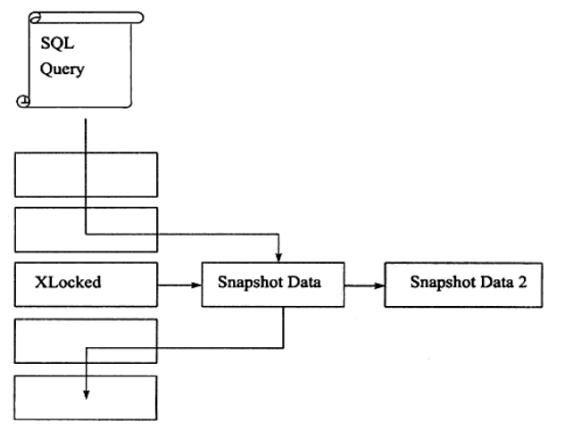
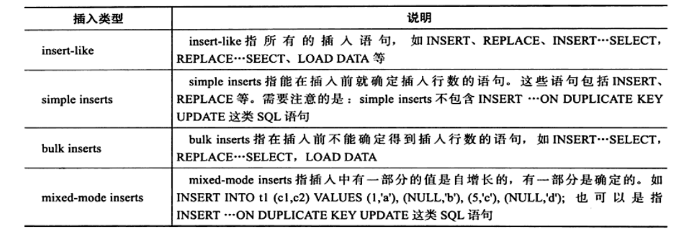
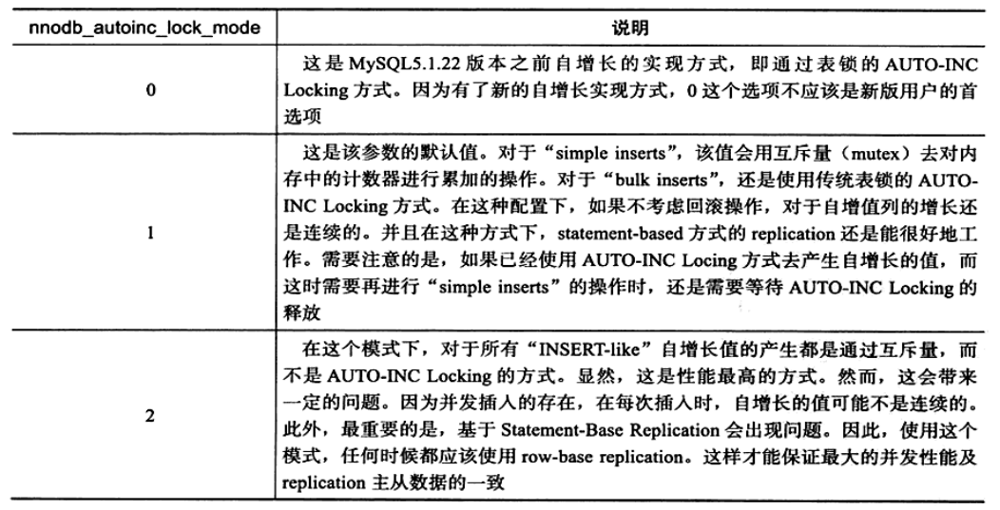
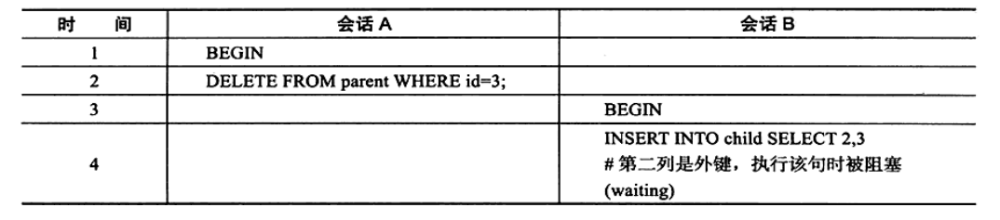

# 锁(一)
最大程度的利用数据库的并发访问,确保每个用户以一致性的方式读取和修改数据,因此就有了锁的机制,**锁机制也是区别于文件系统的关键特性**.
我们先来了解一下什么是锁?
## 锁的概述
锁机制用来管理对共享资源的并发访问.Innodb存储引擎会在行级别上对表数据上锁.不过Innodb也会在数据库的其他位置上锁,操作缓冲池的LRU列表,删除添加修改LRU,为了保证LRU的一致性,必须有锁的介入.
我们在来了解一下其他存储引擎的锁的实现方式
对于MyISAM引擎来说,其锁是表锁.并发情况下读是没有问题的,但是插入性能就差很多,如果是对底部的操作,还是有一定的并发度的.
对于SQL server来说,这个存储引擎是页锁的,相对于表锁,页锁的性能有所提高.后来SQL server开始支持乐观并发和悲观锁.在SQL server下锁是一种稀有资源,锁也多开销就会越大,然后就会有锁的升级
**Innodb存储引擎锁的实现和Oracle数据库十分相似,提供一致性的非锁定读,行锁支持**

## lock与Latch
Latch是轻量级的锁,Latch在Innodb中又分为metux和rwlock.保证并发线程操作临界资源的正确性,通常没有死锁检测的机制.
Lock的对象是事务,锁定数据库中的对象,表,页,行.一般的话Lock实在事务commit和rollback后释放,lock是有死锁机制的.

```
mysql> show engine innodb mutex;
+--------+------------------------+---------+
| Type   | Name                   | Status  |
+--------+------------------------+---------+
| InnoDB | rwlock: log0log.cc:838 | waits=2 |
+--------+------------------------+---------+
1 row in set (0.00 sec)
```
Latch锁的名字以及锁源码所在的位置.

## Innodb存储引擎中的锁
### 锁的类型
S lock 共享锁     **允许事务读一行数据**
X lock 排他锁     **允许事务删除和更新一行数据**
**如果事务1获取到了某一行的共享锁,事务2也能够获得行r的共享锁,这种情况叫做锁兼容**

在锁兼容的情况中,只有共享锁和共享锁是兼容的,其他情况都是不兼容的,

Innodb支持**多粒度**锁定,这时候就引入了意向锁,对数据库进行更深层次的分类,意向锁表示在更细的粒度上进行加锁,
如果把上锁的对象看做是一颗树,如果要对细粒度的上锁,首先要对粗粒度的上锁
如果我们要对一行上X锁,那么分别需要对数据库A,表,页上意向锁IX,最后对记录上X锁.

我们举个例子:
在对记录r加X锁之前,已经有事务对表1进行了S表锁,那么表1上已经存在S锁,这个时候要加意向锁IX,由于不兼容,所以该事务要等待锁操作的完成.
意向锁是表层次的锁,为了在一个事务中揭示下一行被请求的锁类型.


### 一致性非锁定读
一致性的非锁定读是指Innodb存储引擎通过版本控制的方式读取当前执行时间数据库中行的数据.如果读取的行正在执行Delete或者update操作,这个时候不回去等待锁的释放,而是去读取行的快照数据.
非锁定读,就是指不需要等待x锁的释放.读取的是快照数据,这个实现是通过undo段实现的,

快照就是指当前行数据的历史版本,每个行记录都会有多个版本,**行多版本技术**,**多版本并发控制(MVCC)**
不同的隔离级别下,对快照的定义也不同,Innodb默认的repeatable read(Innodb存储引擎的默认事务隔离级别),这里的快照指的是读取事务开始时的行数据文件,
我们用两个回话
```
session A
mysql> create table parent (id int)engine=innodb;
Query OK, 0 rows affected (0.06 sec)

mysql> insert into parent select 1;
Query OK, 1 row affected (0.01 sec)
Records: 1  Duplicates: 0  Warnings: 0
mysql> begin ;
Query OK, 0 rows affected (0.00 sec)

mysql> select * from parent where id = 1;
+------+
| id   |
+------+
|    1 |
+------+
1 row in set (0.00 sec)
```
然后这个时候有session B
```
mysql> begin ;
Query OK, 0 rows affected (0.00 sec)

mysql> update parent set id =3 where id =1 ;
Query OK, 1 row affected (0.00 sec)
Rows matched: 1  Changed: 1  Warnings: 0

mysql> commit ;
Query OK, 0 rows affected (0.01 sec)

mysql> select * from parent;
+------+
| id   |
+------+
|    3 |
+------+
1 row in set (0.00 sec)

```
这个时候,我们看sessionA
```
mysql> select * from parent where id = 1;
+------+
| id   |
+------+
|    1 |
+------+
1 row in set (0.00 sec)

mysql> select @@tx_isolation;
+-----------------+
| @@tx_isolation  |
+-----------------+
| REPEATABLE-READ |
+-----------------+
1 row in set, 1 warning (0.00 sec)
```
对于Read commit版本,它总是会读取最新的版本,所以在session b提交之后,读取到的就是3.但是对于这种隔离级别,实际上违背了ACID中的隔离性
但是Repeatable读取到的一直都是1,它的快照就是事务开始之前的版本.

### 自增长与锁
自增长是数据库中开发人员获取主键的方式.在Innodb中,每一个表都有一个自增长计数器. Auto_INC_LOCKING,特殊的表锁机制,为了提高插入的性能,锁不是在事务提交之后才释放,而是完成插入SQL语句就释放了.
但是依然需要等待前一个插入完,才能够插入,

**后来又提出了轻量级互斥量的自增长机制**
首先我们先了解一下Insert的种类

总结一下:insert-like表示全部的插入语句
simple inserts表示插入前可以确定插入的行数.
bulk inserts插入前不能确定插入行数的语句
mixed-mode inserts



### 外键和锁
父表
```
mysql> show create table parent;
+--------+--------------------------------------------------------------------------------------------------------------+
| Table  | Create Table                                                                                                 |
+--------+--------------------------------------------------------------------------------------------------------------+
| parent | CREATE TABLE `parent` (
  `id` int(11) NOT NULL,
  PRIMARY KEY (`id`)
) ENGINE=InnoDB DEFAULT CHARSET=latin1 |
+--------+--------------------------------------------------------------------------------------------------------------+
1 row in set (0.00 sec)
```
子表
```
mysql> show create table child;
+-------+----------------------------------------------------------------------------------------------------------------------------------------------------------------------------------------------------------------------+
| Table | Create Table                                                                                                                                                                                                         |
+-------+----------------------------------------------------------------------------------------------------------------------------------------------------------------------------------------------------------------------+
| child | CREATE TABLE `child` (
  `id` int(11) NOT NULL,
  `pid` int(11) DEFAULT NULL,
  KEY `pid` (`pid`),
  CONSTRAINT `child_ibfk_1` FOREIGN KEY (`pid`) REFERENCES `parent` (`id`)
) ENGINE=InnoDB DEFAULT CHARSET=latin1 |
+-------+----------------------------------------------------------------------------------------------------------------------------------------------------------------------------------------------------------------------+
1 row in set (0.00 sec)
```
这个时候我们开启两个线程,也就是两个窗口.
父进程
```

mysql> begin;
Query OK, 0 rows affected (0.00 sec)

mysql> delete from parent where id =3;
Query OK, 1 row affected (0.00 sec)

mysql> 

```
子进程
```

mysql> begin ;
Query OK, 0 rows affected (0.00 sec)

mysql> insert into child select 2,3;
在这儿发生了死锁
```
我们看一下书中的timeLine

我们来解释一下原因:
首先是给父表添加了X锁,因为对这个进行修改,然后开始了回话b,这个时候我们要修改子表,我们这个时候要为父表添加一个s锁,这个时候就会阻塞.