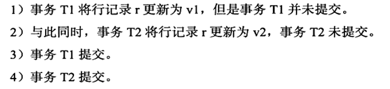
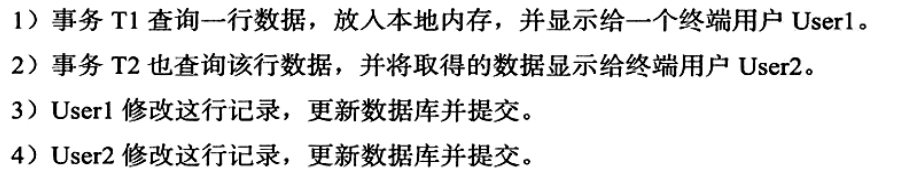
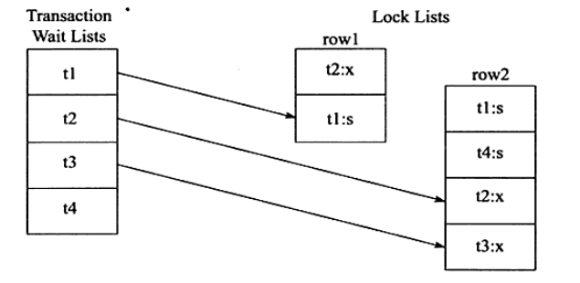
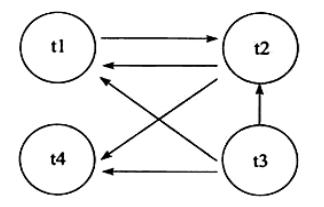
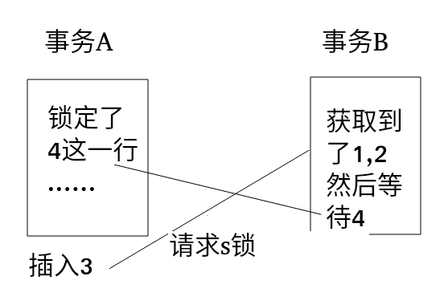

# 锁(三)
## 锁问题
### 脏读
* 脏数据和脏页的区别
脏页表示的是在缓冲池已经被修改的页,但是还没有刷新到磁盘中.脏页的产生是正常的,是数据库实例内存和磁盘的异步造成的,不会影响数据的一致性.
**脏数据**表示的是读到了还没有提交的数据.一个事务读到了另一个事务中的数据,这个就是脏读,违反了数据库的隔离性.

```
mysql> set session tx_isolation='read-uncommitted';
Query OK, 0 rows affected, 1 warning (0.00 sec)

mysql> select @@tx_isolation;
+------------------+
| @@tx_isolation   |
+------------------+
| READ-UNCOMMITTED |
+------------------+
1 row in set, 1 warning (0.00 sec)

mysql> begin;
Query OK, 0 rows affected (0.00 sec)

mysql> insert into t select 10;
Query OK, 1 row affected (0.00 sec)
Records: 1  Duplicates: 0  Warnings: 0

mysql> commit;
Query OK, 0 rows affected (0.01 sec)
```
然后就是另一个会话
```
mysql> set session tx_isolation='read-uncommitted';
Query OK, 0 rows affected, 1 warning (0.00 sec)

mysql> select @@tx_isolation;
+------------------+
| @@tx_isolation   |
+------------------+
| READ-UNCOMMITTED |
+------------------+
1 row in set, 1 warning (0.00 sec)

mysql> begin ;
Query OK, 0 rows affected (0.00 sec)

mysql> select * from t;
+---+
| a |
+---+
| 1 |
| 2 |
| 4 |
| 5 |
+---+
4 rows in set (0.00 sec)

mysql> select * from t;
+----+
| a  |
+----+
|  1 |
|  2 |
|  4 |
|  5 |
| 10 |
+----+
5 rows in set (0.00 sec)

mysql> commit;
Query OK, 0 rows affected (0.00 sec)
```
### 不可重复读
表示第一个事务两次查询事务之间,由于另一个事务的修改,导致第一次事务两次的内容是不同的.
不可重复读和脏读的区别.
脏读是读到未提交的数据,不可重读读到的是已经提交的数据.违反了一致性的要求.
不可重复读也就是我们上面说的幻象问题

### 丢失更新
一个事务的更新操作会被另一个事务的更新给覆盖.
但是任何隔离级别下,都不会导致数据库理论意义上的丢失更新,因为丢失更新,我们来看一下会引发丢失更新的情况

其中t2对r进行更新的时候,不会成功,而会阻塞.
数据库本身是可以阻塞丢失更新问题的.
我们来举一个银行转账的例子:
一个用户有10000,他用两个客户端分别进行转账操作,第一个客户端转账9000,另一个转账1元,最后余额会显示9999,钱变多,账不平.

## 阻塞
## 死锁
两个或者多个事务在执行过程中,因为争夺资源而造成的相互等待的现象.
解决死锁最简单的方式就是不要有任何的等待,直接回滚.这样并发性会降低,而且会浪费资源.或者通过超时机制,根据FIFO的顺序回滚对象,如果超时的事务比较大,然后回滚很多行,会产生undo log,采用FIFO的方式,就不大合适.
wait-for-graph(等待图)进行死锁检测,
* 锁的信息链表
* 事务等待链表
通过链表构造出图来,然后如果存在回路,就代表死锁,

然后我们统计一下,有四个事务t1,t2,t3,t4,然后t2占用x锁,t3占用s锁.
然后t1等待的有t2
t2等待的有t1,t4
t3等待的有t1,t4,它和t2等待的一样,所以它也等待t2.图如下;

**系统中事务的数量越多,死锁的概率就越大**
**每个事务操作的数量也多,发送死锁的可能性越大**
**操作数据的集合,数据量越小,越容易发生死锁**
```
mysql> begin ;
Query OK, 0 rows affected (0.00 sec)

mysql> select * from t where a =1 for update;
+---+
| a |
+---+
| 1 |
+---+
1 row in set (0.00 sec)

mysql> select * from t where a = 2 for update;
+---+
| a |
+---+
| 2 |
+---+
1 row in set (9.47 sec)

```
```
mysql> begin;
Query OK, 0 rows affected (0.00 sec)

mysql> select * from t where a = 2 for update;
+---+
| a |
+---+
| 2 |
+---+
1 row in set (0.00 sec)

mysql> select * from t where a = 1 for update;
ERROR 1213 (40001): Deadlock found when trying to get lock; try restarting transaction
```
发生死锁之后就会回滚一个事务.

```
mysql> begin ;
Query OK, 0 rows affected (0.00 sec)

mysql> select * from t where a = 4 for update;
+---+
| a |
+---+
| 4 |
+---+
1 row in set (0.00 sec)

mysql> insert into t values (3);
ERROR 1213 (40001): Deadlock found when trying to get lock; try restarting transaction

```
```
mysql> create table t (a int primary key)engine = innodb;
Query OK, 0 rows affected (0.05 sec)

mysql> insert into t values(1),(2),(4),(5);
Query OK, 4 rows affected (0.01 sec)
Records: 4  Duplicates: 0  Warnings: 0

mysql> begin ;
Query OK, 0 rows affected (0.00 sec)

mysql> select * from t where a<=4 lock in share mode;
+---+
| a |
+---+
| 1 |
| 2 |
| 4 |
+---+
3 rows in set (7.90 sec)

```

画一个图解释一下:
