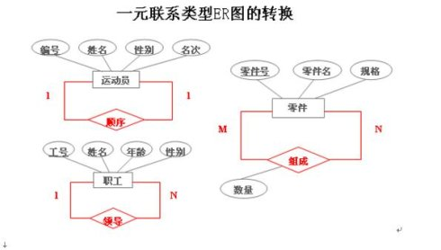

# 练习题
## 1 
```
图是一个“虚表”，视图的构造基于(  )。
正确答案: C   你的答案: A (错误)
基本表
视图
基本表或视图
数据字典
```
解析:
数据库存储数据是通过表来实现的，其有物理存储空间，也是你数据真正存储的地方。可以通过对表的操作来实现你对数据的操作。
视图其实是物理不存在的，其是通过数据库代码来将一些表中的数据进行一个想要的逻辑结构重新进行整理。视图是从一个或几个基本表（或视图）中导出的虚拟的表
## 2
原子性：一个事务对数据库的所有操作，是一个不可分割的工作单元，这些操作要么全部执行，要么什么也不做（由DBMS的事务管理子系统来实现）；
一致性：一个事务独立执行的结果，应（由DBMS的完整性子系统执行测试任务）；
隔离性（由DBMS的并发控制子系统实现）；
持久性（由DBMS的恢复管理子系统实现的）
## 3
数据库的特点是数据共享、数据独立、减少数据冗余、避免数据不一致和加强数据保护
## 4
数据库系统是指数据库和数据库管理系统软件的合称。数据库管理系统是一个帮助用户创建和管理数据库的应用程序的集合。数据结构描述数据的类型、内容、性质以及数据间的联系。数据库是指存储在计算机内有结构的数据集合。
## 5
使用命令方式修改表结构时，使用MODIFY STRUCTURE命令，将当前已打开的表文件的表设计器打开进行修改。
## 6
为在搜索子句中使用通配符，必须使用LIKE操作符：
1、百分号（%）通配符：可匹配0个、1个或多个字符
2、下划线（_）通配符：只可匹配单个字符
## 7
如果有9个不同的实体集，它们之间存在着12个不同的二元联系（二元联系是指两个实体集之间的联系），其中4个1:1联系，4个1:N联系，4个M:N联系，那么根据ER模型转换成关系模型的规则，这个ER结构转换成的关系模式个数为？
9+4=13个
例子
### 实例1
将教学管理ER图转换为关系模式

(1)把三个实体类型转换成三个模式：
　　 ①系（系编号，系名，电话）
　　 ②教师（教工号，姓名，性别，职称）
　　 ③课程（课程号，课程名，学分）
(2)对于1:1联系“主管”，可以在“系”模式中加入教工号（教工号为外键）。对于1:N联系“聘用”，可以在“教师”模式中加入系编号和聘期两个属性（系编号为外键）:
　　 ①系（系编号，系名，电话，主管人的教工号）
　　 ②教师（教工号，姓名，性别，职称，系编号，聘期）
(3)第三步：对于M:N联系“任教”，则生成一个新的关系模式：
　　 ①任教（教工号，课程号，教材）
(4)这样，转换成的四个关系模式如下：
　　 ①系（系编号，系名，电话，主管人的教工号）
　　 ②教师（教工号，姓名，性别，职称，系编号，聘期）
　　 ③课程（课程号，课程名，学分）
　　 ④任教（教工号，课程号，学分）
### 实例2
实例2：一元联系类型ER图结构转换为关系模式

(1)运动员名次之间存在着1:1联系
　　 ①运动员（编号，姓名，性别，名次，上一名次编号）
(2)职工之间存在上下级联系，即1:N联系
　　 ①职工（工号，姓名，年龄，性别，经理工号）
(3)工厂的零件之间存在着组合关系（M:N联系）
　　 ①零件（零件号，零件名，规格）
　　 ②组成（零件号，子零件号，数量）
## 8
```
并发操作会带来哪些数据不一致性（ ）？
正确答案:D 
丢失修改、不可重复读、读脏数据、死锁
不可重复读、读脏数据、死锁
丢失修改、读脏数据、死锁
丢失修改、不可重复读、读脏数据
```
并发操作可能破坏事务的隔离性，带来的数据不一致性包括三类：丢失修改、不可重复读、读“脏”数据。
### 死锁的条件


