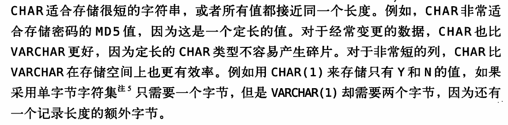

# 数据类型的优化
数据类型优化的原则:
* 更小的通常更好,尽量使用可以正确存储数据的最小数据类型,更小的数据类型意味着更小的磁盘,内存和CPU,处理的CPU周期会更小,
* 简单: 简单的数据类型需要更少的CPU周期.比如:整形比字符型更简单,以为字符型还需要字符集和数据规则.举两个例子:存储时间应该用数据库自带的类型而不是字符串类型,要通过整形来存储IP
* 避免NULL:存在null的列,更加难以优化,因为null值会使得索引,索引统计和值更加复杂,但对于Innodb通过一位(bit)来存储null值,对于稀疏数据有着很好的空间效率.


首先选择大的数据类型,然后选择具体的数据类型,mysql中数据类型可以存储相同类型的数据,只是存储的时间和范围不一样,精度不一样,需要的物理空间不一样.
datetime和timesamp都是用来存储时间的,timesamp占用一半的datetime的空间,timesamp的范围比较小.


## 整数类型
tinyInt smallInt mediumInt int bigInt分别是8 16 24 32 64.unsigned表示非负.
有符号和无符号都选择相同的空间,具有相同的空间
mysql可以执行长度 int(11),但是这只是显示问题,int(1)和int(10)在存储方面是一样的.

## 实数类型
DECIMAL存储比BIGINT还大的整数,但主要是用来存储带小数点的实数的,mysql支持准确类型,也支持不精确类型.
DECIMAL用来存储精确的小数,CPU不支持DECIMAL的运算,在mysql的高版本中实现了服务器自身都DECIMAL的运算,
DECIMAL(18,9)表示小数点两边存储9个数字(每四个字节存储9个数字),那么这个DECIMAL(18.9)需要9个字节,前面4个字节,后面四个字节.
在计算中会转换为double
只有在对小数点精确计算的时候才会使用DECIMAL类型,

## 字符串类型
### varchar和char类型
每个字符串列都可以定义自己的字符集和排序规则
VARCHAR 类型用来存储可变长的字符串,只使用必要的空间,

1个或者2个额外空间.

VARCHAR节省了存储空间,对性能也有帮助.但是行是变长的,Update可能是行变的比原来更长,这就需要额外的工作,myISAM会拆成不同的片,而Innodb会进行页分裂...


字符串列的最大长度比平均长度大很多,列的更新比较少,在mysql更高的版本,mysql存储和检索时会保留空格
Innodb会把过长的varchar存储为blob


```
mysql> create table char_test(char_col char(10));
Query OK, 0 rows affected (0.08 sec)
mysql> insert into char_test(char_col) values('string1'),(' string2'),('string3 ');
Query OK, 3 rows affected (0.00 sec)
Records: 3  Duplicates: 0  Warnings: 0

mysql> select concat("'",char_col,"'") from char_test;
+--------------------------+
| concat("'",char_col,"'") |
+--------------------------+
| 'string1'                |
| ' string2'               |
| 'string3'                |
+--------------------------+
3 rows in set (0.00 sec)
mysql> create table char_test2(char_col varchar(10));
Query OK, 0 rows affected (0.06 sec)
mysql> insert into char_test2(char_col) values('string1'),(' string2'),('string3 ');
Query OK, 3 rows affected (0.01 sec)
Records: 3  Duplicates: 0  Warnings: 0
mysql> select concat("'",char_col,"'") from char_test2;                         +--------------------------+
| concat("'",char_col,"'") |
+--------------------------+
| 'string1'                |
| ' string2'               |
| 'string3 '               |
+--------------------------+
3 rows in set (0.00 sec)
```
### blob和test类型
Innodb在blob和test过大时就会在额外的存储空间存储,然后在用一个指针指向.并且排序只会对其中前面一部分进行排序
### 枚举类型
```
mysql> create table enum_test( e enum ('fish','apple','dog') not null);
Query OK, 0 rows affected (0.06 sec)

mysql> insert into enum_test(e) values ('fish'),('dog'),('apple');
Query OK, 3 rows affected (0.01 sec)
Records: 3  Duplicates: 0  Warnings: 0

mysql> select e+0 from enum_test;
+-----+
| e+0 |
+-----+
|   1 |
|   3 |
|   2 |
+-----+
3 rows in set (0.00 sec)

mysql> select e from enum_test;
+-------+
| e     |
+-------+
| fish  |
| dog   |
| apple |
+-------+
3 rows in set (0.00 sec)

mysql> select e from enum_test order by e;
+-------+
| e     |
+-------+
| fish  |
| apple |
| dog   |
+-------+
3 rows in set (0.01 sec)

mysql> select e from enum_test order by field(e,'apple','dog','fish');
+-------+
| e     |
+-------+
| apple |
| dog   |
| fish  |
+-------+
3 rows in set (0.00 sec)
```
内部是按照整数存储的,然后进行排序的时候要使用field.
### 时间类型

## mysql schema设计中的陷阱
太多的列
工作方式:**服务器层和存储引擎层通过行缓冲格式拷贝数据**,然后在服务器层将缓冲内存转化为各个列,
转换的代价依赖于列的数量,
太多的关联
全能的枚举
....    