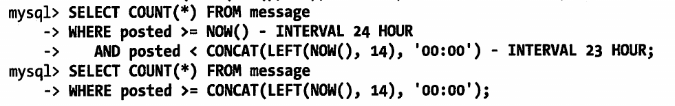
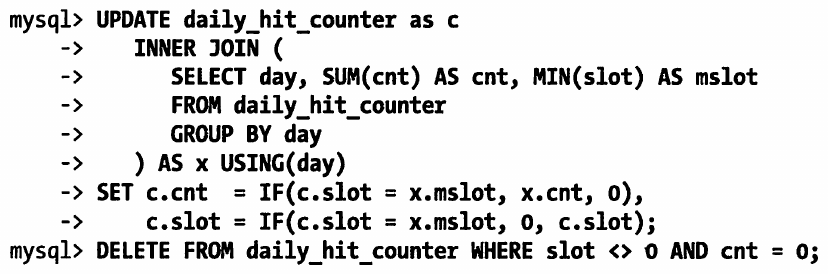

# 汇总表和缓冲表
分析书上了两个例子
```
mysql> select sum(cnt) from msg_per_hr
    -> where hr between 
    -> concat(left(now(),14),'00:00')-interval 23 hour
    -> and concat(left(now(),14),'00:00')-interval 1 hour;
```
计算的是整的小时数期间的消息数,然后就是计算两个不完整的.


## 计数器
### 串行化的计数器
这个就是最简单的计数器
```
mysql> update hit_counter set cnt=cnt+1;
ERROR 1146 (42S02): Table 'learningMysql.hit_counter' doesn't exist
mysql> create table hit_counter(cnt int unsigned not null)engine=innodb;
Query OK, 0 rows affected (0.06 sec)

mysql> update hit_counter set cnt=cnt+1;
Query OK, 0 rows affected (0.00 sec)
Rows matched: 0  Changed: 0  Warnings: 0
```
这样的化计数只能是串行的.
### 获得更高的并发性
```
mysql> create table hit_counter(
    -> slot tinyint unsigned not null primary key,
    -> cnt int unsigned not null)engine = innodb;
Query OK, 0 rows affected (0.05 sec)

mysql> update hit_counter set cnt=cnt+1 where slot = rand()*100;
Query OK, 0 rows affected (0.00 sec)
Rows matched: 0  Changed: 0  Warnings: 0

mysql> select sum(cnt) from hit_counter;
```
其中我们先添加100个槽,最后计算结果的时候,只需要把其中的值做sum就可以了.

### 添加日期
```
mysql> create table daily_hit_counter(
    -> day date not null,
    -> slot tinyint unsigned not null,
    -> cnt int unsigned not null,
    -> primary key(day,slot))engine=innodb;
Query OK, 0 rows affected (0.06 sec)

mysql> insert into daily_hit_counter(day,slot,cnt) 
    -> values (current_date,rand()*100,1)
    -> on duplicate key update cnt=cnt+1;
Query OK, 1 row affected (0.00 sec)
```
最后可以把他合并大0号槽中,并且删除其他的槽.
执行如下:
