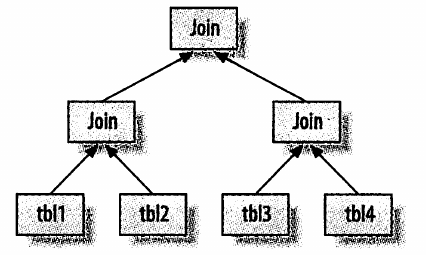
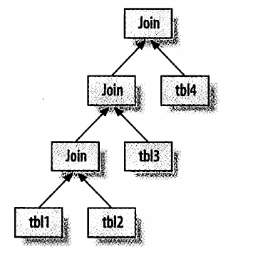

# 优化查询(二)
## 复杂查询和简单查询的抉择
mysql轻量级的查询是非常快的.
但是如果一个复杂查询能够完成工作还要拆分成多个独立查询是不明智的.扫描行数的方面.

## 切分查询
删除旧的数据.如果一次性执行一个大的语句去删除旧的数据.就有可能引起资源的耗尽.
**所以要将一个大的删除语句拆分成几个小的.**
普通的sql语句
```
deleted from messages where created < date_sub(now(),interval 3 month);
```
将大的删除划分成几个小的删除:
```
row_affected=0
do{
   row_affected=(
      "delete from messages where created<date_sub(now(),interval 3 month limit 10000)"
   )
}while(row_affected > 0)
```
同时可以在删除完成后有一个小小的停顿.减少删除时锁的持有时间.
## 分解关联查询
```
mysql> select * from tag
    -> join tag_post on tag_post.tag_id=tag.id
    -> join post on tag_post.post_id=post.id
    -> where tag.tag='mysql';
```
分解之后
```
mysql> select * from tag where tag='mysql';
mysql> select * from tag_post where tag_id=1234;
mysql> select * from post where post.id in (123,456,789,9898,232);
```
分解关联查询的优势:
* 让缓存的效率更高.
如果其中的一条语句已经被缓存了mysql> select * from tag where tag='mysql';在执行这一条语句就直接使用缓存就可以了.
mysql> select * from post where post.id in (123,456,789,9898,232);如果已经缓存了其中的几个id,在查询的时候少查几个. 

* 执行单个查询可以降低锁的竞争
* 在应用层做关联,更容易对数据库进行拆分.高性能和可拓展性
* 查询的本身效率就会提高,使用了in,使得mysql按照id的顺序进行查询
* 减少冗余数据的查询
* 哈希关联


## 查询执行的基础

* 客户端发送查询给服务器
* 查询之前先看缓存,有的话直接返回
* 要进行查询了,先对sql进行解析,预处理,然后再由优化器生成对应的执行计划.
* mysql根据执行计划,直接调用存储引擎的API来执行查询
* 返回
### mysql客户端/服务器通信协议
通信协议是半双工的,服务端向客户端发送数据,和客户端向服务器发送数据.不能同时发生.
无法进行流量控制.
当客户端向服务器发送SQL语句,只能等待了.


大多数编程语言操作数据库的库函数都是将查询的结果集放在内存中,然后一点一点的取

### 查询优化
在执行sql语句之前,首先查的是缓存,查询和缓存中的哈希查找,如果有一个字节不同,就不会匹配.
这样就没必要解析sql语句了,还有要进行一次用户权限的检查.
### 查询优化处理
然后就是将sql语句转化成一个执行计划,
* 解析sql
* 预处理
* 优化sql执行计划
#### 语法解析器
解析并生成一个解析树,语法规则检验和解析查询.
#### 查询优化器
这个时候语法树被认为是合法的了,优化器把它转化成执行计划.优化器的作用就是找到最好的执行计划.
```
mysql> select sql_no_cache count(*) from sakila.film_actor;
+----------+
| count(*) |
+----------+
|     5462 |
+----------+
1 row in set, 1 warning (0.01 sec)

mysql> show status like 'last_query_cost';
+-----------------+-------------+
| Variable_name   | Value       |
+-----------------+-------------+
| Last_query_cost | 1104.399000 |
+-----------------+-------------+
1 row in set (0.00 sec)
```
执行上面的sql语句的成本就是要查询1104个数据页.    
但优化器有可能会选择错误的执行计划
* 统计信息不准确.行数的统计可能是不准确的.
* mysql不知道多少的结果在内存中,所以IO执行多少也是不知道的,所以给出的执行计划可能不是最优的.
* 最优计划的标准不同,你认为的最好不是优化器认为的最好.
* 不考虑并发执行
**优化器分为静态优化和动态优化,静态优化直接对解析树进行解析,并完成优化,也就是通过简单的变化让sql语句变成不同的形式,比如在where中加上常数,编译时优化**
**动态优化和查询的上下文有关,即和查询用到的参数有关.**
**静态优化只需要做一次,动态优化每次执行都要重新评估**
优化的类型:
* 重新定义关联表的顺序
* 外连接转化成内连接
* 等价关系重写 
* 优化count min max
* 转化常量表达式

看一个例子:
```
mysql> select film.film_id,film_actor.actor_id 
    -> from sakila.film
    -> inner join sakila.film_actor using(film_id)
    -> where film.film_id=1;
+---------+----------+
| film_id | actor_id |
+---------+----------+
|       1 |        1 |
|       1 |       10 |
|       1 |       20 |
|       1 |       30 |
|       1 |       40 |
|       1 |       53 |
|       1 |      108 |
|       1 |      162 |
|       1 |      188 |
|       1 |      198 |
+---------+----------+
10 rows in set (0.01 sec)
```
查询某个电影的演员.通过film_id进行关联,我们来explain一下
```
mysql> explain select film.film_id,film_actor.actor_id  from sakila.film inner join sakila.film_actor using(film_id) where film.film_id=1;
+----+-------------+------------+------------+-------+----------------+----------------+---------+-------+------+----------+-------------+
| id | select_type | table      | partitions | type  | possible_keys  | key            | key_len | ref   | rows | filtered | Extra       |
+----+-------------+------------+------------+-------+----------------+----------------+---------+-------+------+----------+-------------+
|  1 | SIMPLE      | film       | NULL       | const | PRIMARY        | PRIMARY        | 2       | const |    1 |   100.00 | Using index |
|  1 | SIMPLE      | film_actor | NULL       | ref   | idx_fk_film_id | idx_fk_film_id | 2       | const |   10 |   100.00 | Using index |
+----+-------------+------------+------------+-------+----------------+----------------+---------+-------+------+----------+-------------+
2 rows in set, 1 warning (0.01 sec)

```
因为有索引(主键索引),所以两个返回的都是常数const,通过索引查询.

* 提前终止查询
当满足某些条件时,就会终止查询.limit
如果有某些条件,就会提前终止条件.
* 等值传播
```
 select film.film_id from sakila.film inner join sakila.film_actor  using (film_id) where film.film_id >500;
```
因为两个表中都有film_id,所以只要其中一个满足条件,另一个也肯定满足条件.
* in()的使用

参半查找更快,所以尽量的使用in

#### 数据和索引的统计信息

处于不同的层次,存储引擎层,所以服务层要存储引擎层要统计数据
#### mysql如何进行关联查询
我们来看一下例子
```
mysql> select tbl1.col1,tbl2.col2
    -> from tbl1 inner join tbl2 using(col3)
    -> where tbl1.col1 in (5,6);
```
伪代码
```
outer_iter=iterator over tbl1 where col1 in(5,6)
outer_row=outer_iter.next
while outer_row
  inner_iter=iterator over tbl2 where col3=outer_row.col3
  inner_row=inner_iter.next
  while inner_row
     output[ outer_row.col1,inner_row.col2]
     inner_row=inner_iter.next
   end
   outer_row=outer_iter.next
end  
```
然后就是外链接
```
mysql> select tbl1.col1,tbl2.col2
    -> from tbl1 left join tbl2 using(col3)
    -> where tbl1.col1 in (5,6);
```
伪代码
```
outer_iter=iterator over tbl1 where col1 in(5,6)
out_row=outer_iter.next
while outer_row
	inner_iter=iterator over tbl2 where col3 = outer_row.col3
    inner_row =inner_iter.next
    if inner_row
	  while inner_row
         output [outer_row.col1,inner_row.col2]
         inner_row=inner_iter.next
      end
    else
      output [out_row.col1,null]
    end 
    outer_row=outer_iter.next
end  
```

在执行子查询时,会产生一个派生表,但是全外连接是无法通过上面的方式进行查询
#### 执行计划



左侧深度优先的树.    
#### 关联查询的优化器
```
mysql>select film.film_id,film.title,film.release_year,actor.actor_id,actor.first_name,actor.last_name 
from sakila.film 
inner join sakila.film_actor using(film_id) 
inner join sakila.actor using(ac;or_id) 
```
我们explain一下
```
mysql> explain select film.film_id,film.title,film.release_year,actor.actor_id,actor.first_name,actor.last_name from sakila.film inner join sakila.film_actor using(film_id) inner join sakila.actor using(actor_id);
+----+-------------+------------+------------+--------+------------------------+---------+---------+---------------------------+------+----------+-------------+
| id | select_type | table      | partitions | type   | possible_keys          | key     | key_len | ref                       | rows | filtered | Extra       |
+----+-------------+------------+------------+--------+------------------------+---------+---------+---------------------------+------+----------+-------------+
|  1 | SIMPLE      | actor      | NULL       | ALL    | PRIMARY                | NULL    | NULL    | NULL                      |  200 |   100.00 | NULL        |
|  1 | SIMPLE      | film_actor | NULL       | ref    | PRIMARY,idx_fk_film_id | PRIMARY | 2       | sakila.actor.actor_id     |   27 |   100.00 | Using index |
|  1 | SIMPLE      | film       | NULL       | eq_ref | PRIMARY                | PRIMARY | 2       | sakila.film_actor.film_id |    1 |   100.00 | NULL        |
+----+-------------+------------+------------+--------+------------------------+---------+---------+---------------------------+------+----------+-------------+
3 rows in set, 1 warning (0.00 sec)

mysql> explain select straight_join  film.film_id,film.title,film.release_year,actor.actor_id,actor.first_name,actor.last_name from sakila.film inner join sakila.film_actor using(film_id) inner join sakila.actor using(actor_id);
+----+-------------+------------+------------+--------+------------------------+----------------+---------+----------------------------+------+----------+-------------+
| id | select_type | table      | partitions | type   | possible_keys          | key            | key_len | ref                        | rows | filtered | Extra       |
+----+-------------+------------+------------+--------+------------------------+----------------+---------+----------------------------+------+----------+-------------+
|  1 | SIMPLE      | film       | NULL       | ALL    | PRIMARY                | NULL           | NULL    | NULL                       | 1000 |   100.00 | NULL        |
|  1 | SIMPLE      | film_actor | NULL       | ref    | PRIMARY,idx_fk_film_id | idx_fk_film_id | 2       | sakila.film.film_id        |    5 |   100.00 | Using index |
|  1 | SIMPLE      | actor      | NULL       | eq_ref | PRIMARY                | PRIMARY        | 2       | sakila.film_actor.actor_id |    1 |   100.00 | NULL        |
+----+-------------+------------+------------+--------+------------------------+----------------+---------+----------------------------+------+----------+-------------+
3 rows in set, 1 warning (0.00 sec)

```
我们发现了优化器会自动的选择总量最少的,也就是自动的倒置关联的顺序

### 查询执行引擎
### 返回结果给客户端
