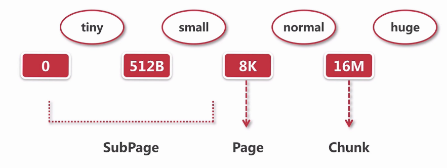

# 源码解读
## part1
### ByteBuf的结构
```
<pre>
 *      +-------------------+------------------+------------------+
 *      | discardable bytes |  readable bytes  |  writable bytes  |
 *      |                   |     (CONTENT)    |                  |
 *      +-------------------+------------------+------------------+
 *      |                   |                  |                  |
 *      0      <=      readerIndex   <=   writerIndex    <=    capacity
 * </pre>
```
三个值,大小关系
- 0-------readerIndex  已经读完,无效的数据
- readIndex-----writerIndex 可以读的数据
- writerIndex-----capacity 可以写的区域
还有一个
```
ByteBuf---------public abstract int maxCapacity();
在AbstractByteBuf中实现------>
public int maxCapacity() {
        return maxCapacity;
}
private int maxCapacity;
```
表示最大可以扩容到多大
### read write set
read的操作表示readIndex向后移动,如果是一个int,移动四个.....
write表示writeIndex移动
### mark和reset方法
mark表示保存位置
reset表示恢复位置
## part2
`public abstract class AbstractByteBuf extends ByteBuf {`
```
    int readerIndex;
    int writerIndex;
    private int markedReaderIndex;
    private int markedWriterIndex;
    private int maxCapacity;
```
```
public int readableBytes() {
        return writerIndex - readerIndex;
    }
 @Override
public int writableBytes() {
        return capacity() - writerIndex;
    }

    @Override
public int maxWritableBytes() {
        return maxCapacity() - writerIndex;
    }    
```
### readByte
```
public byte readByte() {
        checkReadableBytes0(1);//看看当前的位置是否可以读
        int i = readerIndex;//获取当前的索引
        byte b = _getByte(i);//获取到当前的byte
        readerIndex = i + 1;//位置+1
        return b;//返回
    }
```
### writeByte
```
@Override
    public ByteBuf writeByte(int value) {
        ensureWritable0(1);//确保能写
        _setByte(writerIndex++, value);//设置值
        return this;
    }
```
### getByte
```
@Override
    public byte getByte(int index) {
        checkIndex(index);
        return _getByte(index);
    }
```
上面的_setByte,_getByte.....都是交给子类去实现,所以`abstractByteBuf就是提供了骨架的功能`
## part3
- Pooled和Unpooled
池化和非池化
- Unsafe和非Unsafe
Unsafe拿到内存地址,然后进行读写
```
PooledUnsafeHeapByteBuf----->中的某个方法
 protected int _getInt(int index) {
        return UnsafeByteBufUtil.getInt(memory, idx(index));//通过内存直接取得值的
   }
```
其中直接对内存进行操作
```
static byte getByte(byte[] array, int index) {
        return PlatformDependent.getByte(array, index);
    }
--->
public static byte getByte(byte[] data, int index) {
        return PlatformDependent0.getByte(data, index);
    }
---->
static byte getByte(byte[] data, int index) {
        return UNSAFE.getByte(data, BYTE_ARRAY_BASE_OFFSET + index);
    }
```
然后我们看一下非Unsafe
```
PooledHeapByteBuf
protected byte _getByte(int index) {
        return HeapByteBufUtil.getByte(memory, idx(index));
    }
------->
static byte getByte(byte[] memory, int index) {
        return memory[index];//通过数组取得
    }
```
- Heap和Direct
Heap堆上
Direct操作系统
```
UnpooledHeapByteBuf   ------->直接维护    byte[] array;
```
```
UnpooledDirectByteBuf -------->private ByteBuffer buffer;  //nio的buffer
然后我们看一下它的初始化
```
```
Unpooled方法中
 public static ByteBuf directBuffer(int initialCapacity) {
        return ALLOC.directBuffer(initialCapacity);
    } ------> ByteBufAllocator
    ByteBuf directBuffer(int initialCapacity);
      ------->AbstractByteBufAllocator
    public ByteBuf directBuffer(int initialCapacity) {
        return directBuffer(initialCapacity, DEFAULT_MAX_CAPACITY);
    }
    @Override
    public ByteBuf directBuffer(int initialCapacity, int maxCapacity) {
        if (initialCapacity == 0 && maxCapacity == 0) {
            return emptyBuf;
        }
        validate(initialCapacity, maxCapacity);
        return newDirectBuffer(initialCapacity, maxCapacity);
    } 
    ---------->
    protected abstract ByteBuf newDirectBuffer(int initialCapacity, int maxCapacity);
    ---------->
    new InstrumentedUnpooledUnsafeDirectByteBuf(this, initialCapacity, maxCapacity);
    ------------->
    super(alloc, initialCapacity, maxCapacity);
    ---------------------->
    this.alloc = alloc;
        setByteBuffer(allocateDirect(initialCapacity), false);
    ------------------------------>
    protected ByteBuffer allocateDirect(int initialCapacity) {
        return ByteBuffer.allocateDirect(initialCapacity);
    }
    --------------->
    public static ByteBuffer allocateDirect(int capacity) {
        return new DirectByteBuffer(capacity);
    }
```
## part4
ByteBufAllocator的功能,分配内存
AbstractByteBufAllocator抽象的实现
```
ByteBuf buffer();//ByteBufAllocator中定义
public ByteBuf buffer() {
        if (directByDefault) {
            return directBuffer();
        }
        return heapBuffer();
    }//AbstractByteBufAllocator中实现
----------->
 public ByteBuf directBuffer(int initialCapacity) {
        return directBuffer(initialCapacity, DEFAULT_MAX_CAPACITY);
    }
----------->
 public ByteBuf directBuffer(int initialCapacity, int maxCapacity) {
        if (initialCapacity == 0 && maxCapacity == 0) {
            return emptyBuf;
        }
        validate(initialCapacity, maxCapacity);
        return newDirectBuffer(initialCapacity, maxCapacity);
    }
------------>这个时候就需要看是池化还是非池化的
protected abstract ByteBuf newDirectBuffer(int initialCapacity, int maxCapacity);
```
ByteBufAllocator两个子类
```
ByteBufAllocator----->
AbstractByteBufAllocator----->
Unpooled    Pooled
```
Safe和UnSafe
```
protected ByteBuf newHeapBuffer(int initialCapacity, int maxCapacity) {
        return PlatformDependent.hasUnsafe() ?
                new InstrumentedUnpooledUnsafeHeapByteBuf(this, initialCapacity, maxCapacity) :
                new InstrumentedUnpooledHeapByteBuf(this, initialCapacity, maxCapacity);
    }
```
通过if判断
## part5
UnpooleaByteBufAllocator
- heap内存的分配
```
protected ByteBuf newHeapBuffer(int initialCapacity, int maxCapacity) {
        return PlatformDependent.hasUnsafe() ?
                new InstrumentedUnpooledUnsafeHeapByteBuf(this, initialCapacity, maxCapacity) :
                new InstrumentedUnpooledHeapByteBuf(this, initialCapacity, maxCapacity);
    }
```
如果有Unsafe的话,InstrumentedUnpooledUnsafeHeapByteBuf这个体现出了非池化,Unsafe,Heap的分配,三个维度都体现出来了
如果没有Unsafe的话,非池化,非Unsafe,Heap
```
private static final class InstrumentedUnpooledUnsafeHeapByteBuf extends UnpooledUnsafeHeapByteBuf {
        InstrumentedUnpooledUnsafeHeapByteBuf(UnpooledByteBufAllocator alloc, int initialCapacity, int maxCapacity) {
            super(alloc, initialCapacity, maxCapacity);
        }----------->
UnpooledUnsafeHeapByteBuf(ByteBufAllocator alloc, int initialCapacity, int maxCapacity) {
        super(alloc, initialCapacity, maxCapacity);
    }------------>
protected UnpooledHeapByteBuf(ByteBufAllocator alloc, int initialCapacity, int maxCapacity) {
        super(maxCapacity);

        checkNotNull(alloc, "alloc");

        if (initialCapacity > maxCapacity) {
            throw new IllegalArgumentException(String.format(
                    "initialCapacity(%d) > maxCapacity(%d)", initialCapacity, maxCapacity));
        }

        this.alloc = alloc;
        setArray(allocateArray(initialCapacity));//查看
        setIndex(0, 0);
    }----->
private void setArray(byte[] initialArray) {
        array = initialArray;//数组,heap
        tmpNioBuf = null;
    }
```
在这里我们再来区分一下,UnSafe和非Safe在操作上面的区别
```
UnpooledUnsafeHeapByteBuf中的方法
protected byte _getByte(int index) {
        return UnsafeByteBufUtil.getByte(array, index);
    }
    --->
    static byte getByte(byte[] array, int index) {
        return PlatformDependent.getByte(array, index);
    }
    --->
    public static byte getByte(byte[] data, int index) {
        return PlatformDependent0.getByte(data, index);
    }
    --->
    static byte getByte(byte[] data, int index) {//内存层面的偏移值
        return UNSAFE.getByte(data, BYTE_ARRAY_BASE_OFFSET + index);
    }
```
上面就是UnSafe的操作,其中是通过内存层面的偏移值完成的,然后我们来看看非Unsafe的实现
```
new InstrumentedUnpooledHeapByteBuf(this, initialCapacity, maxCapacity);
---->
private static final class InstrumentedUnpooledHeapByteBuf extends UnpooledHeapByteBuf {
        InstrumentedUnpooledHeapByteBuf(UnpooledByteBufAllocator alloc, int initialCapacity, int maxCapacity) {
            super(alloc, initialCapacity, maxCapacity);
        }
----->
 public byte getByte(int index) {
        ensureAccessible();
        return _getByte(index);
    }
 ------>
  protected byte _getByte(int index) {
        return HeapByteBufUtil.getByte(array, index);
    }
  ----->
  static byte getByte(byte[] memory, int index) {
        return memory[index];
    }
```
`通过上面的总结,UnSafe和Safe维度上的区别,就是一个通过底层内存的偏移量,一个通过动态数组的index`
- direct(非池化的)
```
 protected UnpooledUnsafeDirectByteBuf(ByteBufAllocator alloc, int initialCapacity, int maxCapacity) {
        super(maxCapacity);
        if (alloc == null) {
            throw new NullPointerException("alloc");
        }
        if (initialCapacity < 0) {
            throw new IllegalArgumentException("initialCapacity: " + initialCapacity);
        }
        if (maxCapacity < 0) {
            throw new IllegalArgumentException("maxCapacity: " + maxCapacity);
        }
        if (initialCapacity > maxCapacity) {
            throw new IllegalArgumentException(String.format(
                    "initialCapacity(%d) > maxCapacity(%d)", initialCapacity, maxCapacity));
        }

        this.alloc = alloc;
        setByteBuffer(allocateDirect(initialCapacity), false);
    }
```
allocateDirect中new Direct,调用了JDK
然后我们来看一下非池化的,直接的direct的UnSafe和非UnSafe之间的区别
```
UnpooledUnsafeDirectByteBuf
final void setByteBuffer(ByteBuffer buffer, boolean tryFree) {
        if (tryFree) {
            ByteBuffer oldBuffer = this.buffer;
            if (oldBuffer != null) {
                if (doNotFree) {
                    doNotFree = false;
                } else {
                    freeDirect(oldBuffer);
                }
            }
        }
        this.buffer = buffer;
        memoryAddress = PlatformDependent.directBufferAddress(buffer);//其中就调用了UnSafe
        tmpNioBuf = null;
        capacity = buffer.remaining();
    }
```
```
UnpooledDirectByteBuf
private void setByteBuffer(ByteBuffer buffer) {
        ByteBuffer oldBuffer = this.buffer;
        if (oldBuffer != null) {
            if (doNotFree) {
                doNotFree = false;
            } else {
                freeDirect(oldBuffer);
            }
        }

        this.buffer = buffer;
        tmpNioBuf = null;
        capacity = buffer.remaining();
    }
```
```
memoryAddress = PlatformDependent.directBufferAddress(buffer);
----->
public static long directBufferAddress(ByteBuffer buffer) {
        return PlatformDependent0.directBufferAddress(buffer);
    }
---->
static long directBufferAddress(ByteBuffer buffer) {
        return getLong(buffer, ADDRESS_FIELD_OFFSET);
    }
----->
 private static long getLong(Object object, long fieldOffset) {
        return UNSAFE.getLong(object, fieldOffset);
    }
```
## part6
池化的分配,池化下的分配Unsafe和非Unsafe以及Direct和Heap,先从Direct和Heap两个角度,进行大的分配
```
 @Override
    protected ByteBuf newHeapBuffer(int initialCapacity, int maxCapacity) {
        PoolThreadCache cache = threadCache.get();
        PoolArena<byte[]> heapArena = cache.heapArena;

        final ByteBuf buf;
        if (heapArena != null) {
            buf = heapArena.allocate(cache, initialCapacity, maxCapacity);
        } else {
            buf = PlatformDependent.hasUnsafe() ?
                    new UnpooledUnsafeHeapByteBuf(this, initialCapacity, maxCapacity) :
                    new UnpooledHeapByteBuf(this, initialCapacity, maxCapacity);
        }

        return toLeakAwareBuffer(buf);
    }

    @Override
    protected ByteBuf newDirectBuffer(int initialCapacity, int maxCapacity) {
        PoolThreadCache cache = threadCache.get();
        PoolArena<ByteBuffer> directArena = cache.directArena;

        final ByteBuf buf;
        if (directArena != null) {
            buf = directArena.allocate(cache, initialCapacity, maxCapacity);
        } else {
            buf = PlatformDependent.hasUnsafe() ?
                    UnsafeByteBufUtil.newUnsafeDirectByteBuf(this, initialCapacity, maxCapacity) :
                    new UnpooledDirectByteBuf(this, initialCapacity, maxCapacity);
        }

        return toLeakAwareBuffer(buf);
    }
```
### 6.1 
我们来解析一下这两段代码
```
        PoolThreadCache cache = threadCache.get();//线程局部缓存
        PoolArena<byte[]> heapArena = cache.heapArena;
```
我们根据,发现这个threadCache类似于一个ThreadLocal的线程对象
```
private final PoolThreadLocalCache threadCache;
final class PoolThreadLocalCache extends FastThreadLocal<PoolThreadCache>
```
然后我们看一下PoolThreadLocalCache其中的一个方法
```
protected synchronized PoolThreadCache initialValue() {
            final PoolArena<byte[]> heapArena = leastUsedArena(heapArenas);
            final PoolArena<ByteBuffer> directArena = leastUsedArena(directArenas);

            if (useCacheForAllThreads || Thread.currentThread() instanceof FastThreadLocalThread) {
                return new PoolThreadCache(
                        heapArena, directArena, tinyCacheSize, smallCacheSize, normalCacheSize,
                        DEFAULT_MAX_CACHED_BUFFER_CAPACITY, DEFAULT_CACHE_TRIM_INTERVAL);
            }
            // No caching for non FastThreadLocalThreads.
            return new PoolThreadCache(heapArena, directArena, 0, 0, 0, 0, 0);
        }
```
我们发现上面的initialValue方法在这个PoolThreadCache放入了两个area
`heapArena,directArena`
我们也在` PoolArena<byte[]> heapArena = cache.heapArena;`中得到了传入的
现在我们的问题就是在哪儿创建了这两个方法
```
       堆       final PoolArena<byte[]> heapArena = leastUsedArena(heapArenas);
       堆外     final PoolArena<ByteBuffer> directArena = leastUsedArena(directArenas);
```
然后我们看一看传入的两个heapArenas,directArenas
```
   private final PoolArena<byte[]>[] heapArenas;
    private final PoolArena<ByteBuffer>[] directArenas;
```
我们发现在PooledByteBufAllocator这个方法中使用到了
```
 public PooledByteBufAllocator(boolean preferDirect, int nHeapArena, int nDirectArena, int pageSize, int maxOrder,
                                  int tinyCacheSize, int smallCacheSize, int normalCacheSize,
                                  boolean useCacheForAllThreads, int directMemoryCacheAlignment)
                                  .....
                                    heapArenas = newArenaArray(nHeapArena);
                                   ......
                                    directArenas = newArenaArray(nDirectArena);
```
我们发现在初始化这个PooledByteBufAllocator的时候,就会创建这两个数组,并且我们在其中存值
我们继续寻找
```
 public PooledByteBufAllocator(boolean preferDirect) {
        this(preferDirect, DEFAULT_NUM_HEAP_ARENA, DEFAULT_NUM_DIRECT_ARENA, DEFAULT_PAGE_SIZE, DEFAULT_MAX_ORDER);
    }
```
- DEFAULT_NUM_HEAP_ARENA
- DEFAULT_NUM_DIRECT_ARENA
- DEFAULT_PAGE_SIZE
- DEFAULT_MAX_ORDER
我们创建PooledByteBufAllocator其中有两个数组,这两个数组的大小,就是上面四个值的相互关系得到的.
```
 final int defaultMinNumArena = NettyRuntime.availableProcessors() * 2;
        final int defaultChunkSize = DEFAULT_PAGE_SIZE << DEFAULT_MAX_ORDER;
        DEFAULT_NUM_HEAP_ARENA = Math.max(0,
                SystemPropertyUtil.getInt(
                        "io.netty.allocator.numHeapArenas",
                        (int) Math.min(
                                defaultMinNumArena,
                                runtime.maxMemory() / defaultChunkSize / 2 / 3)));
        DEFAULT_NUM_DIRECT_ARENA = Math.max(0,
                SystemPropertyUtil.getInt(
                        "io.netty.allocator.numDirectArenas",
                        (int) Math.min(
                                defaultMinNumArena,
                                PlatformDependent.maxDirectMemory() / defaultChunkSize / 2 / 3)));
```
基本就是CPU核数的2倍

```
    private final int tinyCacheSize;
    private final int smallCacheSize;
    private final int normalCacheSize;
```
```
protected synchronized PoolThreadCache initialValue() {
            final PoolArena<byte[]> heapArena = leastUsedArena(heapArenas);
            final PoolArena<ByteBuffer> directArena = leastUsedArena(directArenas);

            if (useCacheForAllThreads || Thread.currentThread() instanceof FastThreadLocalThread) {
                return new PoolThreadCache(
                        heapArena, directArena, tinyCacheSize, smallCacheSize, normalCacheSize,
                        DEFAULT_MAX_CACHED_BUFFER_CAPACITY, DEFAULT_CACHE_TRIM_INTERVAL);
            }
            // No caching for non FastThreadLocalThreads.
            return new PoolThreadCache(heapArena, directArena, 0, 0, 0, 0, 0);
        }
```
我们在创建这个PoolThreadCache维护了上面的三个值
### 6.2
```
        PoolThreadCache cache = threadCache.get();
        PoolArena<ByteBuffer> directArena = cache.directArena;
        .....
        buf = directArena.allocate(cache, initialCapacity, maxCapacity);//我们这个时候就要拿一个buf,从对象池中
        ----->
        PooledByteBuf<T> buf = newByteBuf(maxCapacity);
        ----->
        protected PooledByteBuf<ByteBuffer> newByteBuf(int maxCapacity) {
            if (HAS_UNSAFE) {
                return PooledUnsafeDirectByteBuf.newInstance(maxCapacity);
            } else {
                return PooledDirectByteBuf.newInstance(maxCapacity);
            }
        }
        ----->
        static PooledUnsafeDirectByteBuf newInstance(int maxCapacity) {
        PooledUnsafeDirectByteBuf buf = RECYCLER.get();//可以复用
        buf.reuse(maxCapacity);//重新设置这一块buf的属性
        return buf;//我们从这里拿到了一个buf
        }
        ----> 
        final void reuse(int maxCapacity) {
        maxCapacity(maxCapacity);
        setRefCnt(1);
        setIndex0(0, 0);
        discardMarks();
        }
```
以上就完成了`从对象池里面拿到PooledByteBuf进行复用`
拿到了buf,我们的任务就是`从缓存上进行内存分配`
```
 allocate(cache, buf, reqCapacity);
```
buf就是我们从对象池中取到的buf,然后我们要从cache上给他分配内存
我们拿到其中核心代码
```
if (cache.allocateSmall(this, buf, reqCapacity, normCapacity)) {//在缓存中分配
                    // was able to allocate out of the cache so move on
                    return;
                }
```
如果失败,我们就在内存堆中进行内存分配
### 6.3
```
0 ----- 512B ------8K ------ 16M
   tiny       small    normal    huge
    -------------      page      Chunk
        subPage
```
### 6.4
我们分配的缓存,在Netty的数据结构MemoryRegionCache
我们先找到它
```
        PoolThreadCache cache = threadCache.get();
        PoolArena<ByteBuffer> directArena = cache.directArena;
```
我们在获取cache,也就是一块内存的时候
```
       return new PoolThreadCache(heapArena, directArena, 0, 0, 0, 0, 0);
```
我们进入到这个构造方法中
```
我们以构造方法的一个为例
tinySubPageHeapCaches = createSubPageCaches(
                    tinyCacheSize, PoolArena.numTinySubpagePools, SizeClass.Tiny);
------------>
private static <T> MemoryRegionCache<T>[] createSubPageCaches(
            int cacheSize, int numCaches, SizeClass sizeClass) {
            MemoryRegionCache<T>[] cache = new MemoryRegionCache[numCaches];
    }
```
MemoryRegionCache这个就是缓存的数据结构
```
private abstract static class MemoryRegionCache<T> {
        private final int size;
        private final Queue<Entry<T>> queue;
        private final SizeClass sizeClass;
        private int allocations;
```
我们先来看看SizeClass,枚举类型
```
enum SizeClass {
        Tiny,
        Small,
        Normal
    }
```
然后这个缓存数据结构每一个线程都会维护一个
```
在PoolThreadCache这个类中维护
    private final MemoryRegionCache<byte[]>[] tinySubPageHeapCaches;
    private final MemoryRegionCache<byte[]>[] smallSubPageHeapCaches;
    private final MemoryRegionCache<ByteBuffer>[] tinySubPageDirectCaches;
    private final MemoryRegionCache<ByteBuffer>[] smallSubPageDirectCaches;
    private final MemoryRegionCache<byte[]>[] normalHeapCaches;
    private final MemoryRegionCache<ByteBuffer>[] normalDirectCaches;
```
一个线程里面维护一个PoolThreadCache,其中会维护三种内存规格的cache
### 6.5
然后我们来研究一下缓存是如何分配的.
我们找到缓存分配的起点,我们在分配这个缓存之前,我们从池中拿到了一个纯净的buf
我们的起点就是
```
buf = directArena.allocate(cache, initialCapacity, maxCapacity);
--------->
PooledByteBuf<T> allocate(PoolThreadCache cache, int reqCapacity, int maxCapacity) {
        PooledByteBuf<T> buf = newByteBuf(maxCapacity);
        allocate(cache, buf, reqCapacity);
        return buf;
    }
```
分配缓存,首先将我们需要的缓存传入
```
allocate
----->
final int normCapacity = normalizeCapacity(reqCapacity);
```

```
if (isTinyOrSmall(normCapacity)) { // capacity < pageSize 如果是tiny或者small的范围的大小
```
```
if (isTinyOrSmall(normCapacity)) { // capacity < pageSize
            int tableIdx;
            PoolSubpage<T>[] table;
            boolean tiny = isTiny(normCapacity);
            if (tiny) { // < 512
                if (cache.allocateTiny(this, buf, reqCapacity, normCapacity)) {
                    // was able to allocate out of the cache so move on
                    return;
                }
                tableIdx = tinyIdx(normCapacity);
                table = tinySubpagePools;
            } else {
                if (cache.allocateSmall(this, buf, reqCapacity, normCapacity)) {
                    // was able to allocate out of the cache so move on
                    return;
                }
                tableIdx = smallIdx(normCapacity);
                table = smallSubpagePools;
            }
```
我们从这个方法中
```
cache.allocateTiny(this, buf, reqCapacity, normCapacity)
cache.allocateSmall(this, buf, reqCapacity, normCapacity)
cache.allocateNormal(this, buf, reqCapacity, normCapacity)
```
上面的三个就是真正的为buf从缓冲中分配内存
- 1,找到对应size的MemoryRegionCache
- 2,从queue中弹出一个entry给ByteBufAllocator初始化
- 3,将弹出的entry放入到对象池中进行服用
我们以其中的一个为例子
```
cache.allocateTiny(this, buf, reqCapacity, normCapacity)
----->
boolean allocateTiny(PoolArena<?> area, PooledByteBuf<?> buf, int reqCapacity, int normCapacity) {
        return allocate(cacheForTiny(area, normCapacity), buf, reqCapacity);
    }
```
cacheForTiny这个方法就是找到一块可以匹配的缓存
```
 private MemoryRegionCache<?> cacheForTiny(PoolArena<?> area, int normCapacity) {
        int idx = PoolArena.tinyIdx(normCapacity);
        if (area.isDirect()) {
            return cache(tinySubPageDirectCaches, idx);
        }
        return cache(tinySubPageHeapCaches, idx);
    }
 ------>
 static int tinyIdx(int normCapacity) {
        return normCapacity >>> 4;
    }
 我们将normCapacity除16就得到了可以使用的数组节点
```
总结一下cacheForTiny就是根据buf需要的大小,在cache这个数组中,找到一个对应的位置
```
private boolean allocate(MemoryRegionCache<?> cache, PooledByteBuf buf, int reqCapacity) {
        if (cache == null) {
            // no cache found so just return false here
            return false;
        }
        boolean allocated = cache.allocate(buf, reqCapacity);
        if (++ allocations >= freeSweepAllocationThreshold) {
            allocations = 0;
            trim();
        }
        return allocated;
    }
```
现在我们拿到了cache中一个位置,现在进行真正的分配
```
public final boolean allocate(PooledByteBuf<T> buf, int reqCapacity) {
            Entry<T> entry = queue.poll();
            if (entry == null) {
                return false;
            }
            initBuf(entry.chunk, entry.handle, buf, reqCapacity);
            entry.recycle();

            // allocations is not thread-safe which is fine as this is only called from the same thread all time.
            ++ allocations;
            return true;
        }
```
我们首先从queue中弹出一个entry对象,这个entry对象其中有chunk和handle,这两个属性就唯一标识了一段连续的内存区域
```
 protected void initBuf(
                PoolChunk<T> chunk, long handle, PooledByteBuf<T> buf, int reqCapacity) {
            chunk.initBufWithSubpage(buf, handle, reqCapacity);
        }
        ------>
        void initBufWithSubpage(PooledByteBuf<T> buf, long handle, int reqCapacity) {
        initBufWithSubpage(buf, handle, bitmapIdx(handle), reqCapacity);
    }
        ------>
         buf.init(
            this, handle,
            runOffset(memoryMapIdx) + (bitmapIdx & 0x3FFFFFFF) * subpage.elemSize + offset,
                reqCapacity, subpage.elemSize, arena.parent.threadCache());
```
```
 private void init0(PoolChunk<T> chunk, long handle, int offset, int length, int maxLength, PoolThreadCache cache) {
        assert handle >= 0;
        assert chunk != null;

        this.chunk = chunk;
        memory = chunk.memory;
        allocator = chunk.arena.parent;
        this.cache = cache;
        this.handle = handle;
        this.offset = offset;
        this.length = length;
        this.maxLength = maxLength;
        tmpNioBuf = null;
    }
```
最后调用这个完成了初始化
entry放入到对象池中,可以复用
### 6.6
```
        PoolThreadCache cache = threadCache.get();
        PoolArena<ByteBuffer> directArena = cache.directArena;
```
我们是在PoolThreadCache中取得cache的
PoolThreadCache
由两大部分组成
```
 final PoolArena<byte[]> heapArena;
    final PoolArena<ByteBuffer> directArena;

    // Hold the caches for the different size classes, which are tiny, small and normal.
    private final MemoryRegionCache<byte[]>[] tinySubPageHeapCaches;
    private final MemoryRegionCache<byte[]>[] smallSubPageHeapCaches;
    private final MemoryRegionCache<ByteBuffer>[] tinySubPageDirectCaches;
    private final MemoryRegionCache<ByteBuffer>[] smallSubPageDirectCaches;
    private final MemoryRegionCache<byte[]>[] normalHeapCaches;
    private final MemoryRegionCache<ByteBuffer>[] normalDirectCaches;
```
看属性就知道PoolArena和MemoryRegionCache.
```
PoolArena:内存开辟 
MemoryRegionCache:缓存分配
```
## part7 
### 7.1
```
 PoolThreadCache cache = threadCache.get();
 PoolArena<ByteBuffer> directArena = cache.directArena;

 PoolThreadCache cache = threadCache.get();
 PoolArena<byte[]> heapArena = cache.heapArena;
```
我们在池化中分配内存空间的时候,使用的PoolThreadCache
```
final class PoolThreadLocalCache extends FastThreadLocal<PoolThreadCache>

final PoolArena<byte[]> heapArena = leastUsedArena(heapArenas);
final PoolArena<ByteBuffer> directArena = leastUsedArena(directArenas);
```
其中两个heapArenas,directArenas,这是两个数组,我们通过这两个完成了netty中的内存分配
这两个数组,是在分配器初始化时创建的
```
 public PooledByteBufAllocator(boolean preferDirect, int nHeapArena, int nDirectArena, int pageSize, int maxOrder,
                                  int tinyCacheSize, int smallCacheSize, int normalCacheSize,
                                  boolean useCacheForAllThreads, int directMemoryCacheAlignment) {    
    heapArenas = newArenaArray(nHeapArena);
    .....
    directArenas = newArenaArray(nDirectArena);
```
小结一下,我们在创建这个PooledByteBufAllocator,然后我们就创建了两个数组heapArenas和directArenas,它们的大小就是CPU*2,和netty的工作线程相对应,然后PoolThreadLocalCache又是继承于FastThreadLocal,线程之间的隔离,每一个线程都可以有一个Arenas中的一个元素.
上面直接在内存上进行分配,也可以在缓冲上进行分配
### 7.2
PoolThreadCache
tinyCacheSize ----- smallCacheSize ------ normalCacheSize
这个分配器维护了这三个属性
```
    private final int tinyCacheSize;
    private final int smallCacheSize;
    private final int normalCacheSize;
```
### 7.3 
我们在7.1中做的任务就是获取到一块区域,它可能是开辟的,也可能是缓存,这个时候我们要继续执行代码
```
buf = directArena.allocate(cache, initialCapacity, maxCapacity);
```
我们以上面的代码作为入口
```
PooledByteBuf<T> allocate(PoolThreadCache cache, int reqCapacity, int maxCapacity) {
        PooledByteBuf<T> buf = newByteBuf(maxCapacity);//获取到一个buf
        allocate(cache, buf, reqCapacity);//然后使用在7.1中获取到的cache,为buf分配
        return buf;
    }
```
看newByteBuf
```
static PooledUnsafeDirectByteBuf newInstance(int maxCapacity) {
        PooledUnsafeDirectByteBuf buf = RECYCLER.get();
        buf.reuse(maxCapacity);//将所有的索引设置为初始化的情况
        return buf;
    }
```
看一下RECYCLER,我们从对象池中获得对象,如果没办法获取到,就创建一个
```
private static final Recycler<PooledUnsafeDirectByteBuf> RECYCLER = new Recycler<PooledUnsafeDirectByteBuf>() {
        @Override
        protected PooledUnsafeDirectByteBuf newObject(Handle<PooledUnsafeDirectByteBuf> handle) {
            return new PooledUnsafeDirectByteBuf(handle, 0);
        }
    };
```

然后就是从缓冲上进行分配,如果失败,就进行内存上的分配
### 7.4

当我们要分配内存的时候,最小的单位是Chunk,然后我们在Chunk上面取Page或者是SubPage
### 7.5 缓存的数据结构

chunk表示最小的分配单位,然后handler表示一节连续的内存,然后把这些连接在一起就是一个Queue

每一个节点都是MemoryRegionCache.
每个节点都有queue.
```
private abstract static class MemoryRegionCache<T> {
        private final int size;
        private final Queue<Entry<T>> queue;//每一个节点都维护这一个queue
        private final SizeClass sizeClass;
        private int allocations;
```

```
    private final MemoryRegionCache<byte[]>[] tinySubPageHeapCaches;
    private final MemoryRegionCache<byte[]>[] smallSubPageHeapCaches;
    private final MemoryRegionCache<ByteBuffer>[] tinySubPageDirectCaches;
    private final MemoryRegionCache<ByteBuffer>[] smallSubPageDirectCaches;
    private final MemoryRegionCache<byte[]>[] normalHeapCaches;
    private final MemoryRegionCache<ByteBuffer>[] normalDirectCaches;
```
我们分别创建32,4,3的长度

