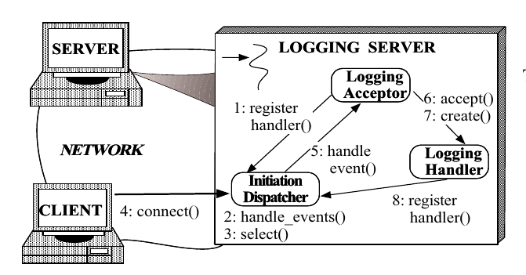
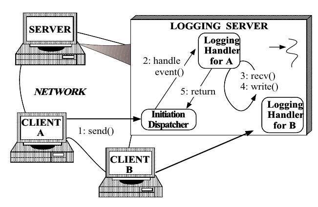

# reactor-siemens
## part1
```
The Reactor design pattern handles service requests that are
delivered concurrently to an application by one or more
clients. Each service in an application may consist of
serveral methods and is represented by a separate event han-
dler that is responsible for dispatching service-specific re-
quests. Dispatching of event handlers is performed by an ini-
tiation dispatcher, which manages the registered event han-
dlers. Demultiplexing of service requests is performed by a
synchronous event demultiplexer.
```

```
首先是客户机和日志服务器建立联系,首先是Logging Acceptor的acceptor方法,收到了connect之后,就会创建一个新的handler,然后客户机和服务器的交互就是通过Logging Handler的recv()和write()来进行.
```
## part2


```
1,首先是初始化Dispatcher()(分发器),最开始要注册一个handler,它的event_type就是接受(acceptor)
2,建立连接
3,等待事件,通过不同的时间,做出不同的反应
```
## part3

```
1.最开始有一个Logging Acceptor和一个Initiation Dispatcher,将Logging Acceptor注册到Initiation Dispatcher中
2.handler_event()连接的事件放在Initiation Dispatcher,然后就是
3.selector方法,一直阻塞等待连接
4.连接connect()
5.这个时候时间给了Logging Acceptor
6.触发了accept()
7.创建了Logging Handler()
8.将Logging Handler()注册到分发器上去,这样就可以处理读和写了
```
