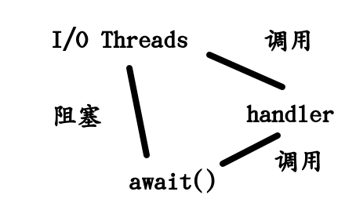

# ChannelFuture
## jdk1.5 Future
```
/**
 * A {@code Future} represents the result of an asynchronous
 * computation.  Methods are provided to check if the computation is
 * complete, to wait for its completion, and to retrieve the result of
 * the computation.  The result can only be retrieved using method
 * {@code get} when the computation has completed, blocking if
 * necessary until it is ready.  Cancellation is performed by the
 * {@code cancel} method.  Additional methods are provided to
 * determine if the task completed normally or was cancelled. Once a
 * computation has completed, the computation cannot be cancelled.
 * If you would like to use a {@code Future} for the sake
 * of cancellability but not provide a usable result, you can
 * declare types of the form {@code Future<?>} and
 * return {@code null} as a result of the underlying task.
```
Future表示了一种结果,这个结果是异步的.然后Future的方法都是用来检测计算是否完成的,或者区等待它的计算,最后在取回这个结果
解释一下:**Future**表示将来的结果,也就是一个线程是否有返回值.
在要取回这个线程的结果,就要通过get,如果在这个线程还没有完成之前就调用这个get方法,就会阻塞.
Future也是可以取消的.会有额外的方法提供来使得任务完成或者取消.
但是在任务完成之后,在执行**取消**的操作,就不能够使得任务取消了.

**如果你使用Future为了实现取消性,但是不能够提供可用的方法,你就可以声明一类的表单,并且返回一个null作为结果**

```
 * <p>
 * <b>Sample Usage</b> (Note that the following classes are all
 * made-up.)
 * <pre> {@code
 * interface ArchiveSearcher { String search(String target); } //接口
 * class App {
 *   ExecutorService executor = ... 
 *   ArchiveSearcher searcher = ...
 *   void showSearch(final String target)
 *       throws InterruptedException {
 *     Future<String> future
 *       = executor.submit(new Callable<String>() {
 *         public String call() {
 *             return searcher.search(target);
 *         }});             //调用一个Future,相当于开启另一个线程
 *     displayOtherThings();//主线程可以运行其他的事情 
 *     try {
 *       displayText(future.get()); //我们在这儿获取到Future线程的内容
 *     } catch (ExecutionException ex) { cleanup(); return; }
 *   }
 * }}</pre>
```
## FutureTask
```
 * The {@link FutureTask} class is an implementation of {@code Future} that
 * implements {@code Runnable}, and so may be executed by an {@code Executor}.
 * For example, the above construction with {@code submit} could be replaced by:
 *  <pre> {@code
 * FutureTask<String> future =
 *   new FutureTask<String>(new Callable<String>() {
 *     public String call() {
 *       return searcher.search(target);
 *   }});
 * executor.execute(future);}</pre>
 *
 * <p>Memory consistency effects: Actions taken by the asynchronous computation
 * <a href="package-summary.html#MemoryVisibility"> <i>happen-before</i></a>
 * actions following the corresponding {@code Future.get()} in another thread.
 *
 * @see FutureTask
 * @see Executor
 * @since 1.5
 * @author Doug Lea
 * @param <V> The result type returned by this Future's {@code get} method
 */
```
然后我们引入了FutureTask,FutureTask实现了Future和Runnable,它可以被Executor执行.
原来调用Future
```
 Future<String> future
 *       = executor.submit(new Callable<String>() {
 *         public String call() {
 *             return searcher.search(target);
 *         }});             //调用一个Future,相当于开启另一个线程
```
现在使用Future
```
 * FutureTask<String> future =
 *   new FutureTask<String>(new Callable<String>() {
 *     public String call() {
 *       return searcher.search(target);
 *   }});
 * executor.execute(future);
```
Future就相当于是对future的封装

## Netty下的Future
```
 /**
     * Adds the specified listener to this future.  The
     * specified listener is notified when this future is
     * {@linkplain #isDone() done}.  If this future is already
     * completed, the specified listener is notified immediately.
     */
    Future<V> addListener(GenericFutureListener<? extends Future<? super V>> listener);
```
我们看一下这个方法
* 在future做的时候会有通知
* 在future完成之后,也会发通知
这样就很好的解决了jdk1.5下的Future的get()方法的弊端

## ChannelFuture
### part1
```
/**
 * The result of an asynchronous {@link Channel} I/O operation.
 * <p>
 * All I/O operations in Netty are asynchronous.  It means any I/O calls will
 * return immediately with no guarantee that the requested I/O operation has
 * been completed at the end of the call.  Instead, you will be returned with
 * a {@link ChannelFuture} instance which gives you the information about the
 * result or status of the I/O operation.
 * <p>
 * A {@link ChannelFuture} is either <em>uncompleted</em> or <em>completed</em>.
 * When an I/O operation begins, a new future object is created.  The new future
 * is uncompleted initially - it is neither succeeded, failed, nor cancelled
 * because the I/O operation is not finished yet.  If the I/O operation is
 * finished either successfully, with failure, or by cancellation, the future is
 * marked as completed with more specific information, such as the cause of the
 * failure.  Please note that even failure and cancellation belong to the
 * completed state.
 *  * <pre>                                 以下三种情况都是完成的情况
 *                                      +---------------------------+
 *                                      | Completed successfully    |
 *                                      +---------------------------+
 *                                 +---->      isDone() = true      |
 * +--------------------------+    |    |   isSuccess() = true      |
 * |        Uncompleted       |    |    +===========================+
 * +--------------------------+    |    | Completed with failure    |
 * |      isDone() = false    |    |    +---------------------------+
 * |   isSuccess() = false    |----+---->      isDone() = true      |
 * | isCancelled() = false    |    |    |       cause() = non-null  |
 * |       cause() = null     |    |    +===========================+
 * +--------------------------+    |    | Completed by cancellation |
 *                                 |    +---------------------------+
 *                                 +---->      isDone() = true      |
 *                                      | isCancelled() = true      |
 *                                      +---------------------------+
 * </pre>
```
ChannelFuture会对不同的情况进行不同的返回
```
 * Various methods are provided to let you check if the I/O operation has been
 * completed, wait for the completion, and retrieve the result of the I/O
 * operation. It also allows you to add {@link ChannelFutureListener}s so you
 * can get notified when the I/O operation is completed.
 *
 * <h3>Prefer {@link #addListener(GenericFutureListener)} to {@link #await()}</h3>
 *
 * It is recommended to prefer {@link #addListener(GenericFutureListener)} to
 * {@link #await()} wherever possible to get notified when an I/O operation is
 * done and to do any follow-up tasks.
 * <p>
 * {@link #addListener(GenericFutureListener)} is non-blocking.  It simply adds
 * the specified {@link ChannelFutureListener} to the {@link ChannelFuture}, and
 * I/O thread will notify the listeners when the I/O operation associated with
 * the future is done.  {@link ChannelFutureListener} yields the best
 * performance and resource utilization because it does not block at all, but
 * it could be tricky to implement a sequential logic if you are not used to
 * event-driven programming.
 * <p>
 * By contrast, {@link #await()} is a blocking operation.  Once called, the
 * caller thread blocks until the operation is done.  It is easier to implement
 * a sequential logic with {@link #await()}, but the caller thread blocks
 * unnecessarily until the I/O operation is done and there's relatively
 * expensive cost of inter-thread notification.  Moreover, there's a chance of
 * dead lock in a particular circumstance, which is described below.
 *
 * <h3>Do not call {@link #await()} inside {@link ChannelHandler}</h3>
 * <p>
```
**使用addListener就是异步的,非阻塞的
使用await就是阻塞的,同步的**
更建议使用addListener

### part2
```
 * <h3>Do not call {@link #await()} inside {@link ChannelHandler}</h3>
```
不要在ChannelHandler中调用await()方法
```
 * <p>
 * The event handler methods in {@link ChannelHandler} are usually called by
 * an I/O thread.  If {@link #await()} is called by an event handler
 * method, which is called by the I/O thread, the I/O operation it is waiting
 * for might never complete because {@link #await()} can block the I/O
 * operation it is waiting for, which is a dead lock.
 * <pre>
 * // BAD - NEVER DO THIS
 * {@code @Override}
 * public void channelRead({@link ChannelHandlerContext} ctx, Object msg) {
 *     {@link ChannelFuture} future = ctx.channel().close();
 *     future.awaitUninterruptibly();
 *     // Perform post-closure operation
 *     // ...
 * }
```

正确的做法
```
 * // GOOD
 * {@code @Override}
 * public void channelRead({@link ChannelHandlerContext} ctx, Object msg) {
 *     {@link ChannelFuture} future = ctx.channel().close();
 *     future.addListener(new {@link ChannelFutureListener}() {
 *         public void operationComplete({@link ChannelFuture} future) {
 *             // Perform post-closure operation
 *             // ...
 *         }
 *     });
 * }
```
```
 * In spite of the disadvantages mentioned above, there are certainly the cases
 * where it is more convenient to call {@link #await()}. In such a case, please
 * make sure you do not call {@link #await()} in an I/O thread.  Otherwise,
 * {@link BlockingOperationException} will be raised to prevent a dead lock.
```
发送死锁的时候就会产生BlockingOperationException
### part3
**等待超时和i/o超时(连接超时)**
```
 * // BAD - NEVER DO THIS
 * {@link Bootstrap} b = ...;
 * {@link ChannelFuture} f = b.connect(...);
 * f.awaitUninterruptibly(10, TimeUnit.SECONDS);
 * if (f.isCancelled()) {
 *     // Connection attempt cancelled by user
 * } else if (!f.isSuccess()) {
 *     // You might get a NullPointerException here because the future
 *     // might not be completed yet.
 *     f.cause().printStackTrace();
 * } else {
 *     // Connection established successfully
 * }
 *
 * // GOOD
 * {@link Bootstrap} b = ...;
 * // Configure the connect timeout option.
 * <b>b.option({@link ChannelOption}.CONNECT_TIMEOUT_MILLIS, 10000);</b>
 * {@link ChannelFuture} f = b.connect(...);
 * f.awaitUninterruptibly();
 *
 * // Now we are sure the future is completed.
 * assert f.isDone();
 *
 * if (f.isCancelled()) {
 *     // Connection attempt cancelled by user
 * } else if (!f.isSuccess()) {
 *     f.cause().printStackTrace();
 * } else {
 *     // Connection established successfully
 * }
 * </pre>
 */
```