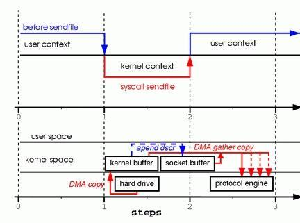

# 零拷贝
## 传统IO代码
服务器,接收信息
```
public class OldIOServer {

    public static void main(String[] args) throws Exception{
        //服务端绑定端口
        ServerSocket serverSocket=new ServerSocket(8899);
        while (true)
        {   
            //等待客户机
            Socket socket=serverSocket.accept();
            DataInputStream dataInputStream = new DataInputStream(socket.getInputStream());
            try {
                byte[] byteArray=new byte[4096];
                while(true){
                    //不断的从客户机读字节
                    int readCount = dataInputStream.read(byteArray, 0, byteArray.length);
                    if(-1==readCount) break;
                }
            }catch (Exception e)
            {
                e.printStackTrace();
            }

        }
    }

}
```
客户机
```
public class OldIOClient {

    public static void main(String[] args) throws Exception{
        Socket socket=new Socket("localhost",8899);
        String fileName="/home/chengcongyue/下载/deepin.com.qq.im_8.9.19983deepin18.tar.xz";
        InputStream inputStream =new FileInputStream(fileName);
        DataOutputStream dataOutputStream = new DataOutputStream(socket.getOutputStream());
        byte[] buffer=new byte[4096];
        long readCount;
        long total=0;
        long startTime=System.currentTimeMillis();
        while((readCount=inputStream.read(buffer))>=0)
        {
            total+=readCount;
            dataOutputStream.write(buffer);
        }
        System.out.println(""+total+"time cost: "+(System.currentTimeMillis()-startTime));
        dataOutputStream.close();
        socket.close();
        inputStream.close();
    }
}
```
传统IO的方式就是


```
DMA：
DMA(Direct Memory Access) —直接内存访问 ：
DMA是允许外设组件将I/O数据直接传送到主存储器中并且传输不需要CPU的参与，以此将CPU解放出来去完成其他的事情
```
1、JVM进程内发起read()系统调用，操作系统由用户态空间切换到内核态空间（第一次上下文切换）(**用户态切换到内核态**)
2、通过DMA引擎建数据从磁盘拷贝到内核态空间的输入的socket缓冲区中（第一次拷贝）(**从磁盘拷贝到内核空间**)
3、将内核态空间缓冲区的数据原封不动的拷贝到用户态空间的缓存区中（第二次拷贝），同时内核态空间切换到用户态空间（第二次上下文切换），read()系统调用结束
**以上需要两次上下文切换,两次拷贝**
4、JVM进程内业务逻辑代码执行

5、JVM进程内发起write()系统调用
6、操作系统由用户态空间切换到内核态空间（第三次上下文切换），将用户态空间的缓存区数据原封不动的拷贝到内核态空间输出的socket缓存区中（第三次拷贝）
7、write()系统调用返回，操作系统由内核态空间切换到用户态空间（第四次上下文切换），**通过DMA引擎将数据从内核态空间的socket缓存区数据拷贝到协议引擎中（第四次拷贝）** (发送到网络)
传统IO方式，一共在用户态空间与内核态空间之间发生了4次上下文的切换，4次数据的拷贝过程，其中包括2次DMA拷贝和2次I/O拷贝（内核态与用户应用程序之间发生的拷贝）。
内核空间缓冲区的一大用处是为了减少磁盘I/O操作，因为它会从磁盘中预读更多的数据到缓冲区中。而使用BufferedInputStream的用处是减少“系统调用”。

## 零拷贝
```
public class NewIOServer {

    public static void main(String[] args) throws IOException {
        InetSocketAddress address=new InetSocketAddress(8899);
        ServerSocketChannel serverSocketChannel=ServerSocketChannel.open();
        ServerSocket serverSocket = serverSocketChannel.socket();
        serverSocket.setReuseAddress(true);
        serverSocket.bind(address);

        ByteBuffer byteBuffer=ByteBuffer.allocate(4096);

        while(true)
        {
            SocketChannel socketChannel = serverSocketChannel.accept();
            socketChannel.configureBlocking(true);

            int readCount=0;
            while(-1!=readCount)
            {
                try {
                    readCount=socketChannel.read(byteBuffer);
                }catch (Exception ex)
                {
                    ex.printStackTrace();
                }
                byteBuffer.rewind();
            }
        }
    }
}
```
```

public class NewIOClient {


    public static void main(String[] args) throws IOException {
        SocketChannel socketChannel=SocketChannel.open();
        socketChannel.connect(new InetSocketAddress("localhost",8899));
        socketChannel.configureBlocking(true);

        String fileName="/home/chengcongyue/下载/deepin.com.qq.im_8.9.19983deepin18.tar.xz";
        FileChannel fileChannel = new FileInputStream(fileName).getChannel();

        long startTime = System.currentTimeMillis();
        //零拷贝 
        long transferCount = fileChannel.transferTo(0, fileChannel.size(), socketChannel);

        System.out.println("send byte num:"+transferCount+"time cost:"+(System.currentTimeMillis()-startTime));

        fileChannel.close();
    }
}
```


1、发起sendfile()系统调用，操作系统由用户态空间切换到内核态空间（第一次上下文切换）
2、通过DMA引擎建数据从磁盘拷贝到内核态空间的输入的socket缓冲区中（第一次拷贝）
3、将数据从内核空间拷贝到与之关联的socket缓冲区（第二次拷贝）
4、将socket缓冲区的数据拷贝到协议引擎中（第三次拷贝）
5、sendfile()系统调用结束，操作系统由用户态空间切换到内核态空间（第二次上下文切换）
一共有2次的上下文切换，3次的I/O拷贝


## 带有收集功能的零拷贝




## 总结
