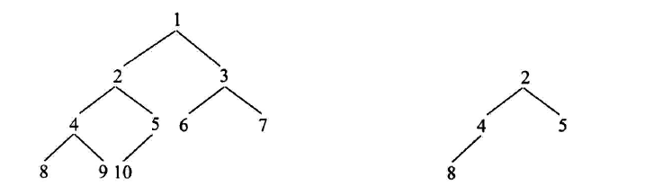

# 判断t1树中是否有t2树的全部拓扑结构
## 题目

这样的话t1就包括t2全部的拓扑结构
## 分析
很简单的一道题,使用递归,我们先来定义我们的递归函数
` public static boolean contains(Node h1,Node h2)`我们将两个节点传入,然后比较,总的思路
肯定先是以当前节点t1和t2的全部比较,然后是t1.left和t2的比较,然后是t1.right和t2的比较
```
先比较t1和t2是否完全相同,如果不同的话,说明当前t1的节点不包括这个t2
我们就要看t1.left是否完全包含t2(调用当前的方法)
然后再看t1.right是否完全包含t2 (调用当前的方法) 
```
### 完成核心逻辑函数
我们要看看当前的两个节点的树是否完全相同,这个就是我们的核心逻辑,这个我们先来完成一般的递归部分
`public static boolean check(Node t1,Node t2)`,其中递归的部分
```
check(t1.left,t2.left)
check(t1.right,t2.left)
```
然后就是分析什么时候返回true什么时候返回false了,base case
```
if(t1.value!=t2.value) return false;
```
```
if(t1==null&&t2!=null) return false;
```
```
if(t1!=null&&t2==null) return true;
if(t1==null&&t2==null) return true;
```
这样我们就完成了我们的函数了
## 代码实现
```
 public static class Node
    {
        public int value;
        public Node left;
        public Node right;

        public Node(int value)
        {
            this.value=value;
        }
    }

    public static boolean contains(Node n1,Node n2)
    {
        return check(n1,n2)||contains(n1.left,n2)||contains(n1.right,n2);
    }

    public static boolean check(Node n1,Node n2)
    {
         if(n2==null) return true;
         if(n1==null||n1.value!=n2.value) return false;
         return check(n1.left,n2.left)&&check(n1.right,n2.right);
    }
```
其中我们需要注意的点就是,如果n1==null而n2==null的时候,我们check为false,所以我们要对contains进行保护
```
return check(n1,n2)||(n1!=null?contains(n1.left,n2):false)||(n1!=null?contains(n1.right,n2):false);
```