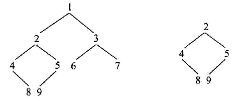
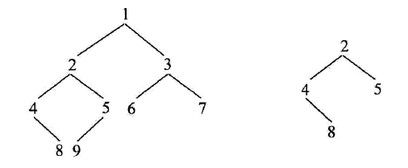

# 判断t1树中是否有t2树的全部拓扑结构的子树
和上面的题十分相似
## 题目

上面的两个树比较就可以返回true

这两个树比较就会返回false
## 分析
只需要修改base case就可以了
```
public static boolean contains(Node n1,Node n2)
    {
        return check(n1,n2)||(n1!=null?contains(n1.left,n2):false)||(n1!=null?contains(n1.right,n2):false);
    }

    public static boolean check(Node n1,Node n2)
    {
        if (n1==null && n2==null) {
            return true;
        }
        if (n1 == null||n2 == null || n1.value != n2.value) {
            return false;
        }
         return check(n1.left,n2.left)&&check(n1.right,n2.right);
    }
```
同时我们要在contains中加上对于n1的判断,因为传入的n1和n2有可能是null,为什么呢
```
因为在一方是null的时候,我们check为false,又是||,所以会继续执行下去
```
