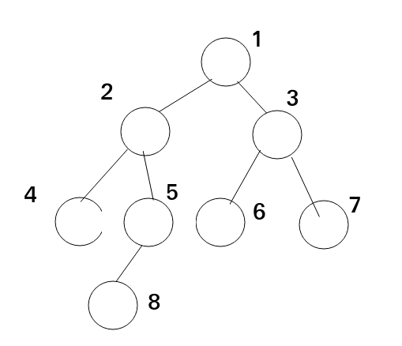
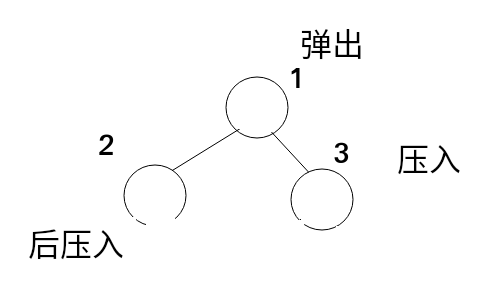
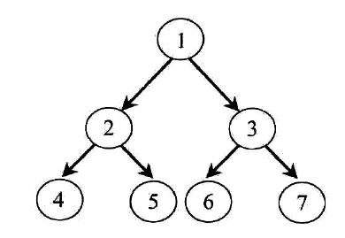
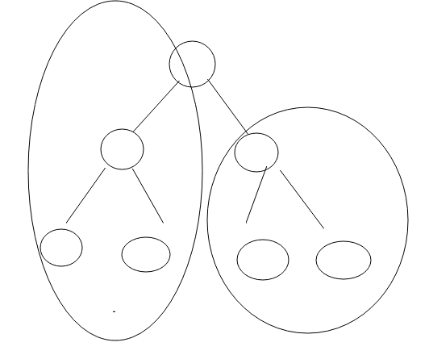

# 后序遍历(非递归和mirrors)
后序遍历相对于先序和中序更加的复杂,而且其他的题中会有更多的应用.所以我们现在开始研究后序遍历.
## 后序遍历的递归算法
```
public static void f(Node head)
{
    f(head.left)
    f(head.right)
    sout.....head.value
}
```
很简单就像是公式一样,也很好记,我们通过一个例子,走一边.

后序遍历就是先当前节点的左子树,然后当前节点的右子树,然后当前节点.
4,8,5,2,6,7,3,1..这个就是后序遍历的方式,其中每个节点都是走了两边.对于递归来说都是这样的,无论是先序中序
## 后序遍历的非递归算法
### 两个栈解决
对于非递归算法,其中肯定是应用了额外的空间,像先序中序我们用到了栈,这里肯定也是要用到栈的.我们先来看一种讨巧的方法
先看一下,先序遍历的非递归算法
```
    //xuanxv
    public static void f(Node head)
    {
        Stack<Node> stack=new Stack();
        stack.push(head);
        while(!stack.isEmpty())
        {
            Node curNode=stack.pop();
            System.out.print(curNode.value+" ");
            if(curNode.right!=null)
            {
                stack.push(curNode.right);
            }
            if(curNode.left!=null)
            {
                stack.push(curNode.left);
            }
        }
    }
```
这个也非常好记,这里的栈充当的就是保留现场的作用.我们弹出栈,就要打印它,这个就是头,弹出之后我们要对头的左右子树进行操作,先把右子树压入栈中,因为我们后来才去打印它,在讲左子树压入其中,因为下一个循环,我们要先打印左子树.我们就记住一个简单了例子就行

因为要执行这样的顺序,所以我们在循环开始之前就要将头放进来,否则无值可入.
因为先序是先头,左,右,而后序是先左,右,在头,这样的话,如果我们
```
public static void f(Node head)
    {
        Stack<Node> stack=new Stack();
        stack.push(head);
        while(!stack.isEmpty())
        {
            Node curNode=stack.pop();
            System.out.print(curNode.value+" ");
            if(curNode.left!=null)
            {
                stack.push(curNode.left);
            }
            if(curNode.right!=null)
            {
                stack.push(curNode.right);
            }
        }
    }
```
这样就是后序的逆序了,然后我们把他放在另一个栈中,在打印就是后序遍历了,这种方法比较容易理解,然后我们来看一种难以理解的解法
### 一个栈解决
```
public static void f(Node head)
    {
        Stack<Node> stack=new Stack();
        stack.push(head);
        Node top=null;
        Node pre=null;
        while(!stack.isEmpty())
        {
            top=stack.peek();
            if(top.left!=null&&top.left!=pre&&top.right!=pre)
            {
                stack.push(top.left);
            }
            else if(top.right!=null&&top.right!=pre)
            {
                stack.push(top.right);
            }
            else if((top.left==null&&top.right==null)||top.right==pre||top.left==pre)
            {
                System.out.print(stack.pop().value+" ");
                pre=top;
            }
        }
    }
```
我们以书中例子跑一下.


最开始的和先序,中序都一样要把1放入到其中,进入循环
```
在把2放入到其中 stack.peek()当前栈顶为1
把4放入到其中  stack.peek()当前栈顶为2
因为当前栈顶为4然后4是叶子节点,然后我们打印它.pre指向4
然后stack.peek()是2,这个时候2.left=pre所以就不用讲4压栈了,然后2.right!=null,5压栈
stack.peek()是5,然后叶子节点打印.pre指向5
stack.peek()是2,这个时候我们要保证4不压栈,5也不压栈,所有stack.peek().left!=pre&&stack.peek().right!=pre,然后打印2
这个时候pre是2了,栈顶是1了,然后.....
```
我们说了一边,大致了解了一下过程,就是通过if判断禁止重入.加了一个pre来记录上一个节点,我们把代码修改一下
```
public static void f(Node head)
    {
        Stack<Node> stack=new Stack();
        stack.push(head);
        Node top=null;
        Node pre=null;
        while(!stack.isEmpty())
        {
            top=stack.peek();
            if(top.left!=null&&top.left!=pre&&top.right!=pre)
            {
                stack.push(top.left);
            }
            else if(top.right!=null&&top.right!=pre)
            {
                stack.push(top.right);
            }
            else
            {
                System.out.print(stack.pop().value+" ");
                pre=top;
            }
        }
    }
```
### 后序遍历的mirrors算法

我们先看一下递归算法和非递归算法的局限性.它们是一定会使用到栈结构的,就是为了保存现场,mirrors遍历就是空间复杂度为O(1),时间复杂度为O(1)的一种方法.
而mirrors遍历对于先序,后序,中序都是千篇一律的,只是打印的时机不同,而其中最复杂的就是后序遍历.
#### mirrors遍历的过程
我们首先先来了解一下mirrors遍历的过程

mirrors遍历直接解决的就是中序遍历,它的核心思想就是利用这些null指针来构建有用的指向
分为两个过程
```
建立有用的right指针
恢复原本执行null的right指针
```
这样的操作要在一个循环中完成,是很困难的,我直接实现书中的代码
```
首先,我们用到了两个指针,命名它们为cur1,cur2
cur1就是被指向的那个节点,也是当前循环的节点
cur2就是在循环中主要被操作的节点,它在建立right指针的过程中一直跳,最后指向cur1
恢复null的过程中,也是通过cur2进行操作的
```
上面先解释了cur1,cur2的意思
```
  public static void f(Node head)
    {
        Node cur1,cur2;
        cur1=head;
        cur2=null;
        while(cur1!=null)
        {
            cur2=cur1.left;
            if(cur2!=null)
            {
               while(cur2.right!=null&&cur2.right!=cur1)
               {
                   cur2=cur2.right;
               }
               if(cur2.right==null)
               {
                   cur2.right=cur1;
                   cur1= cur1.left;
                   continue;
               }else
               {
                   cur2.right=null;
               }
            }
            System.out.print(cur1.value+" ");
            cur1=cur1.right;
        }
    }
```
#### mirrors中序遍历
也就是打印时机的变化
```
public static void f2(Node head)
    {
        Node cur1,cur2;
        cur1=head;
        cur2=null;
        while(cur1!=null)
        {
            cur2=cur1.left;
            if(cur2!=null)
            {
                while(cur2.right!=null&&cur2.right!=cur1)
                {
                    cur2=cur2.right;
                }
                if(cur2.right==null)
                {
                    System.out.print(cur1.value+" ");
                    cur2.right=cur1;
                    cur1= cur1.left;
                    continue;
                }else
                {
                    cur2.right=null;
                }
            }else
            {
                System.out.print(cur1.value+" ");
            }
            cur1=cur1.right;
        }
    }
```
打印的时机
* 当cur1没有左子树时
* 当构建有用的right指针的循环跳出时
#### mirrors实现后序遍历

其中是在恢复null时构建
其中用到了逆序字符串的操作
```
public void reverse(Node head)
{
    Node next=null;
    Node cur=head;
    Node pre=null;
    while(cur!=null)
    {
        next=cur.next;
        cur.next=pre;
        pre=cur;
        cur=next;
    }
}
```
```
其中使用到的都是right指针,修改一下
public void reverse(Node head)
{
    Node next=null;
    Node cur=head;
    Node pre=null;
    while(cur!=null)
    {
        next=cur.right;
        cur.right=pre;
        pre=cur;
        cur=next;
    }
}
```
```
 public static void f2(Node head)
    {
        Node cur1,cur2;
        cur1=head;
        cur2=null;
        while(cur1!=null)
        {
            cur2=cur1.left;
            if(cur2!=null)
            {
                while(cur2.right!=null&&cur2.right!=cur1)
                {
                    cur2=cur2.right;
                }
                if(cur2.right==null)
                {
                    cur2.right=cur1;
                    cur1= cur1.left;
                    continue;
                }else
                {
                    cur2.right=null;
                    printEdge(cur1.left);
                }
            }
            cur1=cur1.right;
        }
        printEdge(head);
    }

    public static void printEdge(Node head) {
        Node tail = reverseEdge(head);
        Node cur = tail;
        while (cur != null) {
            System.out.print(cur.value + " ");
            cur = cur.right;
        }
        reverseEdge(tail);
    }

    public static Node reverseEdge(Node from) {
        Node pre = null;
        Node next = null;
        while (from != null) {
            next = from.right;
            from.right = pre;
            pre = from;
            from = next;
        }
        return pre;
    }
```

## 总结
总结一下Morris遍历
最原始的是中序遍历,
然后更改一下,在cur2==null时打印,在构建时打印
然后后序遍历 在恢复时打印,同时记得逆序

总结一下非递归遍历
既然少了一个栈的应用,那么就要多一个变量的使用,每次都要记录上一次打印的,
防止下次循环的重入

