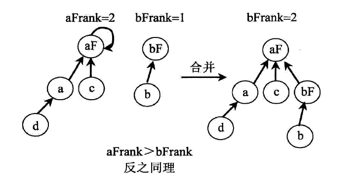
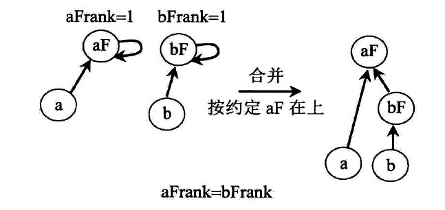

# 并查集
并查集在解决二叉树中两个节点的公共祖先用到了.我们先来学习一下它的实现细节
## 初始化
最开始的并查集,就是每个数都是单独的集合({1},{2},{3},{4},,,,,{9}),每个数都是一个集合,这样的集合是可以合并的,最后是可以合并成一个大的集合({1,2,3,4,,,,,,,9}),这是一个大的集合.**并查集呢就是集合的集合,记住这个概念**
初始化,每一个节点都有一个集合,每个集合就只有它们自己,然后这个集合的father,就是它们自己.
**我们通过HashMap来保存一个节点的father**,最开始的记录就是(a(key),a(value)).在只有一个节点的时候,还有一个rank值为0,表示这个节点一下的层数,当然是0了.这个书中称为轶.

## 一般情况下的分析
### 查找代表元素以及压缩路径 
一个节点找到自己所在集合的代表节点称为findFather,最顶层的节点的father就是自己.同时这个过程也是压缩路径的过程,让节点直接指向自己所在集合的代表节点,我们看一下书中的信息


###  合并
执行合并操作的时候,操作的不是两个集合,而是两个节点,我们先执行findFather(a),然后在执行findFather(b),得到的节点就是两个节点所在集合的代表节点.
如果相等的话,说明就就在同一个集合下,
如果不相等的话,这个时候我们就需要用到rank这个Map了,然后两个rank不同的话,谁小谁就被挂,不打好理解,我们画一张图.


## 代码实现
```
public static class DisjoinSets
{
    public HashMap<Node,Node> fatherMap;
    public HashMap<Node,Integer> rankMap;

    public DisjoinSets()
    {
      fatherMap=new HashMap<>;
      rankMap=new HashMap<>;
    }
    private void preOrderMake(Node head)
    {
       if(head==null)
       {
         return ;
       }
       fatherMap.put(head,head);
       rankMap.put(head,0);
       preOrderMake(head.left);
       preOrderMake(head.right);
    }
    public Node findFather(Node n)
    {
       Node father=fatherMap.get(n);
       if(father!=n)
       {
           father=findFather(n);
       }
       fatherMap.put(n,father);
       return father;
    }
    public void union(Node a,Node b)
    {
        if(a==null||b==null)
        {
            return ;
        }
        Node aFather=findFather(a);
        Node bFather=findFather(b);
        if(aFather!=bFather)
        {
            int aFrank=rankMap.get(aFather);
            int bFrank=rankMap.get(bFather);
            if(aFrank<bFrank)
            {
                fatherMap.put(aFather,bFather);
            }else if(aFrank>bFrank)
            {
                fatherMap.put(bFather,aFather);
            }else
            {
                fatherMap.put(bFather,aFather);
                rankMap.put(aFather,aFrank+1);
            }
        }
    }
}
```
代码分析
其中最让人在意的就是找到father(代表节点,并且压缩路径的代码),就是几行代码的递归,完成的非常简单.
**思维方式**我们要一直一直的去找father,知道father等于自身,然后我们要在同时完成压缩路径,这个时候就相当于是反馈,我们倒着分析,我们得到了father(代表节点),然后要返回最里面一层的肯定是fatherMap.put(father,father).然后返回节点,然后就是退出一层了,回到了上一层,这个时候,我们我们返回的还是father(代表节点),然后继续通过map设置就可以了.

**递归返回的值都是一致的,就像套娃一样,一层的接一层,但是最后的结果是只有一个,然后反过来,一层一层的回给最开始的调用**