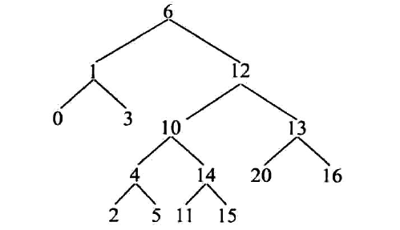
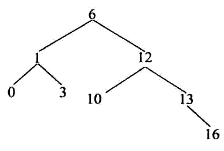

# 最大搜索二叉树拓扑结构(一)
## 题目
我们先来看一下题目

它的最大二叉树拓扑结构为

所以要区分这一道题和**求最大搜索二叉树**两道题的区别
## 分析
首先求最大搜索二叉树是从下向上走的,所以要用到后序遍历,而这一道题是一每个头节点来计算的,则应该按照先序遍历.
我们应该以某个节点为头结点,然后向下一个一个的判断是否能够加入自己的最大搜索二叉树的拓扑.我们首先来解决这个问题
我们的当前的头结点为root,然后被判断的节点为n
```
public boolean isMine(Node root,Node n)
{
   //base case
   //如果到底了
   if(n==null) return false;
   if(n==root) return true;
   return isMine(root.value>n.value?root.left:root.right,n); 
}
```
我们看这个代码,我们就知道,这个方法就是对最原始的搜索二叉树的使用,充分发挥了搜索二叉树的作用.这个是第一点
我们已经完成了第一步,然后我们来实现第二步
```
public int maxtuopu(Node root,Node n)
{
   如果当前的节点满足条件if(isMine(root,n))
   {
        //我们就继续向下面找
        return maxtuopu(root,n.left)+maxtuopu(root,n.right)+1;  
   }
   return 0;
}
```
## 代码实现
```
    public static int f(Node head)
    {
        if(head==null)
            return 0;
        int max=maxTuoPu(head,head);
        max=Math.max(max,f(head.left));
        max=Math.max(max,f(head.right));

        return max;
    }
    public static int maxTuoPu(Node head,Node n)
    {
        if(head!=null&&n!=null&&isMine(head,n))
        {
            return maxTuoPu(head,n.left)+maxTuoPu(head,n.right)+1;
        }
        return 0;
    }

    public static boolean isMine(Node head,Node n)
    {
        if(head==null) return false;
        if(head==n) return true;

        return isMine(head.value>n.value?head.left:head.right,n);
    }
```

## 总结
这道题的解法并不符合套路,先序后序还是中序的使用并不是十分的明显
总结如下几点
* 我们要充分利用搜索二叉树的特点,通过**搜索二叉树判断某一个节点是否可以加入到当前的拓扑中**,我们在把这个利用BST特性的代码写一下
```
public static boolean f(Node root,Node n)
{
    if(root==null) return false;
    if(root==n) return true;
    
    return f(head.value>n.value?head.left:head.right,n);
}
```
充分理解递归的含义
* 在递归中一行一行的去找,也就是第二个递归函数
* 针对每一个节点进行一次判断的递归函数
这道题的三个递归函数,要充分理解它们的含义

