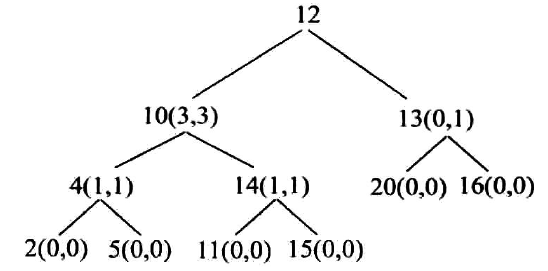

# 最大搜索二叉树拓扑结构(二)
我们完成了第一种方法,通过了三个递归方法,我们来分析一下它的时间复杂度,每个节点都要进行查找,最大的情况就是N个节点,所以时间复杂度为O(n^2).
然后我们来看第二种方法,引入了一个复合的返回值-----拓扑贡献率
## 拓扑贡献率
我们先来看看拓扑贡献率的概念,举两个例子

其中左边的这一颗比较大的树,就是一个BST,其中每个节点值后面,都跟着一个括号,括号里面都有两个值,其含义就是
当前节点的左子树贡献了几个节点,使它称为BST,第二个值就是当前节点的右子树贡献了几个节点,使它成为了BST.其中4(1,1),表示它的左右子树各贡献了一个
然后我们来看一下右边比较小的这棵树,它不是一个BST,但是13和16可以构成一个BST,那么以13为头结点,形成BST,只有它的右子树贡献了.
## 分析
这个方法的核心就是如果得到了两个子树节点的拓扑贡献率的话,就可以推出来当前节点的拓扑贡献率  


第一个方法就是类似**最大搜索二叉树拓扑结构(一)**中的第三个递归函数,充分利用了BST的特性,一点点的向下找.我们先来复习一下
```
//判断一个节点是否在当前节点的BST拓扑中
public static boolean isMine(Node n,Node v)//n是一直动的节点,而v是一直被比的节点
{
    if(n==null) return false;//首先就是base case的判断,也就是递归函数的常用的思路,就是首先判断是否递归完成
    //然后就是核心思路阶段
    if(n==v) return true;
    else
    {
        return isMine(n.value>v.value?n.left,n.right);
    }
}
```
我们从中也是可以找出一点规律的,像这样的利用BST进行查找的题目
```
//base case
//如果找到的话
//如果没有找到的话
```
这就是这类题的规律
然后我们来看这一道题,我们先要明确我们现在要干什么,我们从当前的节点一直向下修改拓扑贡献率


因为左子树和右子树的思路是相同的,只是比较是不同的,我们通过一个boolean类型的值,区分左子树和右子树
```
public static int modify(Node h,int value,HashMap map,boolean flag)
{
   if(h==null)
   {
      return 0;
   }
   Record res=map.get(n);
   //命中
   if((flag&&h.value>value)||(!flag&&h.value<value))
   {
       //map.remove(n);
       return res.l+res.r+1;
   }
   else
   {
       int minute=modify(flag?h.right:h.left,value,map,flag);
       if(flag)
       {
          res.r-=minute;
       }else
       {
          res.l-=minute;
       }
       map.put(h,new Record(res.l,res.r));
       return minute;
   }
}
```
我们可以进一步的简化....
```
public static int modify(Node h,int value,HashMap map,boolean flag)
{
   if(h==null||!m.containKey(n))
   {
      return 0;
   }
   Record res=map.get(n);
   //命中
   if((flag&&h.value>value)||(!flag&&h.value<value))
   {
       map.remove(n);
       return res.l+res.r+1;
   }
   else
   {
       int minute=modify(flag?h.right:h.left,value,map,flag);
       if(flag)
       {
          res.r-=minute;
       }else
       {
          res.l-=minute;
       }
       map.put(h,new Record(res.l,res.r));
       return minute;
   }
}
```
现在我们已经完成了修改拓扑贡献率的问题,然后我们继续

我们的核心思路是两边的拓扑贡献率完成修改之后,再来修改当前的.
```
所以我们的思路是

后序遍历左子树,获取到信息
后序遍历右子树,获取到信息

然后都当前信息进行修改
```
我们先来写逻辑
```
public static int postOrder(Node h,HashMap map)
{
    if(head==null)
    {
        return 0; 
    }
    int ll=postOrder(h.left,map);
    int rl=postOrder(h.right,map);
    modify(h.left,h.value,map,true);
    modify(h.right,h.value,map,false);
    //已经修改好的
    Record lr=map.get(h.left);
    Record rr=map.get(h.right);
      
    map.put(h,new Record(lr,rr));
    return 当前最大 
}
```
然后就是边界条件的判断
```
public static int posOrder(Node h, Map<Node, Record> map) {
		if (h == null) {
			return 0;
		}
		int ls = posOrder(h.left, map);
		int rs = posOrder(h.right, map);
		modifyMap(h.left, h.value, map, true);
		modifyMap(h.right, h.value, map, false);
		Record lr = map.get(h.left);
		Record rr = map.get(h.right);
		int lbst = lr == null ? 0 : lr.l + lr.r + 1;
		int rbst = rr == null ? 0 : rr.l + rr.r + 1;
		map.put(h, new Record(lbst, rbst));
		return Math.max(lbst + rbst + 1, Math.max(ls, rs));
	}
```

## 总结
* 这道题用到了两个递归,一个典型的后序遍历的改写,同
{"files":["/home/chengcongyue/文档/vnote_notebooks/chengcongyue/算法与数据结构/二叉树/后序遍历以及应用/后序遍历(非递归和mirrors).md",
            "/home/chengcongyue/文档/vnote_notebooks/chengcongyue/算法与数据结构/二叉树/后序遍历以及应用/最大搜索二叉树.md",
            "/home/chengcongyue/文档/vnote_notebooks/chengcongyue/算法与数据结构/二叉树/后序遍历以及应用/两个节点的最大距离.md"],"is_cut":false,"magic":2094988287,"type":0}

* 然后就是基于BST特性的从上向下遍历
* 然后就是map的remove和base case判断,在第一个中对get(n)的判断我们来看一下书中的内容

