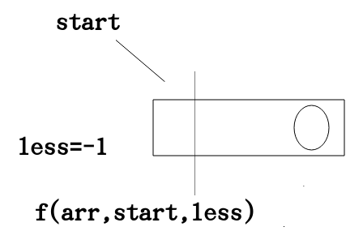
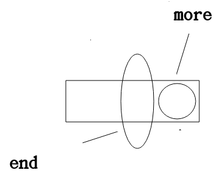

# 根据后序数组重建搜索二叉树(二)
通过1的思路我们可以根据一个后序遍历的数组进行重建
```
 public static Node getSearchByArray(int[] arr,int start,int end)
    {
         if(start==end)
         {
             return new Node(arr[start]);
         }
         Node node=new Node(arr[end]);
         int less=-1;
         int more=end;
         for(int i=start;i<end;i++)
         {
             if(arr[i]<arr[end])
             {
                 less=i;
             }else
             {
                 more=more==end?i:more;
             }
         }
         if(less==-1)
         {
             node.left=null;
         }else
         {
             node.left=getSearchByArray(arr,start,less);
         }
        if(more==end)
        {
            node.right=null;
        }else
        {
            node.right=getSearchByArray(arr,more,end-1);
        }

        return node;
    }
```
## 优化
我们在base case中和**核心逻辑中**都有new Node的操作.我们想一想能不能只有一个new Node的操作.
我们就考虑一下一边的子树为0的情况


所以base case
```
if(start>end) return null
```
### 代码实现
```
 public static Node getSearchTreeByArray(int[] arr,int start,int end)
    {
        if(start>end) return null;
        int less=-1;
        int more=end;
        Node node=new Node(arr[end]);
        for(int i=start;i<end;i++)
        {
            if(arr[end]>arr[i])
            {
                less=i;
            }else
            {
                more=more==end?i:more;
            }
        }
        node.left=getSearchByArray(arr,start,less);
        node.right=getSearchByArray(arr,more,end-1);
        return node;
    }
```
