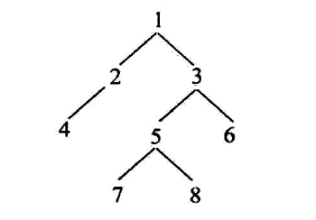
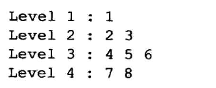
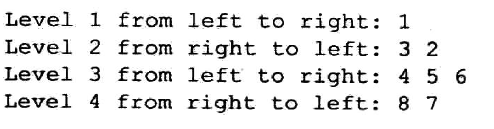

# 二叉树的按行遍历
## 打印行号然后按行遍历
二叉树的按行遍历是使用队列最典型的操作了,先进队列的就先打印,我们这一道题修改一下,增加一下难度,同时加深都二叉树的按行遍历的理解

其运行结果如下:


### 分析
这样的话就不能仅仅背代码了,我们先来实现最原始的二叉树的按行遍历
```
public static void printTreeByLevel(Node head)
    {
       LinkedList<Node> queue=new LinkedList<>();
       //add head
       queue.addLast(head);
       while(!queue.isEmpty())
       {
           Node curNode=queue.poll();
           System.out.print(curNode.value+" ");
           if(curNode.left!=null)
           {
               queue.addLast(curNode.left);
           }
           if(curNode.right!=null)
           {
               queue.addLast(curNode.right);
           }
       }
    }
```
也就是使用了队列**先进先出**的特性,我们画一张图,来表示它的核心操作

如果我们还要打印每一行并且做到换行,我们就要在每一行的最后一个节点,执行某些操作
```
last用来记录当前这一行的最后一个节点
我们从最开始来想,也就是头结点的时候,当打印完头结点之后,就要进行换行了,这个时候head==last
在每次入队的时候,我们要记录下一行的情况,这样,就实现了循环
```
### 代码实现
```
 public static void printTreeAndLevelByLevel(Node head)
    {
        LinkedList<Node> queue=new LinkedList<>();
        //add head
        queue.addLast(head);
        int level=1;
        System.out.println();
        System.out.print("level "+level+++" :");
        Node last=head;
        Node nlast=null;
        while(!queue.isEmpty())
        {
            Node curNode=queue.poll();
            System.out.print(curNode.value+" ");
            if(curNode.left!=null)
            {
                queue.addLast(curNode.left);
                nlast=curNode.left;
            }
            if(curNode.right!=null)
            {
                queue.addLast(curNode.right);
                nlast=curNode.right;
            }
            if(curNode==last&&!queue.isEmpty())
            {
                System.out.println();
                System.out.print("level "+level+++" :");
                last=nlast;
            }
        }
    }
```

## ZigZag遍历
其中还是要使用到last和nlast的交替使用,然后还要使用到flag来完成正这打印和反这打印
```
   public static void printTreeByZigZag(Node head)
    {
        LinkedList<Node> queue=new LinkedList<>();
        queue.addLast(head);
        Node last=head;
        Node nlast=null;
        boolean flag=true;
        Node cur=null;
        int level=1;
        printFromToAndLevel(level++,flag);
        while(!queue.isEmpty())
        {
           if(flag)
           {
               cur=queue.pollFirst();
               if(cur.left!=null)
               {
                   nlast=nlast==null?cur.left:nlast;
                   queue.addLast(cur.left);
               }
               if(cur.right!=null)
               {
                   nlast=nlast==null?cur.right:nlast;
                   queue.addLast(cur.right);
               }
           }else
           {
               cur=queue.pollLast();
               if(cur.right!=null)
               {
                   nlast=nlast==null?cur.right:nlast;
                   queue.addFirst(cur.right);
               }
               if(cur.left!=null)
               {
                   nlast=nlast==null?cur.left:nlast;
                   queue.addFirst(cur.left);
               }
           }
           System.out.print(cur.value+" ");
           if(cur==last&&!queue.isEmpty())
           {
               flag=!flag;
               last=nlast;
               nlast=null;
               System.out.println();
               printFromToAndLevel(level++,flag);
           }
        }
    }
```
其中改变的就是确认nlast的时机,也就是在nlast为空的确认,要每一行的第一个才行
然后就是flag的改变