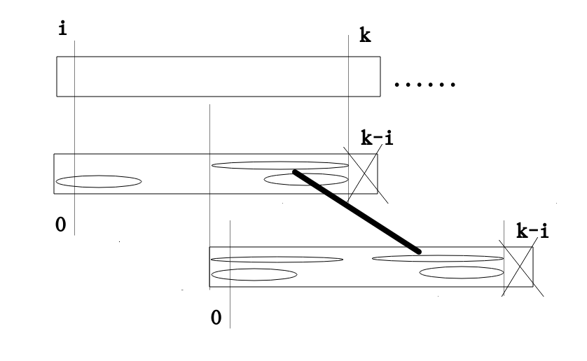

# KMP算法
## 简介
KMP算法的典型应用就是字符串的匹配,也就是str和match进行匹配,其中match是比较小的那个,我们返回匹配成功的起始位置
## 分析
KMP算法是在普通算法的基础上进行了改进,进入了前缀子串和后缀子串的概念
对于普通的匹配,它每一次都是相同的操作,这样的操作就是不懂脑子的时间复杂度就是两个字符串长度的乘积
KMP算法就是在从左到右的过程中实现了加速,通过前后缀的信息,可以知道一些位置是不用进行匹配的,从而实现了加速,KMP算法可以做到O(N)(比较长的,被匹配的那个)
### 前缀和后缀子串的概念
```
abc123abcf
aaab
```
我们求的前缀和后缀子串是相对于数组中的某个位置说的,而不整个数组来说的
```
当我们求arr[i]的前缀后缀.....的相关问题时,求的范围是不包括当前位置的,也就是0......i-1的范围
```
我们求的前缀子串是不包括i-1的,我们求的后缀子串是不包括0的位置的.
因此我们可以知道一个字符的前缀还是后缀的长度都是-1,如果是两个字符呢,它的前缀和后缀就是0
```
next[0]=-1
next[1]=0
```
以上就是两个默认情况,然后我们可以知道abc123abcf中求f的前缀和后缀最大的匹配长度为abc为3
aaab以b为结尾的前缀后缀最大匹配长度为2,子串为aa
### KMP实现匹配加速的原理

上图,其中上面的字符串为str,下面的为match,我们假设匹配到k位置就停止了,我们从i位置开始匹配
```
我们可以知道当前子串匹配成功的下标为k-i
```
如果是对于普通的方法来说,我们这一次匹配失败,我们下一次就是从i+1位置开始匹配,这个时候就要用到前缀和后缀的概念了

画×的两个位置继续进行匹配,椭圆表示的是前缀和后缀的匹配子串,现在我们就要解决一个问题,

涂黑的位置为什么不能匹配成功,假设我们可以在涂黑的某个位置匹配成功

入上图,假设我们有更大的椭圆可以匹配成功,那么在match子串中会有更大的前缀后缀匹配长度,所以不可能.
### 前缀后缀最大匹配长度的求法
现在我们就要求这个最大匹配长度,也就是这个next数组,我们在上面分析中可以知道
```
next[0]=-1
next[1]= 0
```
假设当前位置为i,i位置它是依赖于前面的值的
```
next数组的生成是从左到右的
```
我们可以把它看做成动态规划的一种实现思路
```
我们要求next[i]的时候,这个时候我们已经知道next[i-1]的值了,next[i-1]就表示i-1之前,也就是0....i-2的匹配情况
如果i-1的值和next[i-1]的前缀子串下一个值相等,那么next[i]=next[i-1]+1;
```
通过上面的描述,我们知道我们需要一个变量一直指向前缀子串的下一个位置,设置为cn
```
如果i-1的值和next[i-1]的前缀子串下一个位置的值不相等,也就是match[cn]!=match[i-1]
```
在这里说一下,我们还是要继续寻找next[i]的子串,也就是还要将match[i-1]的值和某个值进行匹配,所以我们要继续寻找i-1之前后缀子串

```
if(match[cn]!=match[i-1])
{
    if(cn>0)
    {
        cn=next[cn];
    }else
    {
        next[i++]=0;
    }
}
```
```
public static int getMaxP(char[] arr)
    {
        int[] nextStr=new int[arr.length];
        nextStr[0]=-1;
        nextStr[1]=0;
        int pos=2;
        int cn=0;//
        while(pos<arr.length)
        {
            if(arr[cn]==arr[pos-1])
            {
                nextStr[pos++]=++cn;
            }else if(arr[cn]!=arr[pos-1])
            {
                if(cn>0)
                {
                   cn=nextStr[cn];
                }else if(cn==0)
                {
                    nextStr[pos++]=0;
                }
            }
        }
        return nextStr[arr.length-1];
    }
```
## 代码实现    
```
 public static int getIndexOf(String s,String m)
    {
        char[] ss=s.toCharArray();
        char[] ms=m.toCharArray();
        int si=0;
        int mi=0;
        int[] next=getNextArray(ms);
        while(si<ss.length&&mi<ms.length)
        {
            if(ss[si]==ms[si])
            {
                si++;
                mi++;
            }else if(next[mi]==-1)
            {
                si++;
            }else
            {
                mi=next[mi];
            }
        }

        return mi==ms.length?si-mi:-1;
    }
```
## 分析2
星期五写的分析,现在重新进行分析一下,我们要明确,nextArr的生成是从左向右一次生成的,就像我们的动态规划中的dp的使用,每一个当前的值都是依赖前面的值得到的,`所以我们首先要确定最开始位置的值`,并且在此之前,我们要明确,nextArr[i]表示的意思
### 明确nextArr的含义
```
nextArr[i]表示0-----i-1中前缀和后缀的最大匹配长度,然后前缀不包括i-1的位置,后缀不包括0的位置,这样我们就可以知道nextArr[0]=-1,nextArr[1]=0,也可以把这个当做是硬性规定
```
### 设置什么变量
我们画一张图

从上一小节中,我们知道nextArr[i]是依赖i-1的值得到的,我们在明确我们现在的任务是得到nextArr[i]的值,所以nextArr[i-1]的值就知道了,我们肯定要将i-1位置的值和前缀后面的那个数做比较,`变量cn因此产生`,前缀也是时刻发生变化的,所以我们又多了一个任务就是维护cn的值的变化
```
在i-1位置的值和cn位置的值相等的时候,我们nextArr[i]=nextArr[i-1]+1,cn++(important)
```
更简便的,我们可以
```
nextArr[i]=++cn;
```
以上是在相等的时候,完成的值的改变,那么如果i-1和cn的值不相等呢
### 不相等的情况
不相等,我们不能完全妥协,我们就要来到cn的位置,画一张图

在我们cn的位置和i-1的值不相等的时候,我们就要做出适当的妥协,但是还是要明确我们的目的,找到前后缀的匹配,剩下的可能性就是在CN之前了,
```
a b a m......a b a a q
```
当我们用q之前的a去匹配的时候,匹配的是m不相等,我们找到m之前的前后缀,cn指向了a
```
if(cn>0)
{
   cn=nextArr[cn];
}
```
当我们当前的位置不匹配了,我们就要在cn之前找,因为在cn之前的前后缀匹配中,其中的后缀和i-1的后缀,从右开始就可能有相等的部分,如果没有继续让cn=nextArr[cn],牢记`cn=nextArr[cn]`这个代码
### 比较极端的情况
当一直缩,一直都找不到相匹配的子串怎么办?这个时候cn=nextArr[cn]会一直进行,然后肯定会碰到nextArr[cn]=0的情况,这个时候cn就是1,之前是不可能有子串可以使用的,我们继续cn=nextArr[cn]最后肯定会等于-1的
### 分析2的总结
我们再一次分析了nextArr数组是如何得到的,还是要注意
- 1,cn变量为什么要设
- 2,`if(cn>0){cn=next[cn]}else if(cn==-1){ nextArr[pos++]=0}`


## 主方法的分析
主方法就是进行核心逻辑的方法,就是匹配的方法,我们贴上代码
```
  public static int f(char[] str,char[] match)
    {
        int strIndex=0;
        int matchIndex=0;
        int[] nextArr=getNextArr(match);
        while(strIndex<str.length&&matchIndex<match.length)
        {
            if(str[strIndex]==match[matchIndex])
            {
                strIndex++;
                matchIndex++;
            }else if(nextArr[matchIndex]>0)
            {
                matchIndex=nextArr[matchIndex];
            }else
            {
                strIndex++;
                matchIndex=0;
            }
        }
        return matchIndex==match.length?strIndex-matchIndex:-1;
    }
```
我们需要注意的几个点
- 1,while()循环,我们需要保证两个字符串的字符都要小于最大长度,很好理解
- 2,相等的情况最容易判断
- 3,如果不相等并且nextArr[matchIndex]>0,这个时候就要向前移动,说明这个时候有子串匹配
- 4,如果nextArr[matchIndex]=或者<0,表明这个时候全部没有办法匹配,我们需要注意`一定要将matchIndex置为0`
但是如果是下面的这种判断
```
 if(str[strIndex]==match[matchIndex])
            {
                strIndex++;
                matchIndex++;
            }else if(nextArr[matchIndex]==-1)
            {
                strIndex++;
            }else
            {
                matchIndex=nextArr[matchIndex];
            }
```
就没有必要将matchIndex设置为0了,因为这个时候matchIndex一定为0