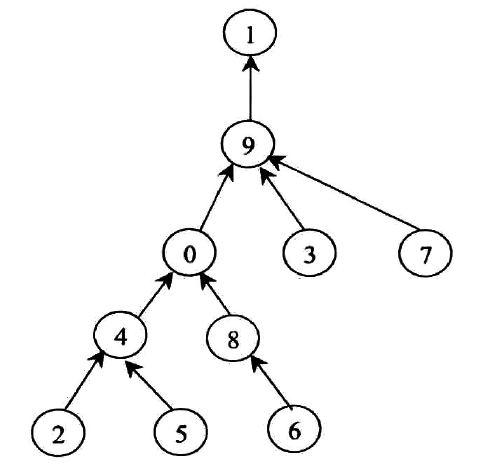

# 路径数组变成统计数组
给定一个路径数组paths,表示一张图,paths[i]==j代表城市i连向城市j,如果paths[i]=j,表示城市i连向城市j,当paths[i]=i,表示是首都.如下图paths数组为

[9,1,4,9,0,4,8,9,0,1]图片如下:


如图所示,首先我们要实现的第一步就是这个paths数组转化为距离数组,也就是path[i]=j表示到首都的距离为j,我们先不分析,直接呈现代码
```
public static void f1(int[] paths)
{
     int cap=0;
     for(int i=0;i!=paths.lenght;i++)
     {
          if(paths[i]==i)
          {
              paths[i]=0;
          }else if(paths[i]>-1)
          {
              int curI=paths[i];
              paths[i]=-1; 
              int preI=i;
              while(paths[curI]!=curI)
              {
                  if(paths[curI]>-1)
                  {  
                      nextI=paths[curI];
                      paths[curI]=preI;
                      preI=curI;
                      curI=nextI;     
                  }else{ break;}
              }
              int value=path[curI]==curI?0:path[curI];
              while(path[preI]!=-1)
              {
                   int lastPreI=path[preI];
                   path[preI]=--value;
                   preI=lastPreI;
              }
              path[preI]=--value;
          }
          
     }


}

```
然后就是把距离数组变成统计数组了
```
public static void f2(int[] disArr)
{
     for(int i=0;i<disArr.length;i++)
     {
         int index=disArr[i];
         if(index<0)
         {
              index=index*-1;
              
              while(true)
              {
                  if(disArr[index]>-1)
                  {
                       disArr[index]++;
                       break;
                  }else
                  {
                      int nextIndex=disArr[index];
                      disArr[index]=1; 
                  }
              }
         }     
     
     }
}
```
