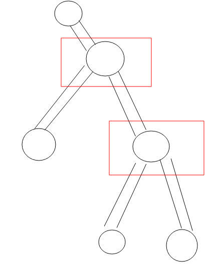
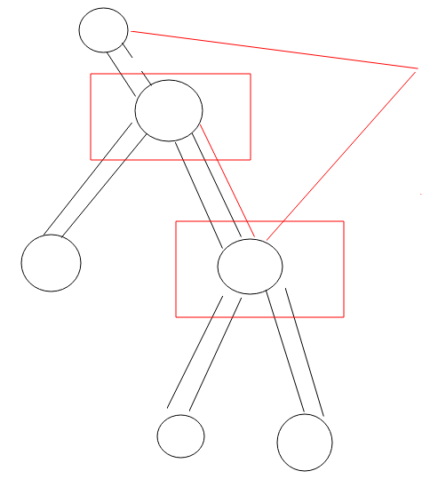
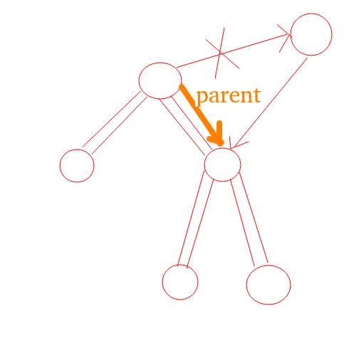

# 在一个数据流中时刻取得到中位数(一)
这道题比较复杂,我们分成几块进行开发
首先我们先不看题目,我们现在定义,节点的类型为如下
```
public static class Node<K> {
        public K value;
        public Node<K> left;
        public Node<K> right;
        public Node<K> parent;

        public Node(K data) {
            value = data;
        }
}
```
就是树节点,包括泛型(这无所谓),我们现在要完成一个任务,就是将树中的相邻两个节点交换位置.



我们对其中的两个节点进行操作,首先要获取其中所有的相邻节点,我们把上面标注的称为parent,下面标注的称为node
```
parentParent=parent.parent;
parentLeft=parent.left;
parentRight=parent.right;
nodeLeft=node.left;
nodeRight=node.right;
```
我们把周围的5个节点全部获取到了,这个时候,我们就要更改连接了,我们先来修改最简单的,也就是parentParent和parent的连接,因为这涉及到的连接是最少的
```
if(parentParent!=null)
{
   if(parentParent.left=parent) parentParent.left=node;
   else parentParent.right=node;
}
parent.parent=node;
```
这个时候连接就变成了

 
重新画一下


然后修改node下的两个节点
```
  if(nodeLeft!=null)
  {
     nodeLeft.parent=parent;  
  }
  if(nodeRight!=null)
  {
     nodeRight.parent=parent;
  }
```
然后就是node和parent的关系
```
if(parent.left==node)
{
   node.left=parent;
   node.right=parentRight;
   if(parentRight!=null)
   {
      parentRight.parent=parent;
   }
}
```
```
if(parent.right==node)
{
   node.left=parentRight;
   node.right=parent;
   if(parentLeft!=null)
   {
      parentLeft.parent=parent;
   }
}
```
最后就是连接
```
parent.left=nodeleft;
parent.right=nodeRight;
```
### 总结
交换两个相邻的节点,实际上就是修改指针的变化,我们首先应该要明确,**和它们向关联的节点有哪些,然后再按照特定的顺序对它们进行修改**

首先,我们对父节点的指向进行修改
然后我们对父父节点指向node,parent指向node,上面的问题解决
然后就是node和parent的关系
这里要判断两个节点之间的相互关系
如果node是parent的左孩子,那么node将变为node.left=parent,node.right=parentRight(然后判断再进行反指)
如果node是parent的右孩子,那么node将变为node.right=parent,node.left=parentLeft(然后判断再进行反指)
最后剩下的是node的两个孩子,和parent相互指向即可.