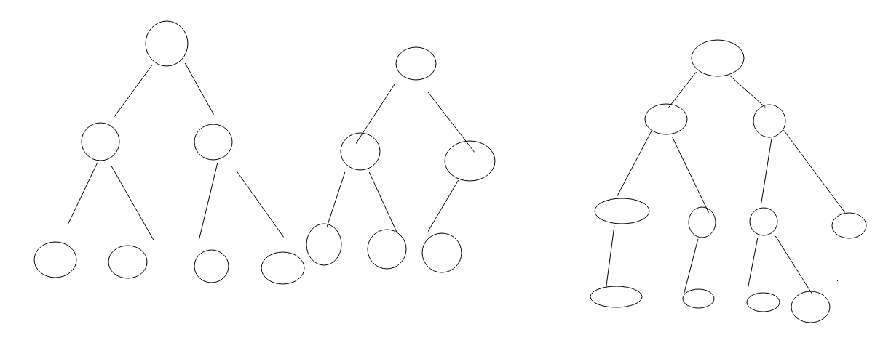

# 在一个数据流中时刻取得到中位数(二)
在(一)中完成了,相邻节点的交换,只是完成了一小部分,然后我们要自己定义一个堆,和平常的堆不同,这个堆就是实实在在的树形结构
我们先定义堆的节点类型,根据(一)我们知道,Node类型是有parent的节点的,所以下面就是我们的节点类型
```
public static class Node<K>
{
   public K value;
   public Node<K> left;
   public Node<K> right;
   public Node<K> parent;

   public Node(K k)
   {
      this.k=k;
   }

}
```
然后我们在来创建一个堆,名字叫做MyHeap,我们想想这里需要哪些值,我们类比数组的堆,肯定需要一个头结点,然后在完成heapInsert和heapfiy的过程中要可以获取到未节点也就是树中最右下角的节点,然后需要size,记录节点的个数,heapInsert的需要,我们这里还需要一个比较器,我们这个先带着,在三中进行解释.这样的话堆的雏形就出来了
```
public static class MyHeap<K>
{
   public Node<k> head;
   public Node<k> tail;
   public int size;
   public Comparator<K> comp;

   //构造函数也出来了
   public MyHeap(Comparator comparator)
   {
      this.head=null;
      this.tail=null;
      this.size=0;
      this.comp=comparator;
   }
}
```
我们来写第一个方法,addNode(K k)也就是向树中最后的位置添加一个节点.
我们先来分析一下,在最后的位置添加一个节点,可能的情况有哪些,我先画几种情况

至于为什么是这几种情况,是因为在堆的形成过程中,实际上是按照行来形成的,所有,一定是完全二叉树,所以,在完全二叉树中,得到最后位置的节点,然后在插入一个新的位置的节点,就上面这几种情况.
```
public void add(K value)
{
   Node newNode=new Node<K>(value);
   if(size==0)
   {
       
   }
   Node<K> node=last;
   Node<K> parent=node.parent;
   while(parent!=null&&parent.left!=node)
   {
       node=parent;
       parent=node.parent;
   }
}
```
为什么要按照上面这种形式查找呢?我们结合图来分析一下,通俗的说一下就是要得到最近的一个要分叉的位置.然后根据parent的不同我们进行不同的处理
```
   Node<K> nodetoAdd=null; 
   if(parent==null)//图片一的情况
   {
       nodeToAdd=mostLeft(head);
       nodeToAdd.left=newNode;
       newNode.parent=nodeToAdd;
   }
```
```
   //情况二 
   else if(parent.right!=null)
   {
        parent.right=newNode;
        newNode.parent=parent;
   }

```
```
   //情况三
   else
   {
       nodeToAdd=mostLeft(node.right);
       nodeToAdd.left=newNode;
       newNode.parent=nodeToAdd;
   }
```
在(二)中,我们完成了MyHeap的基本属性,以及它的方法,add(将新的节点放在树中的最后的位置).