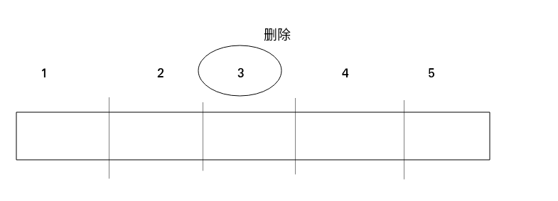
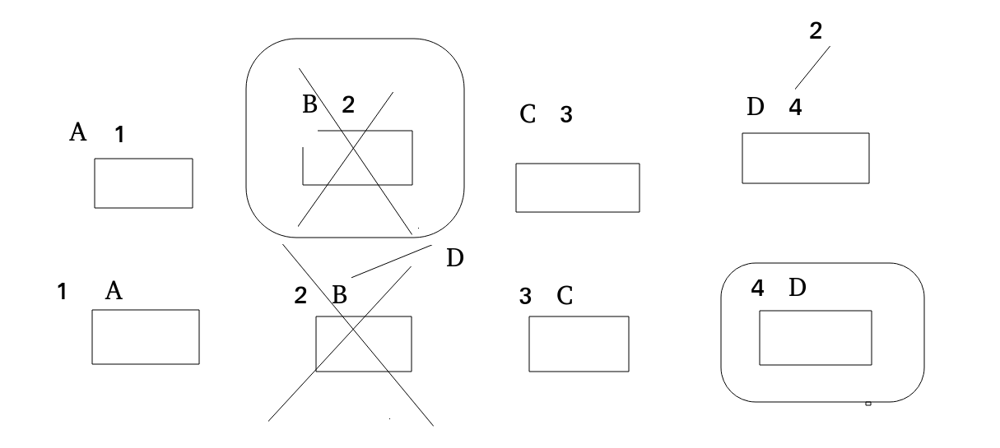

# 设计一个randomPool结构
### 题目
设计一个结构,此结构有三个功能:
* insert(key):将某个key加入到结构中,做到不重复
* delete(key):删除key
* getRandom():等概率的返回结构中的值


### 分析

根据题目可以知道,这一定要使用hash进行解决,其中比较与众不同的是,等概率的返回结构中的值,也就是getRandom()这个方法.我们假设有这样的一种情况,


如图所示,这个时候我们删除结构中的3,这个时候此结构就不连续了,这样也就没有办法做到等概率返回数值了,所以如何能够实现等概率的返回结构中的值呢?一定要让结构保持连续,这个时候我们就要用到一个hash设计中的一个技巧,创建两个hash表,分成存放<key,value>和<value,key>
```
public static class Pool<K> //我们加上泛型
{
    private HashMap<K,Integer> hash1=new HashMap<>();
    private HashMap<Integer,K> hash2=new HashMap<>();
    private int size;
    .....//其方法尚未实现
}

```
这就是我们初始化的情况,我们知道在Insert的时候是不会造成结构不连续的,所以Insert的方法,正常的操作即可
```
   public void Insert(K key)
   {
       if(!hash1.containsKey(key))
       {
           hash1.put(hash1,size);
           hash2.put(size++,hash2);
       }
   }

```
然后就是重头戏了,我们如何进行删除了,因为删除有可能造成结构的不连续,我们先来看代码
```
   public void delete(K key)
   {
      if(hash1.containsKey(key)) 
      {
         int lastIndex=--size;//
         K lastKey=hash2.get(size);//
         int deleteIndex=hash1.get(key);//
         hash1.put(lastKey,deleteIndex);
         hash2,put(deleteIndex,lastKey);
         hash1.remove(key);
         hash2.remove(lastKey);
      }
   }
```
看起来很乱,我们来分析一下过程
```
     int lastIndex=--size;//最后位置的下标
     int lastKey=hash2.get(size);//最后位置的值
     int deleteIndex=hash1.get(key);//删除位置的下标
     hash1.put(lastKey,deleteIndex);//新的位置生成
     hash2,put(deleteIndex,lastKey);//同上
     hash1.remove(deleteIindex);//旧的位置删除
     hash2.remove(lastKey);//旧的下标也删除
     
```

最终要删除的就是化成圆形矩阵的,所有最后remove的是
hash1.remove(key);
hash2.remove(lastIndex);
对于这道题来说,**先添加,再删除是比较简单的做法**

然后就是getRandom()
```
public K getRandom()
{
   int randomIndex=(int)(Math.random()*size); 
   return  hash2.get(randomIndex);  
}
```