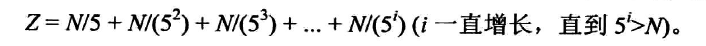

# 阶乘相关问题
## 题目

## 分析
### 原方法
对于这种会有较大数据参与的题目,都不应该直接算值,因为时刻有溢出的风险.
我们分析一下,末尾0的个数和什么有关系?
```
2*5肯定会出1个0,如果是两个2*5那么就出两个0,但是2的数量是远远大于5的数量的,这里2表示的是因子(2,4,6,....)
```
所以阶乘中有多少个5,最后结果就会有多少个0
所以我们要求的就是1到num之中,一共有多少个5的因子.
```
int res=0;
for(int i=5;i<num+1;i=i+5)
{
    int cur=i;
    while(cur%5==0)//为什么是这个循环条件,因为最后肯定是1,1%5==1,不等于0
    {
        res++;
        cur=cur/5;
    }
}
```
### 优化之后

我们可以在5,10,15,20,25,30..........5的倍数中,分别拿到5的因子,这个时候5的数量就是N(有多少个数)/5,N/5
然后我们可以在25,50,75,100,125......中在拿到一个5.........有多少这样的数.........N/25
我们可以在125,250,375.............再拿到一个5,这样的数有.........N/125

解法如下:
```
int res=0;
while(num==0)//一直加到N/5^i当这个为0时,就暂停
{
   res+=num/5;
   num=/5; 
}
```
## 进阶题目

## 分析
上面判断的是5的因子,我们这里判断2的因子
```
int res=0;
while(num!=0)
{
   num=num/2; //  <--------> num>>>=1;
   res+=num; 
}
```
```
num=num/2;  ------- num>>>=1
```