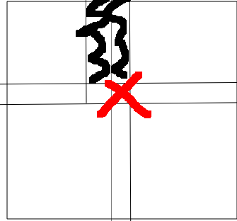
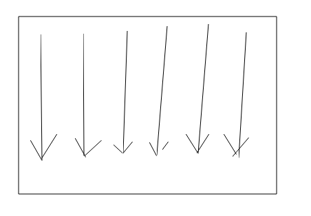

# 丢棋子问题
## 题目

## 例子

## 分析
策略类的问题,需要分析的第一个问题
### 最差情况的?
什么叫做最差情况,怎么叫最少步数
最差情况,当我们判断i层的时候,这个时候我们有K个棋子,如果这个时候棋子碎了,表示要在0-----i-1上面寻找答案,而如果棋子没有碎,表示要在i-----N去寻找答案
```
如果碎了 f(i-1,K-1)
如果没有碎 f(N-i,k)
```
什么叫做最差的情况,说一下大概的理解,就是当在i楼的时候,它碎和不碎,是我们选择的,如果它碎之后,它走的步数会更多,那么选碎的情况,否则就选择不碎的情况
```
在这种选择策略的题中,我们都是预知未来的,也就是我们在走当前这一步的时候,就可以知道将来的所有情况,拿上面的作为例子,在i层上扔一颗棋子,它碎的话,步数为f(i-1,k-1),如果它没碎的情况下步数为f(n-i,k)其中这两个函数的值,我们都是知道的.
```
上面已经分析完了最差的情况,我们可以说,使我们的选择导致了最差的情况
### 最少步数?
上面我们可以人为的选择最差的情况,然后就是最少步数的抉择,我们对于在i楼扔棋子,这个i可以是0......N层楼的任意一层,我们同样是知道所有的情况的,我们选择其中最少的那个,在通过上一个小节的分析,我们就得到了`最差情况的最少步数`
## 代码实现之暴力递归
```
public static int solution1(int nLevel,int kChess)
    {
        if(nLevel<1||kChess<1)
        {
            return 0;
        }
        return process1(nLevel,kChess);
    }
    public static int process1(int nLevel,int kChess)
    {
        if(nLevel==0)
        {
            return 0;
        }
        if(kChess==1)
        {
            return nLevel;
        }
        int min=Integer.MAX_VALUE;
        for(int i=1;i!=nLevel+1;i++)
        {
            min=Math.min(min,Math.max(process1(i-1,kChess-1),
                    process1(nLevel-i,kChess)));
        }
        return min+1;
    }
```
其中一定要在min上加1,再来分析一下
```
当i层楼的时候进行实验的时候,如果碎了,如果没有碎
dp[i][j]=Math.max{dp[i-1][j-1],dp[n-i][j]}+1
然后在所有i的情况下找到最少的那个
遍历i的所有可能
```
## 分析2
我们有两个变量N楼层数和K棋子数,我们发现当前的递归f(i,k)它是依赖f(i-1,k-1)和f(N-i,k)的.我们可以通过动态规划的二维数组的方式进行求解.
我们分析一下边界
```
当只有一颗棋子的时候,我们dp[i][1]=i,当只有0层楼的时候,我们的dp[0][k]=0;
```
所以遍历中间位置的时候,我们从第一层开始遍历,我们从两颗棋子开始遍历.
我们依赖的是上面以及前面的,所以我们就按照大部分的方式,从上到下,从左到右
## 代码实现之动态规划1
```
//边界
for(int i=0;i<dp.length;i++)
{
     dp[i][1]=i;
}
for(int i=1;i<dp.length;i++)
{
   for(int j=2;j<dp[0].length;j++)
   {
       int min=Integer.MAX_VALUE;
       for(int k=1;k<=i;k++)
       {
           min=Math.min(min,Math.max(dp[k-1][j-1],dp[i-k][j]));
       }
       dp[i][j]=min+1;
   }
}
return ....
```
## 分析3
我们在上面的动态规划中实现,多了一次遍历,我们要列举出,所有扔棋子的可能性

我们通过刚才的走法知道了,当前的位置只是依赖图中所标的位置.
我们可以设置两个长度为N的数组,然后完成这个任务.
对于遍历方式,对于第一种方式,我们通过从左到右,然后从上到下.对于这一道题,我们可以先从上到下,然后从左到右

当我们到新的一列的时候,我们将原本的这一列换到前面去
```
int[] tmp=curArr;
curArr=preArr;
preArr=tmp;
```
相当于我们把当前的这一行换到前面去,将前一行换到当前的位置,虽然preArr中还有值,但最后一定会替换掉的,我们可以知道的新换到的这一列,需要全部重新来生成.
最开始的数组curArr,它的i表示层数量,我们初始化的时候
```
for(int i=0;i<curArr.length;i++)
{
    curArr[i]=i;
}
```
这个时候我们知道的是只有一颗棋子的情况,我们的for循环
```
for(int i=)
```