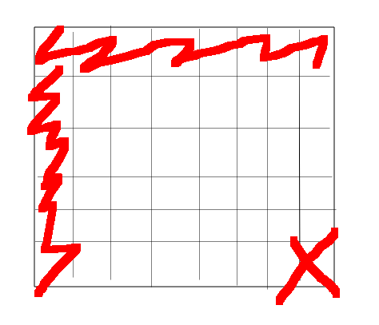

# 判断字符串的交替组成
## 题目介绍
现在有两个字符串str1和str2,然后给出aim,看aim字符串是不是由str1和str2交替组成的.我们举个例子什么叫做**交替组成**,str1="AB",str2="12",然后它交替组成的情况下很多,比如说aim1="A1B2",aim2="AB12"现在给出一个aim,判断是否是由str1和str2交替组成的.
上面是我自己的描述,我们来看一下书中的描述

也就是说 aim包含来自str1和str2全部的字符.
## 分析
其中涉及到str1和str2两个字符串,我们转化为字符数组,char1[0........i-1],char2[0........j-1]
动态规划,要设计一个二维的数组,也就是dp[i][j],**dp[i][j]表示两个字符数组char1[0.....i-1]和char2[0......j-1]交错组成字符串和aim是否是匹配的,也就是一个boolean类型的数组**.

那么我们要的结果就是dp[str.length-1][str2.length-1].

我们先计算边界的条件,然后开始推倒dp[i][j],最后得到最右下角的结果.
首先就是计算dp[0][0],然后dp[....][0],dp[0][.....]
* dp[0][0]表示的就是两个空串交错组成,如果aim是空串,那么就是true.
* 然后就是第一列dp[i][0],表示str1不是空串,str2是空串,这样的话,只要aim[i]等于str1[i],就是true.
* 第一行dp[0][j],表示str1是空串,str2不是空串,这样的话,只要aim[j]等于str2[j],就是true.

然后就是dp[i][j]的推导了,这个时候,就需要上面和左面数据的支持,以及dp[i][j]位置的支持了
先来看dp[i-1][j]表示aim[0....i+j-2]匹配str1[0....i-2]和str2[0....j-1].如果这都匹配不成功的话,dp[i][j]也就是false,如果aim[0.....i+j-1]的位置匹配str1[0.....i-1]的值,并且dp[i-1][j]为true,那么现在也为true.
然后再看dp[i][j-1]类似,如果dp[i][j-1]为true表示匹配成功,这个时候如果aim[i+j-1]匹配str2[j],true.
## 分析边界
现在基本的已经分析完成了,然后就是实现了,我们到底使用多大的二位数组呢?我们再来分析一下dp的含义.
**dp[i][j]表示str1[0-----i-1]和str2[0------j-1]和aim[i+j-1]的交错关系**
**那么表示一个str1[0------str1.length-1]和str2[0.....str2.length-1]需要的dp的下标就是dp[str1.length][str.length],这个时候如果我们创建的dp[str1.length][str2.length]就没办法表示了,所以我们要多创建一行,多创建一列.**

## 总结
这是典型的通过构造dp来解决的问题,对于这种问题,一定先去获取边界,然后去推一般情况.
核心就是分析出dp[i][j]的意思,一般dp[i][j]就是题目想要的,比如说这道题,我们相求**两个字符串**交替匹配和aim比,看看是否匹配,其中设计到了两个字符串,然后返回的结构是boolean类型,我们就可以想到要构造dp,boolean类型的二维数组,然后更深部的去想,dp[i][j]表示的意思.

**dp[i][j]表示的意思就是指str1[0......i-1]和str2[0.......j-2]和aim[0.......j+i-1]匹配的情况**

