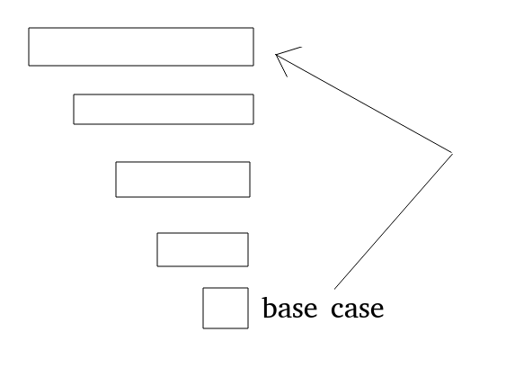

# 字符串匹配(一)
我们要实现一个类似正则表达式的匹配,举几个例子
str='aaaaabc' exp='a*bc' true
str='aaaaabc' exp='.*bc'  true
str='abcccd'   exp='ab.*'  true
也就是正则表达式中.*的应用,两个字符串的匹配肯定需要传入两个字符串,然后传入它们的下标,因为肯定会需要递归传入的.
我们画一张图,来表示我们的思路.

也就是依次的向里面调用,一点一点的调用,最后直接返回给最初的方法,我们也可以确定我们的方法名称
```
public static boolean process(String str,String exp,int si,int ei)
```
然后我们来确定我们的base case,假设我们匹配到了最后一步,这个时候要确定是返回true还是返回false了,我们想一想最极端的情况,也就是两个都到头了,两个剩下的都是空串,这时候就是匹配成功了,如果这个时候一方为空了,,,,
这个时候又需要讨论一下,是哪一方为空,是str方,还是exp方,,,,,总之,其中有一方不是空的,就肯定返回的是false.
```
//base case
if(str.length==si||exp.length==ei)
{
    return str.length==si&&exp.length==ei
}
```
然后就是开始平常的匹配了,我们已经知道了方向
```
如果当前匹配满足条件,那么就去递归调用更少的
  if(满足条件)
  {
     return  process(str,exp,si+?,ei+1)
  }
```
然后就是看条件了,显示最普遍的情况,也就是一对一的匹配
```
if(str[si]==exp[ei]||exp[ei]=='.')
{
    return  process(str,exp,si+1,ei+1)
}
```
这就是一对一的匹配情况了,当时我们举几个例子,看看有没有不符合条件的,
abcddda
abcd*a
我们发现如果d匹配了,然后递归调用以*开头了,这种情况我们应该放在最复杂的时候讨论,所以我们进一步的修改
```
if(ei==exp.lenght-1||exp[ei+1]!='*')
{
    if(str[si]==exp[ei]||exp[ei]=='.')
    {
       return  process(str,exp,si+1,ei+1)
    }
}
```
**然后就是最复杂的情况的判断**
就是匹配x*形式的字符串,这个时候如果当前si位置的字符和x*中的x不匹配,这个时候直接调用return process(str,exp,si,ei+2)
```
if(ei!=exp.length-1&&exp[ei+1]=='*')
{
    if(str[si]!=exp[ei]&&str[si]!='.')
    {
        return process(str,exp,si,ei+2)
    }else
    {
        //最复杂的情况
    }
}
```
其中注解最复杂的情况就是可以匹配上x*这种情况
aaaaXXXXX
a*YYYYY
其中a*可以匹配一个a,也可以匹配多个a,所以要全部都试一下,所以要用到循环
```
while(str[si]==exp[ei]||str[si]=='.')
{
    //匹配
    if(process(......))
    {
        return true;
    }
    si++;
}
```
整体实现如下:
```
public static boolean f(String str,String exp)
    {
        char[] strs = str.toCharArray();
        char[] exps = exp.toCharArray();
        return process(strs,exps,0,0);
    }

    public static boolean process(char[] str,char[] exp,int si,int ei)
    {
        if(str.length==si||exp.length==ei)
        {
            return str.length==si&&exp.length==ei;
        }
        if(ei!=exp.length-1&&exp[ei+1]!='*')
        {
            if(str[si]==exp[ei]||str[si]=='.')
            {
                return process(str,exp,si+1,ei+1);
            }
        }else
        {
            while(si!=str.length&&(str[si]==exp[ei]||exp[ei]=='.'))
                {
                    if(process(str,exp,si,ei+2))
                    {
                        return true;
                    }
                    si++;
                }
        }

        return process(str,exp,si,ei+2);
    }
```
这个就是暴力递归的方式求解.这道题是比较难的一道题,但是思想还是很明确的,其中的条件判断比较多,需要分清楚什么对什么,然后使用下标作为参数是递归解决字符串的重要思路.