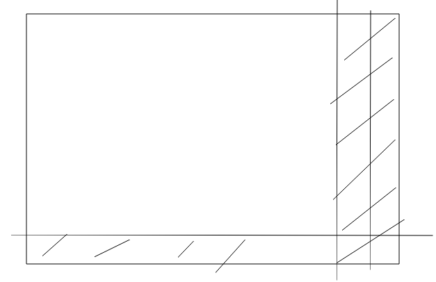

# 字符串匹配(二)
## 解法和分析
我们在一种通过暴力递归的方式,现在我们改用动态递归,也就是用我们的dp的二维数组求解
dp[i][j]也就是i------slen和j------elen的匹配是true还是false
也就是从右下角转到左上角.然后看依赖的情况,我们把(一)中的代码拿过来.
```
process(str,exp,si,ei+2)
process(str,exp,si+1,ei+1)
```
也就是dp[i][j]依赖与dp[i+1][j+1]或者是dp[i][j+1],所以最开始依赖的情况就是

阴影部分就是最开始依赖的情况
然后就是分析它们所代表的意义
```
dp[slen][elen]=true//全部都是空串
//最后一行,也就是str已经是空的了,只有连续的.*才可以
//最后一列全部为false
//倒数第二列,也就是exp只有一个值的时候.
```
```
boolean[][] dp=new boolean[slen+1][elen+1];
dp[slen][elen]=true;
//最后一行
for(int i=slen-2;i>-1;i=i-2)
{
    if(str[i]=='.'&&str[i+1]='*')
    {
        dp[slen][i]=true;
    }else
    {
       break;
    }
}
//倒数第二列
if(str[slen-1]==exp[elen-1]||exp[elen-1]=='.')
{
     dp[slen-1][elen-1]=true;
}
```
然后就是普通的依赖了,从右下角到左上角
```
for(int i=slen-1;i>-1;i--)
{
   for(int j=elen-2;j>-1;j--)
   {
       if(exp[j+1]!='*')
       {
           if(exp[j]==str[i]||exp[j]=='.')
           {
               dp[i][j]=dp[i+1][j+1];
           }
       }else
       {   
           int tmp=i;
           while(exp[j]==str[tmp]||exp[j]=='.')
           {
                if(dp[tmp][j+2])
                {
                   dp[tmp][j]=true;
                   break; 
                }
                tmp++;
           }
           if(dp[i][j]==false)
           {
               dp[i][j]=dp[i][j+2];
           }
       }
   
   }
}
```
## 总结
字符串匹配是一道非常好的动态规划的题.
构造dp二维数组,
求解字符串的问题经常就要引入它的下标
构造二维dp[i][j]其中i和j分别是两个字符串的下标,所以经常要多设置一行和一列.
然后就是其中的*的处理这个是非常重要的.


