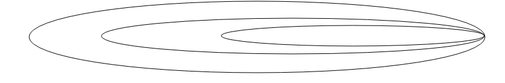

# 换钱的方法数之暴力递归
## 题目

## 分析
### 动态递归的思路
 首先对于一个数组使用动态递归,有很大的可能性要使用到index,这个变量,用这个来表示以index为结尾的递归函数.**对于字符串和数组使用index是一个常见的做法**,
 对于不同的arr[i],可能都要使用不同的张数,所以要使用到一个for循环,而for循环的次数,如下
```
 for(int j=0;j<aim/arr[i];j++)
 {
     /.......
 }
```
然后就是整个递归函数的架构
```
public static int 递归函数(int index,int aim,int[] arr)
{
    //base case
    
    //核心的逻辑

    //当前整个递归得到的值返回给上一层  
}
```
什么时候跳出呢,是等aim为0的时候退出呢,还是等index=arr.length的时候退出了,选择后者,通过1和0来判断这个"轨道"走的对不对
```
if(index==arr.length)
{
    return aim==0?1:0; 
}
```
然后就是核心逻辑了
```
for(int i=0;arr[index]*i<=aim;i++)
{
    res+=f(index+1,aim-arr[index]*i,arr); 
}
```
```
return res;//将当前递归的内容放回给上一层
```
### 动态递归的图

## 代码实现
```
 public static int f(int[] arr,int index,int aim)
    {
        int res=0;
        if(index==arr.length)
        {
            return aim==0?1:0;
        }
        else
        {
            for(int i=0;i*arr[index]<=aim;i++)
            {
                res+=f(arr,index+1,aim-i*arr[index]);
            }
        }
        return res;
    }
```
代码十分的简单,但是重要的思路,我们设置的返回值res,不必要设置全局变量,然后count(次数)是在每一次走完数组才能确定的.


## 总结
这个从左到右的遍历数组或者字符串的递归方式是十分常见的,其中显著的特定就是使用了index,来标识从左到右.其过程

就是**一层包着一层**.
然后就是返回值的判断,最开始我们要计算总共的次数,考虑要不要使用到全局变量,但实际上是不用的,这里的res充分的体现了递归函数**承上启下**的作用,在每一个函数中定义res,然后在返回给上一层,这个非常重要.

**一个类似的递归函数,求字符串的子串**
```
 public static void f2(char[] arr, int index,String str,List<String> list)
    {
        if(index==arr.length)
        {
            list.add(str);
        }else
        {
            f2(arr,index+1,str+String.valueOf(arr[index]),list);
            f2(arr,index+1,str+"",list);
        }
    }
```