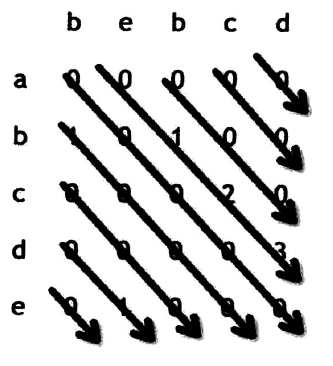

# 最大公共子串问题
## 题目

## 分析
又是两个字符串的问题,我们还是通过构建二维数组的方式来解决问题
```
dp[i][j]表示以i为结尾的str1和以j为结尾的str2的最长子串长度
```
### 边界
我们先来分析dp[0][...],也就是第一行的意义
```
str1的第一个字符和str2的0....k的字符,我们遍历str2,如果是相等的话dp[0][k]就是1,否则的话就是0
```
```
for(int i=0;i<str2.length;i++)
{
    if(str1[0]==str2[i]) dp[0][i]=1
    else dp[0][j]=0;
}
```
同理,我们可以得到dp[i][0]
```
for(int i=0;i<str1.length;i++)
{
     if(str2[0]==str1[i]) dp[i][0]=1
     else dp[i][0]=0;
}
```
### 中间位置
我们要求dp[i][j]肯定就要依赖前面或者是上面的
```
for(int i=0;i<str1.length;i++)
{
   for(int j=0;j<str2.length;j++)
   {
   
   }
}
```
dp[i][j]肯定是从上到下,从左到右的.
```
对于dp[i][j-1]表示str1[0....i]和str2[0....j-1]的最长子串长度
```
```
对于dp[i-1][j]表示str1[0....i-1]和str2[0....j]的最长子串长度
```
```
只有在str1[i]=str2[j]的情况下,才能够推出dp[i][j],然后dp[i][j]=dp[i-1][j-1]
```
这样的话就和我们的平常经验不同了,我们主要是依赖的是dp[i-1][j-1]

## 代码实现
```
public static int[][] f(String str1,String str2)
    {
        char[] cha1=str1.toCharArray();
        char[] cha2=str2.toCharArray();
        int[][] dp=new int[cha1.length][cha2.length];
        for(int i=0;i<cha1.length;i++)
        {
            if(cha1[i]==cha2[0])
            {
                dp[i][0]=1;
            }
        }
        for(int j=0;j<cha2.length;j++)
        {
            if(cha2[j]==cha1[0])
            {
                dp[0][j]=1;
            }
        }
        for(int i=1;i<cha1.length;i++)
        {
            for(int j=1;j<cha2.length;j++)
            {
                if(cha1[i]==cha2[j])
                {
                    dp[i][j]=dp[i-1][j-1]+1;
                }
            }
        }
        return dp;
    }
    public static void printM(int[][] m)
    {
        for(int i=0;i<m.length;i++)
        {
            for(int j=0;j<m[0].length;j++)
            {
                System.out.print(m[i][j]+" ");
            }
            System.out.println();
        }
    }
```
## 代码实现二之通过dp得到res
```
public static String getRes(int[][] m,String str1)
    {
        int max=0;
        int index=0;
        for(int i=0;i<m.length;i++)
        {
            for(int j=0;j<m[0].length;j++)
            {
                max=Math.max(max,m[i][j]);
                index=i;
            }
        }
        return str1.substring(index-max-1,index-1);
    }
```
## 优化(空间复杂度降低为O(1))
```
 public static String getRes(String str1,String str2)
    {
        char[] cha1 = str1.toCharArray();
        char[] cha2 = str2.toCharArray();
        int row=0;
        int col=cha2.length-1;
        int len=0;
        int max=0;
        int i,j;
        int index=0;
        while(row<cha1.length)
        {
           i=row;
           j=col;
           len=0;
           while(i<cha1.length&&j<cha2.length)
           {
               if(cha1[i]==cha2[j])
               {
                  len++;
               }else
               {
                  len=0;
               }
               if(len>max)
               {
                   max=len;
                   index=i;
               }
               i++;
               j++;
           }
           //System.out.println(i+" "+j);
           if(col>0)
           {
               col--;
           }else
           {
               row++;
           }
        }
        //System.out.println(max);
        return str1.substring(index-max+1,index+1);
    }
```
优化的话,肯定是从空间方面进行优化,因为在时间方面是一定要走逻辑上的二维数组的,我们就要看dp[i][j]依赖的项了,我们知道
```
对于这一道题,dp[i][j]依赖的就是dp[i-1][j-1],不想原来的动态规划的问题,我们这里之后依赖一个数据,而不是一行数据,所以我们可以做到空间复杂度为O(1)的操作
```

这就是我们的操作轨迹.
然后我们发现循环次数是依赖与行和列两个值的,我们来一个总体的循环结构
```
while(row<cha1.length)
{
    //执行逻辑 
    if(col>0) col--;
    else if(col==0) row++;
}
```
代码实现如下:
```
 public static String getRes(String str1,String str2)
    {
        char[] cha1 = str1.toCharArray();
        char[] cha2 = str2.toCharArray();
        int row=0;
        int col=cha2.length-1;
        int len=0;
        int max=0;
        int i,j;
        int index=0;
        while(row<cha1.length)
        {
           i=row;
           j=col;
           len=0;
           while(i<cha1.length&&j<cha2.length)
           {
               if(cha1[i]==cha2[j])
               {
                  len++;
               }else
               {
                  len=0;
               }
               if(len>max)
               {
                   max=len;
                   index=i;
               }
               i++;
               j++;
           }
           //System.out.println(i+" "+j);
           if(col>0)
           {
               col--;
           }else
           {
               row++;
           }
        }
        //System.out.println(max);
        return str1.substring(index-max+1,index+1);
    }
```