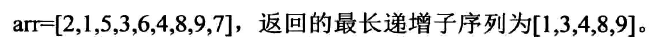

# 最长递增子串
## 题目

## 分析
### 采用dp[i][j]?
我们知道对于数组类的问题,dp[i][j]中的i表示的就是arr[0....i]的这个子数组,我们的结果呢,就是最长子串的长度,这个时候j就是空着了,所以我们干脆就使用dp[i]这个一维数组就可以了.
dp[i]表示在数组为arr[0.....i]的最长递增子序列的长度.然后我们看一看依赖关系,dp[i]肯定是依赖它的左边的值的,因为它是从左向右依次变大的.然后我们看一看依赖哪一个值
### 依赖关系
我们从当前的i向前找,找到比它小的值,比如说是j,然后比它小的肯定有很多,我们挑选一个dp[j]最大的.
```
for(int i=1;i<arr.length;i++)  
{
   dp[i]=1;
   for(int j=0;j<i;j++)
   {
       if(arr[j]<arr[i])
       {
           dp[i]=Math.max(dp[i],dp[j]+1);
       }
   }
   return dp;
}
```
我们要得到dp这个数组,然后找到其中最大的那个值,就是最长递增子序列的末尾的值.
### 还原子序列
我们只需要倒着遍历就可以了
## 代码
### 自己实现的
```

    public static int[] get(int[] arr)
    {
        int[] dp=new int[arr.length];
        dp[0]=1;
        for(int i=1;i<arr.length;i++)
        {
           int max=Integer.MIN_VALUE;
           for(int j=0;j<i;j++)
           {
               if(arr[j]<=arr[i])
               {
                   max=Math.max(dp[j]+1,max);
               }
           }
           dp[i]=max==Integer.MIN_VALUE?1:max;
        }
        return dp;
    }

    public static int[] getRes(int[] arr1,int[] arr)
    {
        int index=0;
        int max=arr[0];
        for(int i=0;i<arr.length;i++)
        {
            if(arr[i]>max)
            {
               max=arr[i];
               index=i;
            }
        }
        System.out.println(index+" "+max);//7
        int[] res=new int[max];//5
        int index2=max-1;//4
        int pre=arr1[index];//9
        for(int i=index;i>-1;i--)
        {
            //System.out.println(arr1[i]);
            if(arr1[i]<=pre)
            {
                res[index2--]=arr1[i];
                //System.out.println(arr1[i]);
                pre=arr1[i];
            }
        }
        return res;
    }
```
### 优化之后
```
 public static int[] list1(int[] arr)
    {
        if(arr==null||arr.length==0)
        {
            return null;
        }

        return null;
    }

    public static int[] getdp1(int[] arr)
    {
        int[] dp=new int[arr.length];
        for(int i=0;i<arr.length;i++){
            dp[i]=1;
            for(int j=0;j<i;j++)
            {
                if(arr[i]>arr[j])
                {
                    dp[i]=Math.max(dp[i],dp[j]+1);
                }
            }
        }
        return dp;
    }

    public static int[] generateLIS(int[] arr,int[] dp)
    {
        int len=0;
        int index=0;
        for(int i=0;i<dp.length;i++)
        {
            if(dp[i]>len)
            {
                len=dp[i];
                index=i;
            }
        }
        int[] lis=new int[len];
        lis[--len]=arr[index];
        for(int i=index;i>=0;i--)
        {
            if(arr[i]<arr[index]&&dp[i]==dp[index]-1)
            {
                lis[--len]=arr[i];
                index=i;
            }
        }
        return lis;
    }
```
## 总结
* 动态规划不一定采用二维数组的dp,有可能使用的就是一维数组
* 这里dp[.]中我们需要的不一定是最后一个值,需要遍历整个数组,然后得到最大的子串的长度
* 通过dp还原出我们要的子串,从右向左