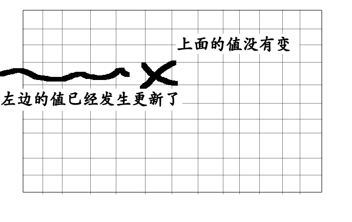

# 换钱的最少货币数
## 分析
为什么了可以根据dp进行优化,我们要看一下dp[i][j]要依赖的是哪些值,在换钱的最少货币数中
```
dp[i][j]依赖自己自己上面的值,还依赖自己左边的值
```
我们画一张图来表示一下

所以我们完全可以使用一维数组来表示
## 代码实现
```
 public static int minCoins1ByZip(int[] arr,int aim)
    {
        if(arr==null||arr.length==0||aim<0)
        {
            return -1;
        }
        int max=Integer.MAX_VALUE;
        int[] dp=new int[aim+1];
        for(int j=1;j<=aim;j++)
        {
           dp[j]=max;
           if(j-arr[0]>=0&&j-arr[0]!=max)
           {
               dp[j]=dp[j-arr[0]]+1;
           }
        }
        //middle
        for(int i=1;i<arr.length;i++)
        {
            for(int j=1;j<=aim;j++)
            {
                int cur=max;
                if(j-arr[i]>=0&&dp[j-arr[i]]!=max)
                {
                    cur=dp[j-arr[i]]+1;
                }
                dp[j]=Math.min(cur,dp[j]);
            }
        }
        return dp[aim]!=max?dp[aim]:-1;
    }
```