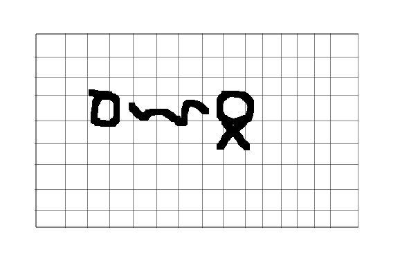
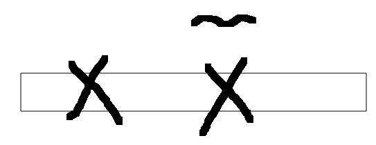
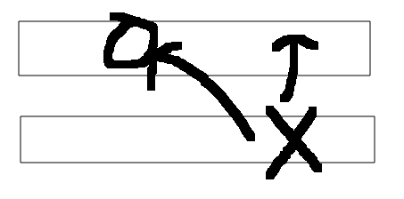

# 还钱的最少货币数(二)
现在我们要完成第二道题的优化,我们来分析一个dp[i][j]依赖的项
```
dp[i][j]=Math.min(dp[i-1][j],dp[i-1][j-arr[i]]+1)
```
如图所示

依赖的位置都是上一行的,如果这个时候,我们按照上一道题的方法走

如果是从上向下,然后从左向右,这样的话,上面的可以保持是原来的,但是dp[i-1][j-arr[i]]就没有办法保持了,这个时候,我们换一个进行方法
```
从上向下,从右向左
```
如果是从右向左呢,

这样就OK了dp[i-1][j-arr[i]]就没有被覆盖
## 代码实现
```
  public static int f(int[] arr,int aim)
    {
        int max=Integer.MAX_VALUE;
        int[] dp=new int[aim+1];
        for(int j=1;j<=aim;j++)
        {
            dp[j]=max;
            if(j==arr[0])
            {
                dp[j]=1;
            }
        }
        for(int i=1;i<arr.length;i++)
        {
            for(int j=aim;j>=1;j--)
            {
                int left=max;
                if(j-arr[i]>=0&&dp[j-arr[i]]!=max)
                {
                    left=dp[j-arr[i]]+1;
                }
                dp[j]=Math.min(left,dp[j]);
            }
        }
        return dp[aim]!=max?dp[aim]:-1;
    }
```