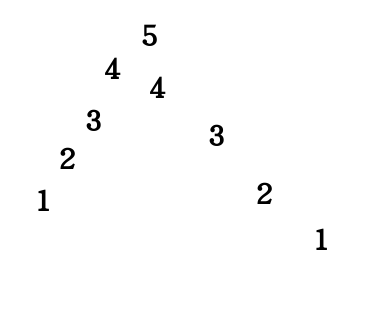

# 分糖果(一)
## 题目

## 分析
按照书中的思路,我们要引入上坡和下坡的概念
如果是上坡的话,从上坡的第一个位置开始,依次递增
如果是下坡的话,我们要找到下坡的最后一个位置,然后最后一个位置置为1,向回依次加1,这样的话才能做到最小
对于下面的这种情况

如果向会倒,发现是4,但是上坡的位置是5,这样的话,就要选择上坡的5.
整个过程是从左向右进行判断的
在相等的时候呢,如果当前位置的数字和前面位置的数字是相等的话,**我们将当前位置设置为1**.
其中如果是下坡的话是可以加速的
```
while(index<arr.length)
{
    if(arr[index]>arr[index-1])
    {
        //当前位置的糖的数量是index-1糖的数量+1
        res+=++perCandyNum;
        index++;
    }else if(arr[index]<arr[index-1])
    {
        //我们要以index-1为开始位置,找到下坡的终点
        //然后计算出终点到index-1最少的糖数
        //判断计算出的index-1的糖数和原本index-1的糖数,选择较大的那个
        //在终点的基础上加1
        //糖的数量置为1
    }else //如果index的糖数和index-1的糖数是相等的
    {
        我们置为1
        index++;
    }
}
```
## 代码实现
```
 public static int getCandyArr(int[] arr)
    {
        int candyNum=1;
        int index=0;
        //from 0 to ?
        index=getLastDown(arr,0);
        int sum=getDownCandyNum(arr,0,index++);
        while(index<arr.length)
        {
            if(arr[index]>arr[index-1])
            {
                sum+=++candyNum;
                index++;
            }
            else if(arr[index]<arr[index-1])
            {
                int next=getLastDown(arr,index-1);
                sum+=getDownCandyNum(arr,index-1,next++);
                //candyNum
                //
                int candyNum2=next-(index-1);
                sum+=(candyNum2>candyNum?-candyNum:-candyNum2);
                index=next;
                candyNum=1;
            }else  //==
            {
                sum+=1;
                candyNum=1;
                index++;
            }
        }
        return sum;
    }

    public static int getLastDown(int[] arr,int index)
    {
        for(int i=index;i<arr.length-1;i++)
        {
           if(arr[i]<=arr[i+1])//important 是小于等于不是小于,因为在等于的时候,也要跳出
           {
               return i;
           }
        }
        return arr.length-1;
    }
    public static int getDownCandyNum(int[] arr,int start,int end)
    {
        int len=end-start+1;
        int sum=0;
        int curNum=1;
        for(int i=end;i>=start;i--)
        {
            sum+=curNum++;
        }
        return sum;
    }

    public static void main(String[] args) {
        int[] test1 = { 3, 0, 5, 5, 4, 4, 0 };
        System.out.println(getCandyArr(test1));
        //System.out.println(getLastDown(test1,0));
        //System.out.println(getDownCandyNum(test1,0,1));
    }
```
## 总结
我们对分糖果(一)和(二)进行一个总结

