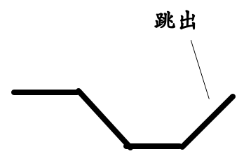
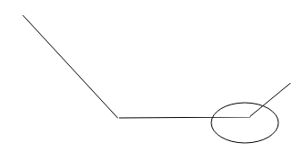
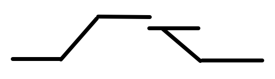
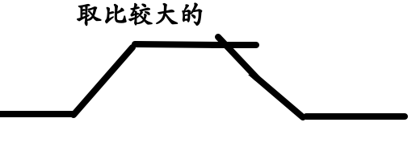
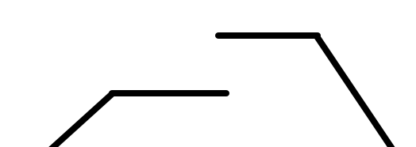
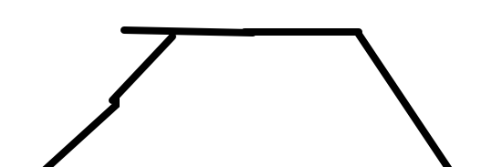

# 分糖果(二)
## 题目

## 分析
我们在分糖果的原始问题中,我们在遇到相等的时候,我们将当前位置的糖果树设置为1,因为(一)中没有对相等的情况进行设置,那个也是对最少情况的一种作用,现在我们要求如果两个孩子得分是一样的,我们要保证这两个孩子的糖果数量是一样的.
我们的基本思路是
```
上坡从左向右找
下坡从右向左找
其中相邻的是相等的为特殊情况
```
所以圈定下坡的范围的方法就要修改一下
```
for(int i=start;i<arr.length-1;i++)
{
   if(arr[i]<arr[i+1]) //这里跳出循环的条件就是<,表示只有在下面开始的是上坡的时候才会跳出
      return i;
}
return arr.length
```

根据上面的我们可以知道,圈定下坡的方法改了,虽然只是改了个符号,这样我们求下坡的糖的总数量也会发生变化.
```
for(int i=end;i>=start;i--)
{
   if(arr[end]==arr[start])
   {
        res+=candyNum;
   }
   else
   {
        res+=++candyNum; 
   }
}
return 我们需要最左边的糖果树,和总数量
```
然后就是核心代码的实现
```
public static int getMaxCandyTotalNum(int[] arr)
    {
        int candyNum=1;
        //最开始就要考察一下下坡,因为后面的循环是index和index-1进行比较的
        int index=getLastDownIndex(arr,0);
        int sum=getDownCandyTotalNum(arr,0,index++)[0];
        //same就是为了记录相等的情况,因为后面的替换还会用到
        int same=1;
```
上面的代码隐藏的信息比较多,我们通过getLastDownIndex()找到的,肯定是如下图所示的情况

花圈的地方就是跳出的位置,然后这个位置的candyNum就是1,我们在下面的这个循环中,最开始走的肯定是上坡,所以设置的肯定为2
```
        while(index<arr.length)
        {   
            if(arr[index]>arr[index-1])
            {
               sum+=++candyNum;
               index++;
               same=1;
            }
```
这个比较好理解,不过我们要将same置成1.
```
            else if(arr[index]<arr[index-1])
            {
                int next=getLastDownIndex(arr,index-1);
                int[] downInfo=getDownCandyTotalNum(arr,index-1,next++);
                //和一中的一样就是替换成较大的那个,其中使用到了same
                if(downInfo[1]<=candyNum)
                {
                   sum+=downInfo[0]-downInfo[1];
                }else //downInfo[1]>candyNum
                {
                   sum=sum-same*candyNum+downInfo[0]-downInfo[1]+same*downInfo[1];
                }
                index=next;
                candyNum=1;
            }
```

替换成

如果是

我们就要

```
            else
            {
               sum+=candyNum;
               same++;
               index++;
            }
        }
        return sum;
    }
```
对于相等的情况就是将same变量++

## 总结
我们在分糖果(一)和(二)中总结一下
* 在分糖果问题中,我们引入了上坡和下坡的概念,为了达到最少的糖果数量,我们在上坡时,就是从左向右,在下坡时,就要加速查找,从右向左依次递增.
* 然后就是上坡和下坡的矛盾,我们应该选择坡顶较高的那个值作为坡顶
* 对于二中,我们要引入same这个变量,为了在计算坡顶时,选择较大的那个