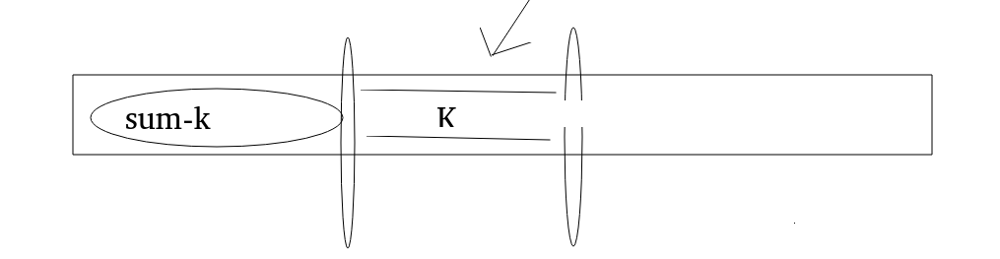

# 未排序数组中累加和为给定值的最长子数组
这个数组中有正有负,我们有一个指定的值为K,我们要求这个数组的子数组中累加和等于K的最大数组长度
## 分析
有可能会出现
```
.......5,-5.....
```
的情况,我们首先要确定一个核心思路
我们已经知道sum,也就是从0累加到当前位置的和,然后我们要求的是累加和为k的子数组.

通过上面的图,我们知道,当你走到i的位置,你可以求得从开头带中间的某个位置的累加和为sum-k,那么中间的某个位置到i的累加和就是k.
我们在向深处分析一下,如果我们能够保证sum-k的长度最短,那么中间的位置到i的位置累加和为k的子数组就是最长的,我们是相对于当前i来说的.
这个时候我们就想当了要使用HashMap,我们只记录某个累加和第一次出现的位置
```
if(!map.containKey(sum))
{
    map.put(sum,i);
}
```
这样,在我们查的时候
```
if(map.containKey(sum-k))//如果为true,那么以当前i为结束的位置,就有最大的累加和为k的子数组,我们要和其他i位置进行比较
{
    maxLen=Math.max(......);
}
```
## 异常情况
如果出现下面的情况呢
```
-5 5 .......
```
我们按照上面的思路分析
sum为0的情况出现在1的位置,按理来说应该出现在-1的位置,所以这就是我们最容易忽略的一点,所以在创建map的时候,我们一定要跟着一句
```
map.put(0,-1);
```
## 代码实现
```
 public static int getMaxLength(int[] arr,int k)
    {
        int maxLen=0;
        int sum=0;
        HashMap<Integer,Integer> map=new HashMap<>();
        map.put(0,-1);
        for(int i=0;i<arr.length;i++)
        {
            sum+=arr[i];
            if(map.containsKey(sum-k))
            {
                int index=map.get(sum-k);
                maxLen=Math.max(i-index,maxLen);
            }
            if(!map.containsKey(sum))
            {
                map.put(sum,i);
            }
        }
        return maxLen;
    }
```

## 代码实现(二)
```
public static int f(int[] arr,int aim)
    {
        HashMap<Integer,Integer> map=new HashMap<>();
        map.put(0,-1);
        int sum=0;
        int max=Integer.MIN_VALUE;
        for(int i=0;i<arr.length;i++)
        {
             sum+=arr[i];
             if(map.containsKey(sum-aim))
             {
                 max=Math.max(max,i-map.get(sum-aim));
             }
             if(!map.containsKey(sum))
             {
                 map.put(sum,i);
             }
        }
        return max;
    }
```
## 总结
已经实现了这个代码好多次,来谈一谈这个代码需要注意的地方
* 我们是要找到和为k的子数组,实际上是截止0.....(当前位置的总和减去k)的值所在的位置,来推出来的,这样的做法如果要能够得到最大的子数组,我们就要保证每一次的sum-k都是第一次出现,然后我们知道第一次出现0的位置就是-1位置,所以一定要执行
```
map.put(0,-1);
```
