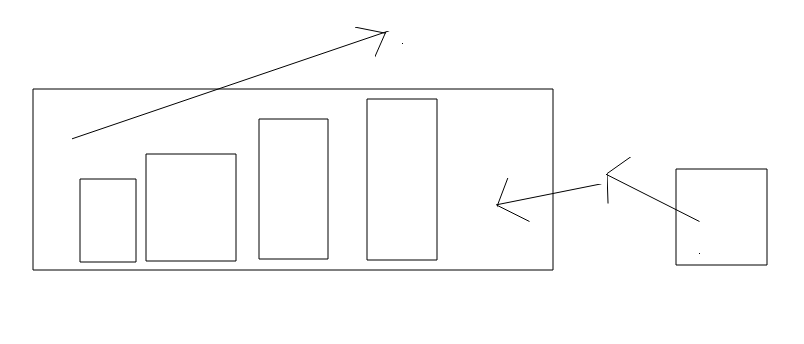
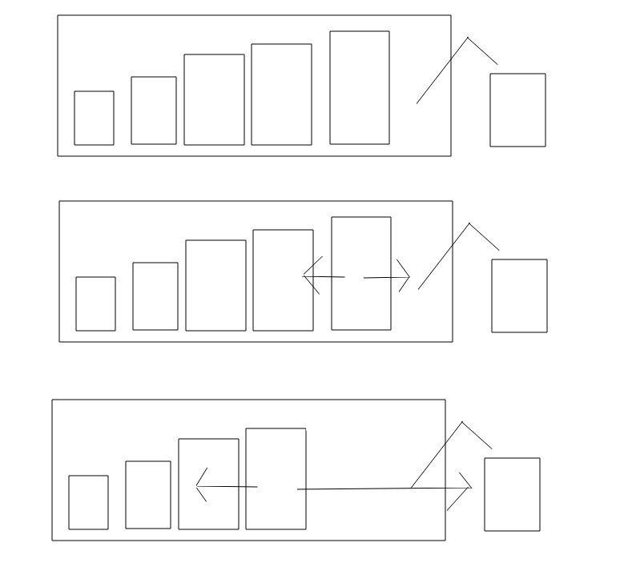
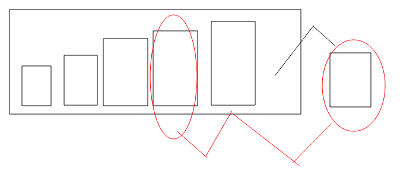

# 求最大子矩阵的大小
```
1 0 1 1
1 1 1 1
1 1 1 0
其中最大的子矩阵就是6
```
## 题目分析
我们可以一层一层的分析,先分析最上面的一层
```
1,0,1,1
```
然后加上一层
```
1 0 1 1
1 1 1 1 
```
也可以转化成
```
2 1 2 2 
```
然后在加一层
```
3 2 3 0
```
然后就可以转化成单调栈进行求解,为什么要用单调栈呢,因为我们大概想一想,我们需要以某一个位置扩,然后扩到不能扩的位置,说白了,也就是找到第一个比自己小的值.这样就没办法扩了.然后我们画一个图
然后还要在配合上单调栈的使用,然后就是来分析如何使用单调栈.
### 引入单调栈
上一道题通过单调栈求得maxTree,我们要求的是第一个比自己大的值,我们是如何确保比自己大的呢,就是在栈顶的时候出栈,然后再往里的那个一定比自己大.这样的话,此时的栈顶就是符合要求的点,然后我们来到这一道题,我们要求的是第一个比自己小的值,那我们想当然的就是单调栈,然后从栈底到栈顶依次变大.

我们可以把单调栈划分成两个方面的问题,一方面就是通过单调栈实现功能,另一方面就是维护单调栈.

我们先来画一个图

这个就是我们单调栈,首先我们如何来维护它
```
while(!stack.isEmpty()&&stack.peek>=arr[i])
{
    stack.pop()
}
```
这很简单,也就是常规的维护单调栈的操作,然后就是分析它是如何实现题目的.
### 单调栈的使用
我们先来画几张图

我们通过这几张图,可以知道栈顶的最多往里面扩一个,栈顶最多能向外扩到,当前如栈的前一个.
为什么扩的都是满足条件的?
我们先明确一个前提,我们存放的下标,然后这些下标在其中是不连续的.
```
while(!stack.isEmpty()&&stack.peek>=arr[i])
{
    int j=stack.pop(); 
    int k=stack.peek();
    int left=(j-k)*arr[k];
    int right=(i-1-j)*arr[k];
    int curPart=left+right;
    max=Math.max(curPart,cur);
}
```
其中j(栈顶)到i(当前要进入的),可能是不连续的,因为有可能是不连续的,但最开始一定是连续的.然后因为栈的弹出所以变的不连续.
这就是这道题比较重要的部分,也是我当时没有想通的部分.

## 代码实现
```
public class Test01 {

    public static int maxPartThisLine(int[] arr)
    {
        int maxPart=0;
        Stack<Integer> stack=new Stack();
        for(int i=0;i<arr.length;i++)
        {
            while(!stack.isEmpty()&&arr[stack.peek()]>=arr[i])
            {
                int j=stack.pop();
                int k=stack.isEmpty()?-1:stack.peek();
                int leftPart=(j-k)*arr[j];
                int rightPart=(i-1-j)*arr[j];
                int curPart=leftPart+rightPart;
                maxPart=Math.max(curPart,maxPart);
            }
            stack.push(i);
        }
        while(!stack.isEmpty())
        {
            int j=stack.pop();
            int k=stack.isEmpty()?-1:stack.peek();
            int leftPart=(j-k)*arr[j];
            int rightPart=(arr.length-1-j)*arr[j];
            int curPart=leftPart+rightPart;
            maxPart=Math.max(curPart,maxPart);
        }
        return maxPart;
    }


    public static void main(String[] args) {
         int[] arr={3,2,3,0};
         System.out.println(maxPartThisLine(arr));
    }
}
```
这个就实现了一层的检索.
### 分析规律
通过这一道题还有上一道的maxTree,我们可以分析出来单调栈的一般规律.

我们作用的对象一直都是要出栈的栈顶,它有可能和两边的元素都发生关系.
其中里面的元素就是指的离栈顶最近的比它大或者比它小的元素,而外面的要进来的,表示以当前栈顶向外扩第一个小的.
所以我们maxTree就没有必要进行两次的操作了
### maxTree的修改
```
 public static void f(int[] arr)
    {
        HashMap<Integer,Integer> map1=new HashMap<>();
        HashMap<Integer,Integer> map2=new HashMap<>();
        Stack<Integer> stack=new Stack<>();
        for(int i=0;i<arr.length;i++)
        {
            while (!stack.isEmpty() && arr[i] >= arr[stack.peek()])
            {
                int value=stack.pop();
                if(stack.isEmpty())
                {
                    map1.put(arr[value],null);
                }else
                {
                    map1.put(arr[value],arr[stack.peek()]);
                }
                map2.put(arr[value],arr[i]);
            }
            stack.push(i);
        }

        while(!stack.isEmpty())
        {
            int value=stack.pop();
            if(stack.isEmpty())
            {
                map1.put(arr[value],null);
            }else
            {
                map1.put(arr[value],arr[stack.peek()]);
            }
            map2.put(arr[value],null);
        }
        for(Map.Entry entry:map1.entrySet())
        {
            System.out.println(entry.getKey()+"..."+entry.getValue());
        }
        System.out.println(".....");
        for(Map.Entry entry:map2.entrySet())
        {
            System.out.println(entry.getKey()+"..."+entry.getValue());
        }
    }
```
所以,我们要理解**单调栈中栈顶,即将要进入的,还有栈顶的下面一个 三者的关系**
### 补充
我们一般操作是在for循环中操作,但是最后肯定会有stack不为空的情况,这个时候我们就在这个循环中的操作和for中的while操作基本相同,但是要根据实际情况进调整.