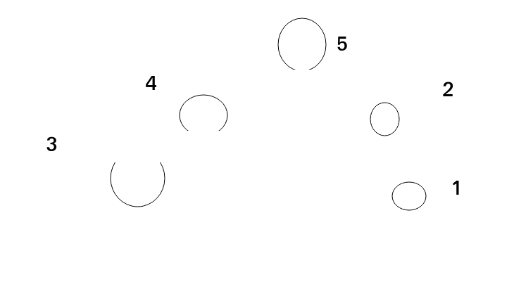
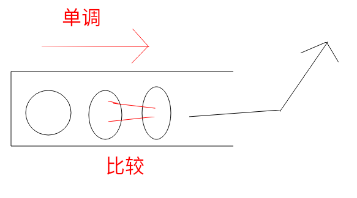
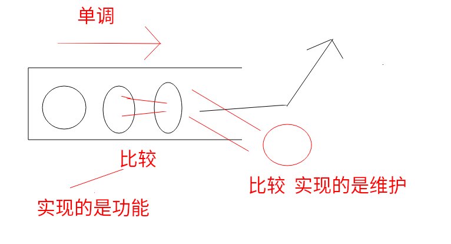

# 生成maxTree
## 题目
这道题就是典型的使用了单调栈,我们先来看一下题目是怎么样的.
给定一个整形的数组,形成一个树的类型,其中保证任何一个子树最大的是头.
## 题目解析
保证任何一个子树最大的是头.
arr=[3,4,5,1,2]那么形成的树就是如下图所示


如图,然后在根据数组分析树是怎么形成的,发现就是找离自己最近的又大于自己的节点.
简单一点的说,就是找第一个比自己大的数.
这就用到了我们的单调栈了,单调栈的最重要的一个功能,就是找最近的一个比自己大或者比自己小的数.
## 单调栈的介绍
那么我就开始介绍一下单调栈是如何上面的功能的.
还是刚才那个数组,arr=[3,4,5,1,2]
首先是3入栈,第一个数字,什么都不用干,然后4也要进来了,这个时候就需要和3进行一下比较,结果发现3比4小,那么3就要弹出,4进去,我们要保证栈底是遍历过程中最大的,这个时候3弹出了,我们可以知道什么信息吗
```
3左边没有比它大的数
```
然后这个时候4在栈底,然后5进入了,4小于5,所以要保证栈底是遍历过的最大的,4就要弹出了,然后这个时候我们伴随这弹出4,可以知道如下
```
4左边没有比它大的数
```
然后继续,这个时候5在栈底,这个时候1进入平安无事,然后2也进入,结果发现2比1大,这个时候又要进行操作了,1弹出,2进入,然后我们可以知道
```
1弹出,1的左边比它大的树是5
```
这个时候栈里面有5和2,我们依次的弹出
```
2的左边比它大的数为5
5的左边比它大的树没有
```
通过这个过程,我们就可以知道这个数组中所有左边第一个比它大的数是什么了,我们画一个形象的图来表示单调栈的操作过程.
\
我们发现每次弹出时的情况就是,和栈中最近的一个元素进行比较,最开始我把比较的对象搞错了,和要进入的进行比较了,这就是没有好好的理解单调栈的意思,单调栈,说的简单一点就是从栈底到栈顶是单调的,那为什么它可以得到离自己最近的第一个大的值呢?
我们看到,我们弹出的时候,比较的对象,因为单调栈的特性,是一定比自己大的.这就是单调栈为什么可以实现这个功能
然后就是单调栈的维护.如何才能维护一个单调栈,就是弹出


其实上面的图并不准确,和栈里面那个元素并不是比较的关系.
但是我们要理解单调栈能够维持以及为什么能实现这个功能.

然后我们来实现一下代码
```
while(单调栈不为空&&栈顶的值小于要来的值)
{
    弹出栈顶的值,然后记录看栈顶的值第一个比它大的值是哪一个
}
```
以上代码可以说是单调栈的一个标志.
## 代码实现
我们已经解决了最核心的问题,我们在来写一下最核心的代码
```
while(stack.isEmpty&&stack.peek<=curValue)
{
     stack.pop()
     //也正是在弹出的时候,我们记录了弹出的这个值左边第一个比它大的值.
}
```
记录我们要采用**哈希表**
然后整着来一下,反着来一下,就完成了.
我们来实现一下这个功能的代码.
```
 public static void f(int[] arr)
    {
        //
        Stack<Integer> stack=new Stack();
        HashMap<Integer,Integer> map1=new HashMap<>();
        HashMap<Integer,Integer> map2=new HashMap<>();
        for(int i=0;i<arr.length;i++)
        {
            while(!stack.isEmpty()&&stack.peek()<arr[i])
            {
                int value=stack.pop();
                //pop and set
                if(stack.isEmpty())
                {
                    map1.put(value,null);
                }
                else{
                    int left=stack.peek();
                    map1.put(value,left);
                }
            }
            stack.push(arr[i]);
        }
        //stack is not empty
        while(!stack.isEmpty())
        {
            int value=stack.pop();
            //pop and set
            if(stack.isEmpty())
            {
                map1.put(value,null);
            }
            else{
                int left=stack.peek();
                map1.put(value,left);
            }
        }

        for(int i=arr.length-1;i>-1;i--)
        {
            while(!stack.isEmpty()&&stack.peek()<arr[i])
            {
                int value=stack.pop();
                //pop and set
                if(stack.isEmpty())
                {
                    map2.put(value,null);
                }
                else{
                    int left=stack.peek();
                    map2.put(value,left);
                }


            }
            stack.push(arr[i]);
        }
        //stack is not empty
        while(!stack.isEmpty())
        {
            int value=stack.pop();
            //pop and set
            if(stack.isEmpty())
            {
                map2.put(value,null);
            }
            else{
                int left=stack.peek();
                map2.put(value,left);
            }
        }

        for(Map.Entry entry:map1.entrySet())
        {
            System.out.println(entry.getKey()+"..."+entry.getValue());
        }
        System.out.println(".....");
        for(Map.Entry entry:map2.entrySet())
        {
            System.out.println(entry.getKey()+"..."+entry.getValue());
        }
    }

    public static void main(String[] args) {

        int[] arr={4,3,2,5,1,6};
        f(arr);
    }
```
这个代码中的两个HashMap就存放了我们要的值.
