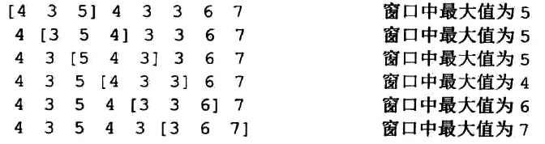

# 生成窗口最大值数组
有一个整形的数组和一个w大小的窗口,窗口从左边移动到右边,产生一个数组res,res[i]表示第i个窗口下的最大值,我们举个例子

时间复杂度O(n).
## 分析
这道题就是单调栈的雏形,我们借助这一道题进入单调栈的学习
首先我们最后返回的是一个int类型的数组,窗口的大小为w,数组的长度为l,所以构造的数组为
```
int[] res=new int[l-w+1];最后一定要加1,因为最开始的窗口也要算.
```
然后就是for循环遍历
```
LinkedList<Integer> queue=new LinkedList();
for(int i=0;i<arr.length;i++)
{
    while(!queue.isEmpty&&arr[queue.peekLast()]<=arr[i])
         queue.pollLast();
    queue.addLast(i);
    if(queue.peekFirst()<i-w)
    {
        queue.pollFirst()
    }
    if(i>=w-1)
    {
        res[index++]=arr[queue.peekFirst()];
    }
}
```
具体代码明天实现,我们先来讨论一下为什么要使用双端队列,我们先来到一个比较简单的问题
最开始是w个数,然后依次扩大,每扩大一个元素,就得出一个最大值.
这个就是要使用**单调栈**,也就是栈中的数据大小是单调的,我们一直保证最大的值在栈的最里面.
```
while(!queue.isEmpty&&arr[queue.peekLast()]<=arr[i])
         queue.pollLast();
    queue.addLast(i);
```
至于为什么要使用双端队列,就是因为要维持窗口的大小w,通过下标去排除的.
```
if(queue.peekFirst()<i-w)
    {
        queue.pollFirst()
    }
```
## 总结
牢记单调栈(保证最大的在栈顶),以及为什么要使用双端队列(队头的操作就是为了维护窗口的固定大小).
这两点牢记.
代码实现
```
  public static int[] f(int[] arr,int w)
    {
        //
        int[] res=new int[arr.length-w+1];
        LinkedList<Integer> queue=new LinkedList<>();
        int index=0;
        for(int i=0;i<arr.length;i++)
        {
             while(!queue.isEmpty()&&arr[queue.peekLast()]<=arr[i])
             {
                 queue.pollLast();
             }
             queue.addLast(i);
             //guoqi
             if(arr[queue.peekFirst()]<=i-w)
             {
                 queue.pollFirst();
             }
             //create
             if(i>=w-1)
             {
                 res[index++]=arr[queue.peekFirst()];
             }
        }
        return res;
    }
```