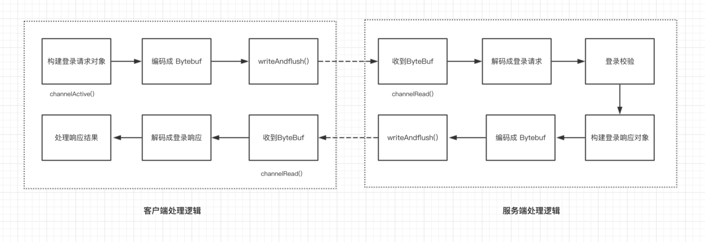
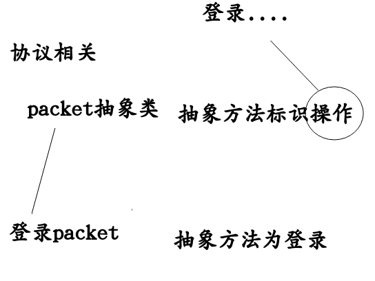

# (九)实战2之用户登录
## 1 整体
### 1.1 设计思路

1,客户端会构建一个登录请求对象，然后通过编码把请求对象编码为 ByteBuf，写到服务端。
2,服务端接受到 ByteBuf 之后，首先通过解码把 ByteBuf 解码为登录请求响应，然后进行校验。
3,服务端校验通过之后，构造一个登录响应对象，依然经过编码，然后再写回到客户端。
4,客户端接收到服务端的之后，解码 ByteBuf，拿到登录响应响应，判断是否登陆成功
## 2.自定义通信协议
这一节中,我们要自定义关于登录的通信协议    
### 2.1 协议相关类和接口的定义
```
@Data//可以省略get/set方法
public abstract class Packet {
    /*
    协议版本
     */
    @JSONField(deserialize = false,serialize = false)
    private Byte version=1;//协议的版本

    @JSONField(serialize = false)
    public abstract Byte getCommand();//这个抽象方法,在子类中实现,表示子类要实现的操作,这些操作,我们将他们放在另一个接口中
}
```
```
//承接上面的抽象类,不同的子类协议都表示这一种操作,我们将这些操作放到一个接口中存储
public interface Command {
    Byte LOGIN_REQUEST=1;//登录的请求,这个操作为1
}
```
然后我们就要实现登录要使用到的类,也就是Packet
```
@Data
public class LoginRequestPacket extends Packet{

    private Integer userId;//登录人的id
    private String username;//登录人的姓名
    private String password;//登录人的密码

    @Override
    public Byte getCommand() {
        return Command.LOGIN_REQUEST;//重写了抽象方法,表明了这个类的作用
    }
}
```
### 2.2 序列化相关类和接口
```
public interface Serializer {

    Serializer DEFAULT = new JSONSerializer();
     /*
     序列化算法
      */
     byte getSerializerAlogrithm();//序列化的算法

     /*
     java对象转化成二进制
      */
     byte[] serialize(Object object);
    /**
     * 二进制转化为java对象
     */
    <T> T deserialize(Class<T> clazz,byte[] bytes);
}
```
我们这里和上面的一节的内容,序列话算法的内容类似于枚举类型的一个类,我们通过一个接口把他都列举出来
```
public interface SerializerAlogrithm {
    /**
     * json 序列化
     */
    byte JSON = 1;
}
```
然后我们来看看Serializer的子类
```
public class JSONSerializer implements Serializer{
    @Override
    public byte getSerializerAlogrithm() {
        return SerializerAlogrithm.JSON;//我们选择的序列化算法是JSON
    }

    @Override
    public byte[] serialize(Object object) {
        return JSON.toJSONBytes(object);//对象转化为JSON的字节数组
    }

    @Override
    public <T> T deserialize(Class<T> clazz, byte[] bytes) {
        return JSON.parseObject(bytes,clazz);//byte[]就是json的内容,clazz就是对象的类,我们将json的字节数组转化为clazz类型的类
    }
}
```
画一个图,总结一下2.1的packet和2.2的序列化


### 2.3 编码和解码类
```
public class PacketCodeC {

    private static final int MAGIC_NUMBER=0x12345678;//魔数
    private static final Map<Byte,Class<? extends Packet>> packetTypeMap;//映射 标识和包的类型
    private static final Map<Byte,Serializer> serializerMap;//映射 标识和序列化器
    
    //在这个类初始化的时候,我们填充了这两个map
    static{
        packetTypeMap=new HashMap<>();
        packetTypeMap.put(Command.LOGIN_REQUEST,LoginRequestPacket.class);

        serializerMap=new HashMap<>();
        Serializer serializer = new JSONSerializer();
        serializerMap.put(serializer.getSerializerAlogrithm(),serializer);
    }
    //编码 将一个class类转化成数据类型
    public ByteBuf encode(Packet packet)
    {
        ByteBuf byteBuf = ByteBufAllocator.DEFAULT.ioBuffer();//开辟一块内存
        byte[] bytes = Serializer.DEFAULT.serialize(packet);//将实在的class类转成数据类型
        byteBuf.writeInt(MAGIC_NUMBER);//魔数
        byteBuf.writeByte(packet.getVersion());//1
        byteBuf.writeByte(Serializer.DEFAULT.getSerializerAlogrithm());//json
        byteBuf.writeByte(packet.getCommand());//login
        byteBuf.writeInt(bytes.length);//数据长度
        byteBuf.writeBytes(bytes);//内容

        return byteBuf;//现在是byteBuf类型了,可以进行传输了
    }
    //解码---->将ByteBuf转化为packet
    public Packet decode(ByteBuf byteBuf)
    {
        byteBuf.skipBytes(4);//跳过魔数
        byteBuf.skipBytes(1);//跳过版本
        byte serializeAlgoirthm=byteBuf.readByte();//序列化的方式,json的标识
        byte command=byteBuf.readByte();//操作的标识,login的表示
        int length=byteBuf.readInt();//内容的长度
        //下面两步,将数据的内容传入到bytes数组中
        byte[] bytes=new byte[length];
        byteBuf.readBytes(bytes);
  
        //现在我们要将得到的byte[]数组通过对应的序列化器转化成class类,也就是反序列化
        //我们就要用来两个map
        
        //例子:登录操作获取到的 LoginRequestPacket
        Class<? extends Packet> requestType = getRequestType(command);
        //json操作获取到的json的序列化器
        Serializer serialzier = getSerialzier(serializeAlgoirthm);

        //有了Packet和序列化器
        if(requestType!=null&&serialzier!=null)
        {   //我们将这个包反序列化,得到这个对象
            //参数1:登录包这个类型
            //参数2:内容
            return serialzier.deserialize(requestType,bytes);
        }
        return null;
    }

    private Serializer getSerialzier(byte serializeAlgorithm)
    {
        return serializerMap.get(serializeAlgorithm);
    }
    private Class<? extends Packet> getRequestType(byte command)
    {
        return packetTypeMap.get(command);
    }
}
```
## 3.登录功能
### 3.1
```
public class ClientHandler extends ChannelInboundHandlerAdapter{
    @Override
    public void channelActive(ChannelHandlerContext ctx) throws Exception {
        System.out.println(new Date()+" :客户端开始登录");

        //创建一个登录数据包
        LoginRequestPacket packet=new LoginRequestPacket();
        packet.setUserId(UUID.randomUUID().toString());
        packet.setUsername("cheng");
        packet.setPassword("123");

        //我们从这个ctx开辟一个buffer,然后将这个Packet写入到其中 
        ByteBuf buffer = PacketCodeC.INSTANCE.encode(ctx.alloc(), packet);
        //客户端发送到服务器 
        ctx.channel().writeAndFlush(buffer);
    }

    @Override
    public void channelRead(ChannelHandlerContext ctx, Object msg) throws Exception {
          //收到了服务器的反馈
          ByteBuf buffer=(ByteBuf)msg;
          //将buffer转化为packet
          Packet packet = PacketCodeC.INSTANCE.decode(buffer);
          
          //登录反馈的包
          if(packet instanceof LoginResponsePacket)
          {
              LoginResponsePacket loginResponsePacket=(LoginResponsePacket)packet;
              if(loginResponsePacket.isSuccess())
              {
                  System.out.println("客户端登录成功!!!");
              }else
              {
                  System.out.println("客户端登录失败!!!,失败的原因如下:"+loginResponsePacket.getReason());
              }
          }
    }
}
```
### 3.2
```
public class ServerHandler extends ChannelInboundHandlerAdapter{

    @Override
    public void channelRead(ChannelHandlerContext ctx, Object msg) throws Exception {
        System.out.println(new Date()+": 客户端开始登录");
        ByteBuf buffer=(ByteBuf)msg;
        Packet packet = PacketCodeC.INSTANCE.decode(buffer);
        
        if(packet instanceof LoginRequestPacket)
        {
            LoginRequestPacket loginRequestPacket=(LoginRequestPacket)packet;
            LoginResponsePacket loginResponsePacket=new LoginResponsePacket();
            loginResponsePacket.setVersion(loginRequestPacket.getVersion());
            if(isValid(loginRequestPacket))
            {
                loginResponsePacket.setSuccess(true);
                System.out.println(new Date() + ": 登录成功!");
            }else
            {
                loginResponsePacket.setReason("账号密码校验失败");
                loginResponsePacket.setSuccess(false);
                System.out.println(new Date() + ": 登录失败!");
            }

            buffer = PacketCodeC.INSTANCE.encode(ctx.alloc(), loginResponsePacket);
            ctx.channel().writeAndFlush(buffer);
        }
    }
    public boolean isValid(LoginRequestPacket loginRequestPacket)
    {
        return loginRequestPacket.getUsername().equals("cheng")&&loginRequestPacket.getPassword().equals("123");
    }
}
```