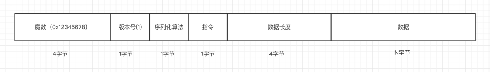

# (八)通信协议的编码
## 1,什么是服务端与客户端的通信协议
无论是使用 Netty 还是原始的 Socket 编程，基于 TCP 通信的数据包格式均为二进制，协议指的就是客户端与服务端事先商量好的，每一个二进制数据包中每一段字节分别代表什么含义的规则。如下图的一个简单的登录指令

在这个数据包中，第一个字节为 1 表示这是一个登录指令，接下来是用户名和密码，这两个值以 \0 分割，客户端发送这段二进制数据包到服务端，服务端就能根据这个协议来取出用户名密码，进行登录逻辑。实际的通信协议设计中，我们会考虑更多细节，要比这个稍微复杂一些。    

如上图所示，客户端与服务端通信

1,首先，客户端把一个 Java 对象按照通信协议转换成二进制数据包。
2,然后通过网络，把这段二进制数据包发送到服务端，数据的传输过程由 TCP/IP 协议负责数据的传输，与我们的应用层无关。
3,服务端接受到数据之后，按照协议取出二进制数据包中的相应字段，包装成 Java 对象，交给应用逻辑处理。
4,服务端处理完之后，如果需要吐出响应给客户端，那么按照相同的流程进行。



1,首先，第一个字段是魔数，通常情况下为固定的几个字节（我们这边规定为4个字节）。 为什么需要这个字段，而且还是一个固定的数？假设我们在服务器上开了一个端口，比如 80 端口，如果没有这个魔数，任何数据包传递到服务器，服务器都会根据自定义协议来进行处理，包括不符合自定义协议规范的数据包。例如，我们直接通过 http://服务器ip 来访问服务器（默认为 80 端口）， 服务端收到的是一个标准的 HTTP 协议数据包，但是它仍然会按照事先约定好的协议来处理 HTTP 协议，显然，这是会解析出错的。而有了这个魔数之后，服务端首先取出前面四个字节进行比对，能够在第一时间识别出这个数据包并非是遵循自定义协议的，也就是无效数据包，为了安全考虑可以直接关闭连接以节省资源。在 Java 的字节码的二进制文件中，开头的 4 个字节为0xcafebabe 用来标识这是个字节码文件，亦是异曲同工之妙。
2,接下来一个字节为版本号，通常情况下是预留字段，用于协议升级的时候用到，有点类似 TCP 协议中的一个字段标识是 IPV4 协议还是 IPV6 协议，大多数情况下，这个字段是用不到的，不过为了协议能够支持升级，我们还是先留着。
3,`第三部分，序列化算法表示如何把 Java 对象转换二进制数据以及二进制数据如何转换回 Java 对象，比如 Java 自带的序列化，json，hessian 等序列化方式。`
4,第四部分的字段表示指令，关于指令相关的介绍，我们在前面已经讨论过，服务端或者客户端每收到一种指令都会有相应的处理逻辑，这里，我们用一个字节来表示，最高支持256种指令，对于我们这个 IM 系统来说已经完全足够了。
5,接下来的字段为数据部分的长度，占四个字节。
6,最后一个部分为数据内容，每一种指令对应的数据是不一样的，比如登录的时候需要用户名密码，收消息的时候需要用户标识和具体消息内容等等。

通常情况下，这样一套标准的协议能够适配大多数情况下的服务端与客户端的通信场景，接下来我们就来看一下我们如何使用 Netty 来实现这套协议。
## 2,通信协议的实现
### 2.1
```
@Data
public abstract class Packet {
    /**
     * 协议版本
     */
    private Byte version = 1;

    /**
    * 指令
    * /
    public abstract Byte getCommand();
}
```
1,
以上是通信过程中 Java 对象的抽象类，可以看到，我们定义了一个版本号（默认值为 1 ）以及一个获取指令的抽象方法，所有的指令数据包都必须实现这个方法，这样我们就可以知道某种指令的含义。
`@Data 注解由 lombok 提供，它会自动帮我们生产 getter/setter 方法，减少大量重复代码，推荐使用。`
### 2.2
```
public interface Command {

    Byte LOGIN_REQUEST = 1;
}

@Data
public class LoginRequestPacket extends Packet {
    private Integer userId;

    private String username;

    private String password;

    @Override
    public Byte getCommand() {
        
        return LOGIN_REQUEST;//登录操作是1
    }
}
```
登录请求数据包继承自 Packet，然后定义了三个字段，分别是用户 ID，用户名，密码，这里最为重要的就是覆盖了父类的 getCommand() 方法，值为常量 LOGIN_REQUEST。
### 2.3 序列化
```
public interface Serializer {

    /**
     * 序列化算法
     */
    byte getSerializerAlgorithm();
    
    /**
     * java 对象转换成二进制
     */
    byte[] serialize(Object object);

    /**
     * 二进制转换成 java 对象
     */
    <T> T deserialize(Class<T> clazz, byte[] bytes);
}
```
序列化接口有三个方法，getSerializerAlgorithm() 获取具体的序列化算法标识，serialize() 将 Java 对象转换成字节数组，deserialize() 将字节数组转换成某种类型的 Java 对象，在本小册中，我们使用最简单的 json 序列化方式，使用阿里巴巴的 fastjson 作为序列化框架。
```
public interface SerializerAlgorithm {
    /**
     * json 序列化标识
     */
    byte JSON = 1;
}


public class JSONSerializer implements Serializer {
   
    @Override
    public byte getSerializerAlgorithm() {
        
        return SerializerAlgorithm.JSON;
    } 

    @Override
    public byte[] serialize(Object object) {
        
        return JSON.toJSONBytes(object);
    }

    @Override
    public <T> T deserialize(Class<T> clazz, byte[] bytes) {
        
        return JSON.parseObject(bytes, clazz);
    }
}
```
```
public interface Serializer {
    /**
     * json 序列化
     */
    byte JSON_SERIALIZER = 1;

    Serializer DEFAULT = new JSONSerializer();

    // ...
}
```
